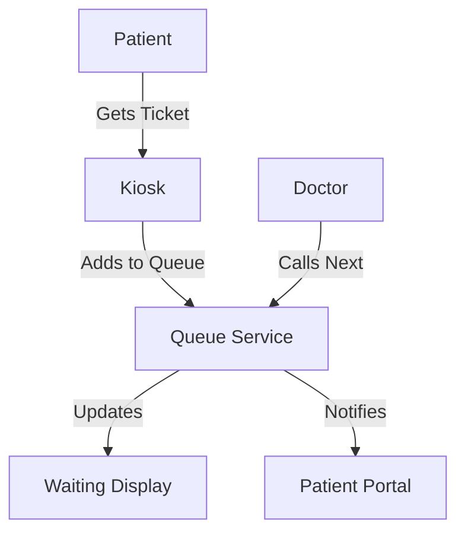
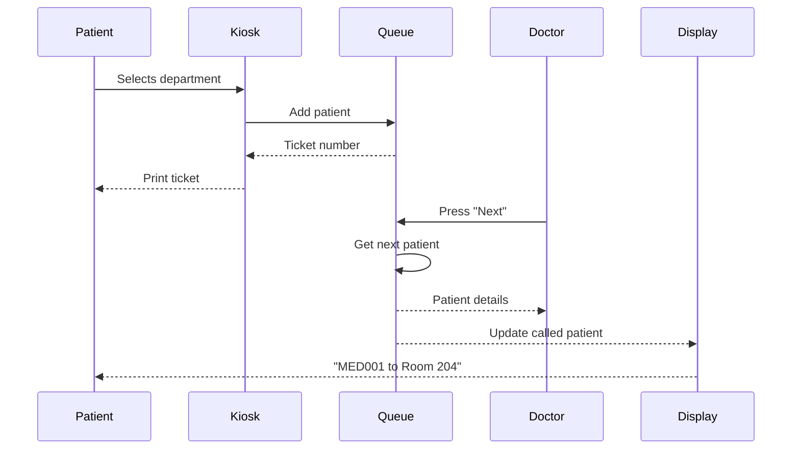
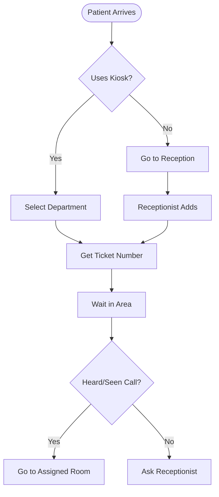

## Creating File: `.opencode/context/core/standards/02-documentation.md`

```markdown
# Documentation Standards
**Document ID:** CORE-STD-02
**Version:** 1.0
**Last Updated:** 2026-03-02
**Owner:** Technical Lead / Documentation Lead

## Purpose

This document defines the documentation standards for the Hospital Queuing System. Consistent, high-quality documentation ensures that all stakeholders (developers, users, administrators) can effectively understand, use, and maintain the system.

## 1. Documentation Principles

### 1.1 Core Tenets
- **Clarity**: Documentation should be clear, concise, and free of ambiguity
- **Accuracy**: Information must be correct and up-to-date
- **Completeness**: Cover all necessary aspects without overwhelming
- **Accessibility**: Organized and searchable for different audiences
- **Maintainability**: Easy to update when the system changes

### 1.2 Documentation Types

| Type | Audience | Purpose | Location |
|------|----------|---------|----------|
| **Technical Documentation** | Developers, DevOps | System architecture, APIs, code standards | `/docs/02-architecture/`, `/docs/10-api/` |
| **User Documentation** | Patients, Doctors, Receptionists | How to use the system | `/docs/12-user-guides/` |
| **Administrator Documentation** | Hospital IT, Admins | Configuration, maintenance, troubleshooting | `/docs/12-user-guides/04-admin-guide.md` |
| **Project Documentation** | PMs, Stakeholders | Requirements, roadmap, status | `/docs/01-requirements/`, `/docs/13-project-management/` |
| **Code Documentation** | Developers | In-code comments, READMEs | Within code files, `/packages/` |

## 2. Document Structure Standards

### 2.1 Document Header

Every document MUST include a standardized header:

```markdown
# Document Title
**Document ID:** [ID-FORMAT-XX]
**Version:** [X.X]
**Last Updated:** [YYYY-MM-DD]
**Owner:** [Role/Person]

## Purpose

Brief description of what this document covers and its intended audience.
```

### 2.2 Document ID Format

```
[CATEGORY]-[TYPE]-[NUMBER]

Categories:
- REQ = Requirements
- ARCH = Architecture
- UI = User Interface
- DEV = Development
- OPS = Operations
- SEC = Security
- TEST = Testing
- GUIDE = User Guide

Types:
- PRD = Product Requirements Document
- SPEC = Technical Specification
- STD = Standard
- FLOW = Workflow/Process
- REF = Reference

Examples:
- REQ-PRD-01: Initial PRD
- ARCH-SPEC-03: Database Schema
- SEC-STD-01: Security Standards
```

### 2.3 Standard Sections

Most documents should follow this structure:

```markdown
# Title

## 1. Introduction
- Background
- Scope
- Audience

## 2. [Main Content Sections]
- Organized hierarchically
- Use numbered sections (1, 1.1, 1.2)

## 3. Appendices
- Glossary
- References
- Version History
```

### 2.4 Version History Table

Every document MUST include a version history at the end:

```markdown
## Version History

| Version | Date | Author | Changes |
|---------|------|--------|---------|
| 1.0 | 2026-03-02 | John Doe | Initial version |
| 1.1 | 2026-03-15 | Jane Smith | Added API examples |
```

## 3. Markdown Standards

### 3.1 Headers

```markdown
# H1 - Document Title (only one per document)
## H2 - Major Sections
### H3 - Subsections
#### H4 - Sub-subsections (use sparingly)
```

### 3.2 Text Formatting

```markdown
**Bold** for emphasis and key terms
*Italic* for foreign words or subtle emphasis
`Code` for inline code, commands, or file names
```

### 3.3 Lists

```markdown
Unordered lists:
- Item one
- Item two
  - Nested item
  - Another nested item

Ordered lists:
1. First step
2. Second step
   1. Sub-step A
   2. Sub-step B
```

### 3.4 Code Blocks

Use triple backticks with language specification:

```javascript
// Example code with syntax highlighting
function calculateWaitTime(queue) {
  return queue.length * 2;
}
```

```sql
-- SQL example
SELECT * FROM patients WHERE id = ?;
```

```bash
# Shell commands
npm run deploy
```

### 3.5 Tables

```markdown
| Header 1 | Header 2 | Header 3 |
|----------|----------|----------|
| Cell 1   | Cell 2   | Cell 3   |
| Cell 4   | Cell 5   | Cell 6   |
```

### 3.6 Links

```markdown
[Link Text](../path/to/document.md)

[Reference-style link][ref-id]

[ref-id]: ../path/to/document.md "Optional Title"
```

### 3.7 Admonitions/ callouts

Use blockquotes with emoji for emphasis:

```markdown
> ⚠️ **Warning**: Important cautionary note

> 💡 **Tip**: Helpful suggestion

> 📝 **Note**: Additional context or information

> 🔒 **Security**: Security-related note

> 🚨 **Critical**: Urgent information
```

## 4. Technical Documentation Standards

### 4.1 API Documentation

Every API endpoint MUST be documented with:

```markdown
## GET /api/queue/{department}

Retrieves the current queue for a specific department.

### Request Parameters

| Parameter | Type | Required | Description |
|-----------|------|----------|-------------|
| `department` | string | Yes | Department code (e.g., 'MED', 'PED') |
| `limit` | integer | No | Maximum number of items (default: 50) |

### Request Example

```
GET /api/queue/MED?limit=10
```

### Response

```json
{
  "department": "MED",
  "waiting": 12,
  "patients": [
    {
      "ticketNumber": "MED042",
      "name": "John Doe",
      "waitTime": 15,
      "position": 1
    }
  ],
  "estimatedWaitTime": 15
}
```

### Error Responses

| Status Code | Description |
|-------------|-------------|
| 400 | Invalid department code |
| 401 | Authentication required |
| 404 | Department not found |

### Rate Limits

- 100 requests per minute per IP
- 1000 requests per day per user
```

### 4.2 Database Schema Documentation

```markdown
## Table: patients

| Column | Type | Nullable | Default | Description |
|--------|------|----------|---------|-------------|
| id | TEXT | NO | - | Primary key (UUID) |
| name | TEXT | NO | - | Patient's full name |
| email | TEXT | YES | NULL | Contact email |
| phone | TEXT | YES | NULL | Contact phone |
| password_hash | TEXT | YES | NULL | Hashed password |
| created_at | DATETIME | NO | CURRENT_TIMESTAMP | Record creation time |

### Indexes

- `idx_patients_email` on `email`
- `idx_patients_phone` on `phone`

### Relationships

- One-to-many with `visits` table via `patient_id`
```

### 4.3 Architecture Diagrams

All architecture documents MUST include or reference diagrams in `/diagrams/`. Use Mermaid for simple diagrams directly in markdown:



## 5. User Documentation Standards

### 5.1 User Guide Structure

Each user guide should follow:

```markdown
# [Role] Guide

## 1. Getting Started
- System requirements
- Login instructions
- First-time setup

## 2. Common Tasks
- Step-by-step instructions with screenshots
- Expected outcomes
- Troubleshooting tips

## 3. Advanced Features
- Optional capabilities
- Configuration options

## 4. Frequently Asked Questions

## 5. Support Contacts
```

### 5.2 Screenshot Standards

- Use PNG format
- Maximum width: 800px
- Include descriptive alt text
- Annotate with numbered callouts if needed
- Store in `/designs/screenshots/`

```markdown


*Figure 1: Doctor Dashboard - Main interface for managing patient queue*
```

### 5.3 Step-by-Step Instructions

```markdown
### Adding a Patient to the Queue

1. **Navigate to the Reception Dashboard**
   - Open your browser and go to `https://queue.hospital.com/reception`
   - Log in with your credentials

2. **Enter Patient Information**
   - Click the **+ Add Patient** button
   - Fill in the required fields:
     - Patient name (required)
     - Phone number (optional)
     - Department (select from dropdown)

3. **Generate Ticket**
   - Click **Add to Queue**
   - The system will display a confirmation with ticket number

4. **Provide Ticket to Patient**
   - If printer is connected, ticket will print automatically
   - Otherwise, write down or tell the patient their number
```

## 6. Code Documentation Standards

### 6.1 File Headers

Every source file should begin with:

```typescript
/**
 * @file queue-service.ts
 * @description Service for managing hospital queue operations
 * @module QueueService
 * @author Hospital System Team
 * @created 2026-03-02
 * @updated 2026-03-02
 */
```

### 6.2 Function Documentation

Use JSDoc for all public functions and methods:

```typescript
/**
 * Calls the next patient in the queue for a specific doctor
 * 
 * This function retrieves the next waiting patient from the queue,
 * updates their status to 'called', assigns them to the specified room,
 * and broadcasts the update to all connected clients.
 * 
 * @param doctorId - Unique identifier of the calling doctor
 * @param roomNumber - Room where patient should report
 * @returns Promise resolving to the called patient object
 * @throws {QueueEmptyError} If no patients are waiting in the queue
 * @throws {DoctorOfflineError} If doctor station is not active
 * 
 * @example
 * ```typescript
 * try {
 *   const patient = await queueService.callNextPatient('dr_smith', '204');
 *   console.log(`Called ${patient.name} to room 204`);
 * } catch (error) {
 *   if (error instanceof QueueEmptyError) {
 *     console.log('No patients waiting');
 *   }
 * }
 * ```
 * 
 * @since 1.0.0
 */
```

### 6.3 Component Documentation

React components should include PropType documentation:

```typescript
interface PatientDashboardProps {
  /**
   * Unique identifier for the patient
   */
  patientId: string;
  
  /**
   * Initial tab to display
   * @default 'queue'
   */
  initialTab?: 'queue' | 'history' | 'profile';
  
  /**
   * Callback when patient is called to a room
   */
  onPatientCalled?: (room: string) => void;
}

/**
 * Patient Dashboard Component
 * 
 * Displays the patient's current queue status, visit history,
 * and allows profile management.
 * 
 * @example
 * ```tsx
 * <PatientDashboard 
 *   patientId="p12345"
 *   initialTab="queue"
 *   onPatientCalled={(room) => console.log(`Go to ${room}`)}
 * />
 * ```
 */
export function PatientDashboard({
  patientId,
  initialTab = 'queue',
  onPatientCalled
}: PatientDashboardProps) {
  // Component implementation
}
```

## 7. README Standards

### 7.1 Root README (Project Level)

Every project MUST have a root `README.md` with:

```markdown
# Hospital Queuing System

## 📋 Overview
Brief description of the system and its purpose.

## ✨ Features
- Key features in bullet points
- Queue management
- Patient portal
- IPTV integration
- etc.

## 🏗️ Architecture
High-level architecture description with link to detailed docs.

## 🚀 Quick Start
```bash
# Clone repository
git clone https://github.com/your-org/hospital-queue.git

# Install dependencies
npm install

# Set up environment
cp .env.example .env

# Run development server
npm run dev
```

## 📚 Documentation
- [User Guides](./docs/12-user-guides/)
- [API Documentation](./docs/10-api/)
- [Architecture Decisions](./docs/02-architecture/)

## 🛠️ Tech Stack
- Next.js 14
- Cloudflare Pages/Workers/D1
- TypeScript
- Tailwind CSS
- tRPC

## 🤝 Contributing
See [CONTRIBUTING.md](./CONTRIBUTING.md)

## 📄 License
MIT
```

### 7.2 Package README

Each package in `/packages/` must have its own README:

```markdown
# @hospital/shared-types

## Purpose
Shared TypeScript type definitions used across web and mobile apps.

## Installation
```bash
npm install @hospital/shared-types
```

## Usage
```typescript
import { Patient, QueueStatus } from '@hospital/shared-types';

const patient: Patient = {
  id: 'p123',
  name: 'John Doe'
};
```

## Types Included
- `Patient` - Patient data structure
- `Doctor` - Doctor/Staff data structure
- `QueueStatus` - Queue status enum
- `ApiResponse` - Standard API response wrapper

## Versioning
This package follows semantic versioning.
```

## 8. Diagram Standards

### 8.1 Tool Requirements
- Use **Draw.io** (`.drawio` files) for complex diagrams
- Use **Mermaid** for simple diagrams directly in markdown
- Export diagrams as PNG for documentation with source files

### 8.2 File Organization

```
/diagrams/
├── architecture/
│   ├── system-architecture.drawio
│   ├── cloudflare-stack.drawio
│   └── database-schema.drawio
├── flows/
│   ├── patient-journey.drawio
│   ├── doctor-workflow.drawio
│   └── queue-flow.drawio
└── sequence/
    ├── call-patient.sequence.drawio
    └── add-to-queue.sequence.drawio
```

### 8.3 Mermaid Examples

**Sequence Diagram:**


**Flowchart:**


## 9. Documentation Maintenance

### 9.1 Review Schedule

| Document Type | Review Frequency | Owner |
|---------------|------------------|-------|
| Technical Standards | Quarterly | Tech Lead |
| API Documentation | Per Release | Dev Team |
| User Guides | Per Feature | Product Manager |
| Architecture Docs | Bi-Annual | System Architect |
| Security Docs | Quarterly | Security Lead |

### 9.2 Deprecation Process

When a document becomes obsolete:

1. Add deprecation notice at the top:
```markdown
> ⚠️ **DEPRECATED**: This document is no longer maintained. 
> See [new-document.md](./new-document.md) for current information.
```

2. Update the document registry
3. Archive after 3 months if no longer referenced

### 9.3 Versioning

Document versions should align with software versions:
- v1.0.x = Minor updates to existing features
- v1.x.0 = New features added
- x.0.0 = Major system changes

## 10. Quality Checklist

### Pre-Commit Checklist for Documentation
- [ ] Header complete with ID, version, date, owner
- [ ] Spelling and grammar checked
- [ ] Links verified and working
- [ ] Code examples tested
- [ ] Screenshots updated (if applicable)
- [ ] Version history updated
- [ ] No placeholder/TODO text

### Review Checklist
- [ ] Accurate and up-to-date
- [ ] Clear and understandable for target audience
- [ ] Consistent with other documentation
- [ ] Follows markdown standards
- [ ] Diagrams included where helpful
- [ ] Examples provided for complex topics

---

## Version History

| Version | Date | Author | Changes |
|---------|------|--------|---------|
| 1.0 | 2026-03-02 | System | Initial version |

**Review Date:** 2026-06-02
```

**File created successfully: `.opencode/context/core/standards/02-documentation.md`**

Please confirm if I should proceed with the next file: `.opencode/context/core/standards/03-testing.md`
