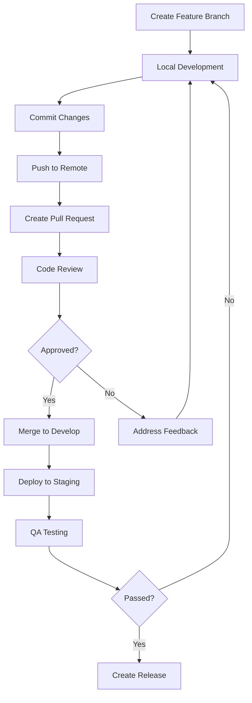
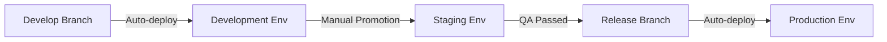
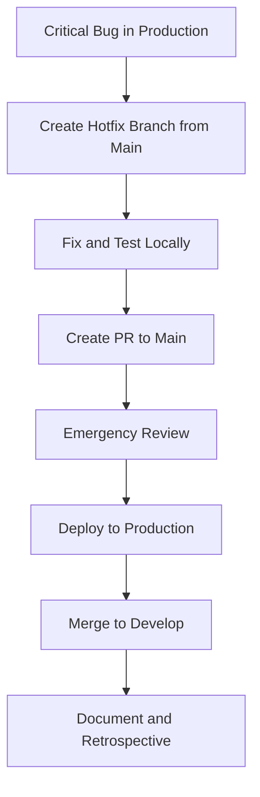

## Creating File: `.opencode/context/core/workflows/01-development.md`

```markdown
# Development Workflow
**Document ID:** CORE-WORK-01
**Version:** 1.0
**Last Updated:** 2026-03-03
**Owner:** Tech Lead

## Purpose

This document defines the development workflow for the Hospital Queuing System. Following this workflow ensures consistent, high-quality code delivery and efficient collaboration across the team.

## 1. Development Principles

### 1.1 Core Tenets
- **Main Branch Stability**: `main` is always deployable
- **Feature Branching**: All work done in branches
- **Continuous Integration**: Merge often, test always
- **Code Reviews**: Every change is reviewed
- **Documentation**: Changes are documented

### 1.2 Branch Strategy

```
main (production)
├── staging (pre-production)
├── develop (integration branch)
│   ├── feature/queue-management
│   ├── feature/patient-portal
│   ├── bugfix/password-reset
│   ├── hotfix/security-issue (from main)
│   └── release/v1.0.0
```

| Branch | Purpose | Base Branch | Deployed To | Protection |
|--------|---------|-------------|-------------|------------|
| `main` | Production code | - | Production | 🔒 Protected |
| `staging` | Pre-release validation | `main` | Staging | 🔒 Protected |
| `develop` | Integration | `main` | Development | 🔒 Protected |
| `feature/*` | New features | `develop` | - | - |
| `bugfix/*` | Bug fixes | `develop` | - | - |
| `hotfix/*` | Urgent production fixes | `main` | - | - |
| `release/*` | Release preparation | `develop` | - | - |

### 1.3 Branch Naming Convention

```bash
# Format: <type>/<description>-<ticket-number>
# Types: feature, bugfix, hotfix, release, docs, chore

# Examples
git checkout -b feature/patient-queue-MD-123
git checkout -b bugfix/password-reset-MD-456
git checkout -b hotfix/security-vulnerability-MD-789
git checkout -b release/v1.2.0
git checkout -b docs/api-documentation
git checkout -b chore/update-dependencies
```

## 2. Local Development Setup

### 2.1 Initial Setup

```bash
# 1. Clone repository
git clone git@github.com:limuru-hospital/queuing-system.git
cd queuing-system

# 2. Install dependencies
npm install

# 3. Set up environment variables
cp .env.example .env.local

# 4. Set up pre-commit hooks
npx husky install

# 5. Start development server
npm run dev

# 6. Run tests
npm test
```

### 2.2 Environment Configuration

```bash
# .env.local - Local development
NODE_ENV=development
NEXT_PUBLIC_API_URL=http://localhost:8787
DATABASE_URL=file:./local.db
JWT_SECRET=local-development-secret
CLOUDFLARE_ACCOUNT_ID=your-account-id

# .env.staging - Staging environment
NODE_ENV=staging
NEXT_PUBLIC_API_URL=https://staging-api.limuruhospital.co.ke

# .env.production - Production environment
NODE_ENV=production
NEXT_PUBLIC_API_URL=https://api.limuruhospital.co.ke
```

### 2.3 Git Hooks

```bash
# .husky/pre-commit
#!/bin/sh
. "$(dirname "$0")/_/husky.sh"

# Run linting
npm run lint

# Run type checking
npm run type-check

# Run tests related to staged files
npm run test:staged

# Check for security issues
npm run security:audit

# .husky/pre-push
#!/bin/sh
. "$(dirname "$0")/_/husky.sh"

# Run all tests
npm test

# Check build
npm run build
```

## 3. Feature Development Workflow

### 3.1 Feature Lifecycle



### 3.2 Daily Development Routine

```bash
# Start of day - sync with develop
git checkout develop
git pull origin develop
git checkout -b feature/my-feature

# During development - commit regularly
git add .
git commit -m "feat: add queue position calculation"

# End of day - push and create draft PR
git push origin feature/my-feature
# Create draft PR on GitHub
```

### 3.3 Commit Message Standards

```bash
# Format: <type>(<scope>): <description>

# Examples
feat(queue): add emergency priority override
fix(auth): resolve password reset token expiration
docs(api): update endpoint documentation
style(components): format according to new standards
refactor(utils): simplify wait time calculation
test(patient): add unit tests for dashboard
chore(deps): update next.js to version 14

# Breaking changes
feat(api)!: change queue response format

# With issue reference
fix(patient): correct DOB validation (Fixes #123)
```

### 3.4 Keeping Branch Updated

```bash
# Method 1: Rebase (preferred for feature branches)
git checkout feature/my-feature
git fetch origin develop
git rebase origin/develop
git push --force-with-lease

# Method 2: Merge (for shared branches)
git checkout feature/my-feature
git merge origin/develop
git push

# Resolve conflicts if any
git add .
git rebase --continue
# or
git merge --continue
```

## 4. Code Review Process

### 4.1 Pull Request Template

```markdown
# Pull Request: [Feature/Bugfix] Description

## Description
<!-- Brief description of changes -->

## Related Issues
<!-- Link to related issues: Fixes #123, MD-456 -->

## Type of Change
- [ ] Feature (non-breaking)
- [ ] Bug fix (non-breaking)
- [ ] Breaking change
- [ ] Documentation update

## Testing Performed
- [ ] Unit tests added/passed
- [ ] Integration tests added/passed
- [ ] Manual testing completed

## Screenshots
<!-- If UI changes -->

## Checklist
- [ ] Code follows style guidelines
- [ ] Self-review completed
- [ ] Documentation updated
- [ ] No new warnings introduced
- [ ] Tests added for new functionality

## Deployment Notes
<!-- Any special deployment considerations -->
```

### 4.2 PR Size Guidelines

| Size | Lines Changed | Review Time | Action |
|------|--------------|-------------|--------|
| 🟢 Small | < 100 | < 30 min | Normal review |
| 🟡 Medium | 100-300 | 1-2 hours | Consider splitting |
| 🔴 Large | 300-500 | 2-4 hours | Strongly consider splitting |
| ⚫ Huge | > 500 | > 4 hours | Must split |

### 4.3 Review Checklist

**For Author:**
- [ ] PR description clearly explains changes
- [ ] All tests pass
- [ ] No merge conflicts
- [ ] Documentation updated
- [ ] Self-review completed

**For Reviewer:**
- [ ] Code follows standards
- [ ] Tests cover changes
- [ ] No security issues
- [ ] Performance considered
- [ ] Edge cases handled

### 4.4 Review Response Times

| Priority | Response Time | Merge Time |
|----------|--------------|------------|
| 🔥 Critical | < 2 hours | < 4 hours |
| ⚡ High | < 1 day | < 2 days |
| 📍 Medium | < 2 days | < 3 days |
| 🎯 Low | < 3 days | < 1 week |

## 5. Testing Workflow

### 5.1 Test Types and Timing

```bash
# During development
npm run test:watch              # Watch mode for TDD
npm run test:file path/to/file   # Test specific file

# Before commit
npm run test:staged              # Test staged files only
npm run lint                     # Lint code
npm run type-check               # TypeScript check

# Before push
npm test                          # All tests
npm run test:integration          # Integration tests
npm run build                     # Build check

# CI pipeline
npm run test:ci                    # All tests with coverage
npm run test:e2e                    # E2E tests
npm run test:accessibility          # a11y tests
```

### 5.2 Test Naming Conventions

```typescript
// Unit tests: [function].test.ts
// queue-service.test.ts

describe('QueueService', () => {
  describe('callNextPatient', () => {
    it('should return next patient in FIFO order', () => {});
    it('should throw error when queue empty', () => {});
    it('should update patient status to called', () => {});
  });
});

// Integration tests: [feature].int.test.ts
// queue-api.int.test.ts

// E2E tests: [feature].e2e.ts
// patient-journey.e2e.ts
```

## 6. Deployment Workflow

### 6.1 Environment Pipeline



### 6.2 Deployment Commands

```bash
# Deploy to development (auto)
git push origin develop
# GitHub Actions deploys to dev env

# Deploy to staging
# Create release branch
git checkout develop
git checkout -b release/v1.2.0
git push origin release/v1.2.0
# Create PR to main
# After merge, deploy to staging

# Deploy to production
# Tag release
git checkout main
git pull origin main
git tag -a v1.2.0 -m "Release v1.2.0"
git push origin v1.2.0
# GitHub Actions deploys to production
```

### 6.3 Rollback Procedure

```bash
# Immediate rollback (if issue detected)
git checkout v1.1.0  # Previous stable tag
npm run build
npm run deploy:prod

# Git revert (if time allows)
git revert HEAD~1
git push origin main

# Database rollback
npm run db:rollback
```

## 7. Hotfix Workflow

### 7.1 Emergency Fix Process



### 7.2 Hotfix Commands

```bash
# 1. Create hotfix branch
git checkout main
git pull origin main
git checkout -b hotfix/security-patch-MD-789

# 2. Fix and test
# Make changes
git add .
git commit -m "hotfix: patch security vulnerability"

# 3. Create PR to main
git push origin hotfix/security-patch-MD-789
# Create PR with [HOTFIX] tag

# 4. After approval and merge, sync with develop
git checkout develop
git pull origin develop
git merge --no-ff main
git push origin develop
```

## 8. Documentation Workflow

### 8.1 Documentation Types and Updates

| Documentation | Updated When | Location |
|--------------|--------------|----------|
| **README** | Major changes | `/README.md` |
| **API Docs** | API changes | `/docs/10-api/` |
| **User Guides** | Feature changes | `/docs/12-user-guides/` |
| **Architecture** | System changes | `/docs/02-architecture/` |
| **Code Comments** | During development | In code |
| **Changelog** | Each release | `/CHANGELOG.md` |

### 8.2 Changelog Format

```markdown
# Changelog

## [1.2.0] - 2026-03-03

### Added
- Patient portal with queue status tracking (#123)
- Email-based password reset flow (#124)
- IPTV channel switching from admin panel (#125)

### Changed
- Improved wait time calculation algorithm (#126)
- Updated dashboard layout for mobile devices (#127)

### Fixed
- Password reset token expiration issue (#128)
- Queue position calculation for priority patients (#129)

### Security
- Patched XSS vulnerability in patient notes (#130)

## [1.1.0] - 2026-02-15

### Added
- Multi-department queue support
- Doctor notes feature
```

## 9. Release Workflow

### 9.1 Release Checklist

```markdown
# Release v1.2.0 Checklist

## Pre-Release (1 week before)
- [ ] Feature freeze declared
- [ ] All planned features merged to develop
- [ ] Release branch created (`release/v1.2.0`)

## Testing (3 days before)
- [ ] Regression testing completed
- [ ] Performance testing completed
- [ ] Security scan passed
- [ ] Accessibility audit passed

## Documentation (2 days before)
- [ ] Changelog updated
- [ ] API documentation updated
- [ ] User guides reviewed
- [ ] Release notes prepared

## Deployment (Release day)
- [ ] Staging deployment verified
- [ ] Database migrations tested
- [ ] Backup completed
- [ ] Production deployment
- [ ] Smoke tests passed

## Post-Release
- [ ] Version tag created
- [ ] Release announced to stakeholders
- [ ] Retrospective scheduled
- [ ] Develop branch updated
```

### 9.2 Release Commands

```bash
# 1. Create release branch
git checkout develop
git checkout -b release/v1.2.0

# 2. Update version
npm version 1.2.0
git add package.json package-lock.json
git commit -m "chore: bump version to 1.2.0"

# 3. Update changelog
# Edit CHANGELOG.md
git add CHANGELOG.md
git commit -m "docs: update changelog for v1.2.0"

# 4. Push and create PR to main
git push origin release/v1.2.0

# 5. After merge, tag release
git checkout main
git pull origin main
git tag -a v1.2.0 -m "Release v1.2.0"
git push origin v1.2.0

# 6. Merge back to develop
git checkout develop
git merge --no-ff main
git push origin develop
```

## 10. Troubleshooting Common Issues

### 10.1 Merge Conflicts

```bash
# When you get merge conflicts
git status  # See conflicted files
# Resolve conflicts in your editor
git add <resolved-files>
git commit -m "merge: resolve conflicts"

# If you mess up during conflict resolution
git merge --abort  # Go back to before merge
```

### 10.2 Lost Changes

```bash
# Find lost commits
git reflog  # Show all HEAD movements
git checkout <hash>  # Go to specific commit

# Recover deleted branch
git reflog
git checkout -b recovered-branch <hash>
```

### 10.3 Undo Commits

```bash
# Undo last commit but keep changes
git reset --soft HEAD~1

# Undo last commit and discard changes
git reset --hard HEAD~1

# Undo multiple commits
git reset --hard HEAD~3

# Revert a commit (safe for shared branches)
git revert <commit-hash>
```

## 11. Team Communication

### 11.1 Daily Standup Template

```markdown
## Daily Standup - [Date]

### What I did yesterday
- [ ] Task 1 (PR #123)
- [ ] Task 2

### What I'll do today
- [ ] Task 3
- [ ] Task 4

### Blockers
- [ ] Need review on PR #123
- [ ] Waiting for design assets
```

### 11.2 Code Review Comments

```markdown
<!-- Positive feedback -->
Great approach on using the new caching strategy!

<!-- Constructive feedback -->
Consider using a more descriptive variable name here.

<!-- Questions -->
Why did you choose this algorithm over the alternative?

<!-- Suggestions -->
We could extract this logic into a reusable hook.
```

### 11.3 Blameless Post-Mortem

```markdown
# Incident Post-Mortem: [Date]

## Summary
- **Incident ID**: INC-2026-03-03
- **Duration**: 2 hours
- **Impact**: Queue updates delayed for 15 minutes
- **Severity**: Medium

## Timeline
- 10:00 - Issue detected (monitoring alert)
- 10:05 - Investigation started
- 10:30 - Root cause identified
- 11:00 - Fix deployed
- 12:00 - All systems normal

## Root Cause
Database connection pool exhausted due to missing release calls.

## Resolution
Added proper connection release in queue service.

## Prevention
- Added connection pool monitoring
- Updated code review checklist
- Added integration test for connection handling

## Action Items
- [ ] Add connection pool metrics (Owner: @tech-lead, Due: 03-10)
- [ ] Update documentation (Owner: @dev, Due: 03-07)
```

## 12. Development Metrics

### 12.1 Key Performance Indicators

| Metric | Target | Measurement |
|--------|--------|-------------|
| **Cycle Time** | < 3 days | PR open to merge |
| **Lead Time** | < 5 days | Idea to production |
| **Deployment Frequency** | Daily | Deploys per week |
| **Change Failure Rate** | < 5% | Failed deployments |
| **Mean Time to Recover** | < 1 hour | Time to fix |

### 12.2 Velocity Tracking

```javascript
// scripts/track-velocity.js
// Run weekly to track team velocity
const velocity = {
  week: '2026-W09',
  completedPoints: 42,
  deployedFeatures: 5,
  bugsFixed: 8,
  prsMerged: 15,
  avgReviewTime: '4.2 hours'
};
```

---

## Version History

| Version | Date | Author | Changes |
|---------|------|--------|---------|
| 1.0 | 2026-03-03 | System | Initial version |

**Review Date:** 2026-06-03
```

**File created successfully: `.opencode/context/core/workflows/01-development.md`**

Please confirm if I should proceed with the next file: `.opencode/context/core/workflows/02-review.md`
