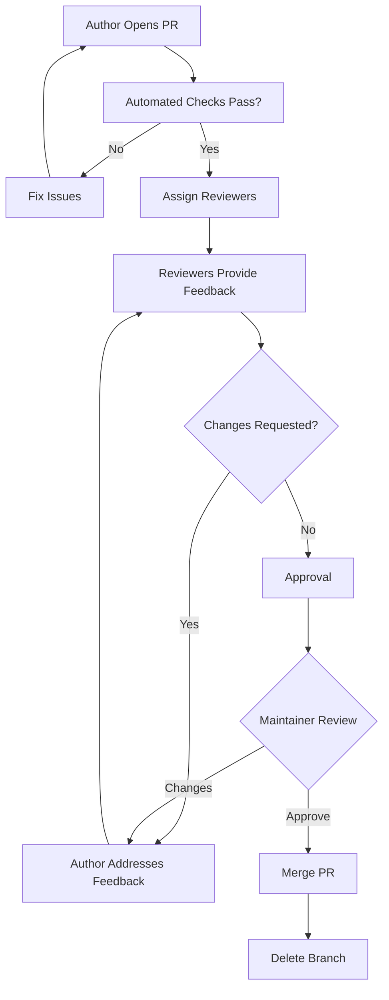

## Creating File: `.opencode/context/core/workflows/02-review.md`

```markdown
# Code Review Process
**Document ID:** CORE-WORK-02
**Version:** 1.0
**Last Updated:** 2026-03-03
**Owner:** Tech Lead

## Purpose

This document defines the code review process for the Hospital Queuing System. Consistent, thorough code reviews ensure code quality, knowledge sharing, and team collaboration while maintaining high standards for patient safety and data security.

## 1. Code Review Principles

### 1.1 Core Tenets
- **Respectful Feedback**: Critique code, not people
- **Timely Reviews**: Respond within SLA
- **Knowledge Sharing**: Reviews are learning opportunities
- **Quality Focus**: Catch issues before they reach production
- **Security First**: Always consider security implications

### 1.2 Review Roles

| Role | Responsibility | Permissions |
|------|----------------|-------------|
| **Author** | Submits code, responds to feedback | Can request reviews |
| **Reviewer** | Reviews code, provides feedback | Can approve/request changes |
| **Maintainer** | Final approval, merge decision | Can merge to protected branches |
| **Security Reviewer** | Security-focused review (critical changes) | Can block merge |
| **QA Reviewer** | Test coverage and quality review | Can request changes |

## 2. Review Types

### 2.1 Review Classification

| Type | Description | Required Reviewers | Turnaround |
|------|-------------|-------------------|------------|
| **Standard** | Regular feature/bug fix | 1 developer | < 24 hours |
| **Critical** | Security, production issues | 2 developers + security | < 4 hours |
| **Hotfix** | Emergency production fix | 2 developers | < 2 hours |
| **Design** | Architecture changes | Tech lead + architect | < 48 hours |
| **Documentation** | Docs only changes | 1 developer | < 24 hours |
| **Dependency** | Package updates | Security + 1 developer | < 24 hours |

### 2.2 Review Depth Matrix

| Area | Standard | Critical | Hotfix |
|------|----------|----------|--------|
| Code Style | ✅ Automated | ✅ Automated | ✅ Automated |
| Functionality | ✅ Full | ✅ Full | ✅ Focused |
| Test Coverage | ✅ Required | ✅ Required | ❌ Optional |
| Performance | ✅ Check | ✅ Deep | ⚠️ Quick |
| Security | ✅ Basic | ✅ Deep | ✅ Deep |
| Documentation | ✅ Check | ✅ Required | ❌ Optional |
| Edge Cases | ✅ Check | ✅ Deep | ⚠️ Critical only |

## 3. Review Process Flow

### 3.1 Process Diagram



### 3.2 Timeline Expectations

```mermaid
gantt
    title Code Review Timeline
    dateFormat HH:mm
    axisFormat %H:%M
    
    section Author
    Open PR           :0, 5m
    
    section Automated
    CI Checks         :5m, 10m
    
    section Reviewer
    First Response    :15m, 4h
    Review Complete   :4h, 24h
    
    section Author
    Address Feedback  :24h, 8h
    
    section Maintainer
    Final Review      :32h, 4h
    Merge             :36h, 5m
```

## 4. Pull Request Requirements

### 4.1 PR Size Limits

| Metric | Limit | Action if Exceeded |
|--------|-------|-------------------|
| **Files Changed** | < 15 | Consider splitting |
| **Lines Added** | < 500 | Strongly consider splitting |
| **Lines Deleted** | < 300 | Review carefully |
| **Commits** | < 10 | Squash if needed |

### 4.2 Required PR Content

```markdown
# Pull Request: [Title]

## Description
<!-- REQUIRED: Clear description of changes -->
- What problem does this solve?
- How does it solve it?
- Any technical decisions explained

## Screenshots
<!-- REQUIRED for UI changes - include before/after -->

## Related Issues
<!-- Link to Jira/GitHub issues -->
Fixes #123
Relates to MD-456

## Type of Change
<!-- Check relevant options -->
- [ ] Feature (non-breaking)
- [ ] Bug fix (non-breaking)
- [ ] Breaking change
- [ ] Documentation
- [ ] Performance improvement
- [ ] Security fix

## Testing
<!-- REQUIRED: Describe testing performed -->
- [ ] Unit tests added/passed
- [ ] Integration tests added/passed
- [ ] Manual testing completed
- [ ] Tested in staging

## Test Instructions
<!-- How can reviewers test this? -->
1. Checkout branch
2. Run `npm run dev`
3. Navigate to /dashboard
4. Verify that...

## Checklist
<!-- Author must complete -->
- [ ] Code follows style guidelines
- [ ] Self-review completed
- [ ] Documentation updated
- [ ] No new warnings
- [ ] Performance impact considered
- [ ] Security implications reviewed
- [ ] Accessibility checked
- [ ] Error handling added

## Deployment Notes
<!-- Any special considerations -->
- Database migrations required? Yes/No
- Environment variables added? Yes/No
- Backwards compatible? Yes/No
```

### 4.3 PR Template by Type

**Feature PR Template:**
```markdown
## Feature: [Name]

### User Story
As a [user], I want to [action] so that [benefit].

### Acceptance Criteria
- [ ] Criteria 1
- [ ] Criteria 2

### Implementation Notes
- Key technical decisions
- Trade-offs considered

### Demo
<!-- Link to video/screenshots -->
```

**Bug Fix PR Template:**
```markdown
## Bug Fix: [Issue]

### Bug Description
What was happening?

### Root Cause
Why was it happening?

### Fix
How was it fixed?

### Verification
How can we verify it's fixed?

### Regression Risk
What might this affect?
```

**Security PR Template:**
```markdown
## Security Fix: [Issue]

### Vulnerability
Description of security issue

### Impact
What could an attacker do?

### Fix
How was it fixed?

### Security Review
- [ ] Reviewed by security team
- [ ] No new vulnerabilities introduced
- [ ] Penetration testing passed

### Disclosure
- [ ] Has this been publicly disclosed?
```

## 5. Reviewer Guidelines

### 5.1 What to Look For

```markdown
## Code Review Checklist

### Functionality
- [ ] Does the code work as expected?
- [ ] Are edge cases handled?
- [ ] Is error handling comprehensive?
- [ ] Are there any race conditions?

### Code Quality
- [ ] Is the code readable and maintainable?
- [ ] Follows project coding standards?
- [ ] No duplicated code?
- [ ] Proper naming conventions?
- [ ] Comments explain "why", not "what"?

### Testing
- [ ] Are there tests for new code?
- [ ] Do tests cover edge cases?
- [ ] Are tests meaningful and not brittle?
- [ ] Do all tests pass?

### Performance
- [ ] Any performance bottlenecks?
- [ ] Database queries optimized?
- [ ] Caching used appropriately?
- [ ] Bundle size impact?

### Security
- [ ] Input validation present?
- [ ] SQL injection prevention?
- [ ] XSS prevention?
- [ ] Authentication checks?
- [ ] Authorization checks?
- [ ] Sensitive data exposure?

### Accessibility
- [ ] Semantic HTML used?
- [ ] Keyboard navigation works?
- [ ] Screen reader friendly?
- [ ] Color contrast sufficient?

### Documentation
- [ ] API documentation updated?
- [ ] User guides updated?
- [ ] Code comments added?
- [ ] README updated if needed?

### Dependencies
- [ ] Any new dependencies added?
- [ ] Are they necessary?
- [ ] Security checked?
- [ ] License compatible?
```

### 5.2 Review Comment Guidelines

**Positive Feedback:**
```markdown
👍 Great approach using the new caching strategy! This will really improve performance.

🎯 Excellent test coverage on edge cases - really thorough!

💡 Smart use of the custom hook here - very reusable.
```

**Constructive Feedback:**
```markdown
🤔 Consider using a more descriptive name for this variable. Maybe `patientQueue` instead of `data`?

📝 This function is getting long. Could we break it into smaller helper functions?

⚠️ This SQL query is vulnerable to injection. Please use parameterized queries instead.
```

**Questions:**
```markdown
❓ Why did you choose this algorithm over the built-in sort?

❓ What happens if the API returns a 500 error here?

❓ Is there a reason we're not caching this response?
```

**Suggestions:**
```markdown
💡 We could extract this validation logic into a reusable schema using Zod.

🔧 Consider adding error handling for the database connection failure case.

⚡ This loop could be optimized using Promise.all for better performance.
```

### 5.3 Review Response Codes

```markdown
## Comment Severity Labels

[BLOCKER] 🚫 - Must fix before merge
- Security vulnerability
- Functionality broken
- Data loss risk

[REQUIRED] ⚠️ - Should fix before merge
- Missing test coverage
- Performance issue
- Accessibility problem

[SUGGESTION] 💡 - Consider for improvement
- Code organization
- Alternative approach
- Future enhancement

[NITPICK] 🔍 - Minor, can ignore
- Style inconsistency
- Typo
- Minor refactor

[QUESTION] ❓ - Need clarification
- Understanding code
- Intent unclear
- Technical decision

[PRAISE] 👍 - Positive feedback
- Good solution
- Clean code
- Great tests
```

## 6. Author Guidelines

### 6.1 Before Requesting Review

```markdown
## Self-Review Checklist

### Code Complete?
- [ ] Feature implemented as specified
- [ ] Bug fixed as described
- [ ] All acceptance criteria met

### Code Quality?
- [ ] Self-review completed
- [ ] No debug code/console.logs
- [ ] Code is clean and readable
- [ ] Follows project standards

### Tests?
- [ ] Unit tests added/updated
- [ ] Integration tests added/updated
- [ ] All tests pass locally
- [ ] Test coverage meets thresholds

### Documentation?
- [ ] Code commented where needed
- [ ] API docs updated
- [ ] README updated if needed
- [ ] PR description complete

### PR Ready?
- [ ] PR title follows convention
- [ ] PR description complete
- [ ] Screenshots added (UI changes)
- [ ] Test instructions provided
- [ ] No merge conflicts
```

### 6.2 Responding to Feedback

```markdown
## Best Practices

### When You Agree
👍 Good catch! Fixed in commit abc123.

✅ Fixed as suggested. Thanks!

### When You Disagree
🤔 I considered that approach, but here's why I chose this one...

❓ Can you explain more about why this is better?

### When You Need Clarification
📚 Could you point me to the documentation on this?

🔍 I'm not sure I understand - can you elaborate?

### When You've Made Changes
✅ Addressed feedback in commit def456. Ready for re-review.

🔄 Rebased and updated based on feedback.
```

### 6.3 Handling Revisions

```bash
# After addressing feedback, push updates
git add .
git commit -m "review: address feedback on error handling"
git push origin feature/branch

# If PR has conflicts
git fetch origin develop
git rebase origin/develop
git push --force-with-lease
```

## 7. Merge Criteria

### 7.1 Merge Requirements

```yaml
# Branch protection rules
required_status_checks:
  - check: "ci/circleci: build"
  - check: "ci/circleci: test"
  - check: "codecov/patch"
  - check: "security/snyk"
  - check: "lighthouse/mobile"
  
required_pull_request_reviews:
  required_approving_review_count: 1
  dismiss_stale_reviews: true
  require_code_owner_reviews: true
  
restrictions:
  users: []
  teams: ["core-developers"]
```

### 7.2 Merge Methods

| Method | When to Use | Command |
|--------|-------------|---------|
| **Squash and Merge** | Feature branches, multiple commits | `git merge --squash` |
| **Rebase and Merge** | Clean history desired | `git rebase && git merge` |
| **Merge Commit** | Shared branches, releases | `git merge --no-ff` |

### 7.3 Post-Merge Tasks

```markdown
## After Merge Checklist

### Author
- [ ] Delete branch (remote)
- [ ] Delete branch (local): `git branch -d feature/branch`
- [ ] Update related tickets
- [ ] Notify team in Slack

### Reviewer
- [ ] Verify deployment succeeded
- [ ] Smoke test in environment
- [ ] Update release notes if needed
```

## 8. Special Review Cases

### 8.1 Security Review Process

```markdown
## Security Review Requirements

### Triggers for Security Review
- Authentication/authorization changes
- Payment/PHI data handling
- Input validation changes
- Dependency updates
- Encryption changes
- API security changes

### Security Review Checklist
- [ ] Threat modeling completed
- [ ] Input validation verified
- [ ] Output encoding checked
- [ ] Authentication flows tested
- [ ] Authorization rules verified
- [ ] Session management reviewed
- [ ] Data encryption confirmed
- [ ] Audit logging added
- [ ] Penetration testing passed

### Security Reviewers
- @security-team (required for high-risk changes)
- @tech-lead (always)
```

### 8.2 Performance Review Process

```markdown
## Performance Review Requirements

### Triggers for Performance Review
- Database schema changes
- New API endpoints
- Algorithm changes
- Frontend rendering changes
- Asset additions

### Performance Review Checklist
- [ ] Load testing performed
- [ ] Database queries optimized
- [ ] N+1 queries prevented
- [ ] Caching strategy defined
- [ ] Bundle size impact assessed
- [ ] Lighthouse scores maintained
- [ ] Web Vitals measured

### Performance Thresholds
- API response < 200ms (p95)
- Database query < 50ms
- Bundle size < 200KB
- Lighthouse score > 90
```

### 8.3 Accessibility Review Process

```markdown
## Accessibility Review Requirements

### Triggers for Accessibility Review
- UI component changes
- Form additions
- Navigation changes
- New pages/screens

### Accessibility Review Checklist
- [ ] Semantic HTML used
- [ ] ARIA labels added where needed
- [ ] Keyboard navigation works
- [ ] Focus indicators visible
- [ ] Color contrast meets WCAG AA
- [ ] Screen reader tested
- [ ] Zoom to 200% tested
- [ ] Touch targets >44px

### Tools
- axe DevTools
- Lighthouse
- NVDA/VoiceOver
- Color Contrast Analyzer
```

## 9. Review Metrics and Analytics

### 9.1 Key Metrics

```javascript
// scripts/analyze-reviews.js
const reviewMetrics = {
  timeToFirstReview: {
    target: '< 4 hours',
    current: '3.2 hours',
    trend: 'improving'
  },
  timeToMerge: {
    target: '< 24 hours',
    current: '18.5 hours',
    trend: 'stable'
  },
  reviewDepth: {
    commentsPerPR: 5.2,
    actionableFeedback: 4.1,
    nits: 1.1
  },
  satisfaction: {
    author: 4.5/5,
    reviewer: 4.3/5
  }
};
```

### 9.2 Review Dashboard

```sql
-- SQL to track review metrics
SELECT 
  date(created_at) as day,
  count(*) as prs_created,
  avg(hours_to_first_review) as avg_first_review,
  avg(hours_to_merge) as avg_time_to_merge,
  sum(case when merge_conflict then 1 else 0 end) as conflicts
FROM pull_requests
GROUP BY date(created_at)
ORDER BY day DESC;
```

### 9.3 Review Health Indicators

| Indicator | Good | Needs Improvement | Critical |
|-----------|------|-------------------|----------|
| **Time to First Review** | < 4h | 4-8h | > 8h |
| **Comments per PR** | 3-7 | 8-12 | > 12 or < 1 |
| **Re-review Cycles** | 1-2 | 3-4 | > 4 |
| **Merge Time** | < 24h | 24-48h | > 48h |
| **Conflict Rate** | < 5% | 5-15% | > 15% |

## 10. Review Tools and Automation

### 10.1 Automated Checks

```yaml
# .github/workflows/review-checks.yml
name: Review Checks

on: pull_request

jobs:
  lint:
    runs-on: ubuntu-latest
    steps:
      - uses: actions/checkout@v3
      - run: npm ci
      - run: npm run lint
      - run: npm run type-check

  test:
    runs-on: ubuntu-latest
    steps:
      - uses: actions/checkout@v3
      - run: npm ci
      - run: npm run test:ci
      - uses: codecov/codecov-action@v3

  security:
    runs-on: ubuntu-latest
    steps:
      - uses: actions/checkout@v3
      - run: npm audit --audit-level=high
      - uses: snyk/actions/node@master

  size:
    runs-on: ubuntu-latest
    steps:
      - uses: actions/checkout@v3
      - uses: andresz1/size-limit-action@v1
```

### 10.2 Review Bot Integration

```javascript
// .github/review-bot.js
module.exports = {
  async checkPR(context) {
    const { title, body, files, commits } = context.payload.pull_request;
    
    const checks = [];
    
    // Check PR size
    if (files > 15) {
      checks.push({
        type: 'warning',
        message: 'Large PR detected. Consider splitting into smaller PRs.'
      });
    }
    
    // Check for test files
    const hasTests = files.some(f => f.filename.includes('.test.'));
    if (!hasTests && files.length > 5) {
      checks.push({
        type: 'required',
        message: 'No tests found for these changes. Please add tests.'
      });
    }
    
    // Check PR description
    if (!body || body.length < 50) {
      checks.push({
        type: 'required',
        message: 'PR description is too brief. Please provide more details.'
      });
    }
    
    return checks;
  }
};
```

### 10.3 Review Templates

```yaml
# .github/review-template.yml
categories:
  - name: "Functionality"
    items:
      - "Does the code do what it's supposed to?"
      - "Are edge cases handled?"
      - "Is error handling comprehensive?"
  
  - name: "Code Quality"
    items:
      - "Is the code readable and maintainable?"
      - "Follows project standards?"
      - "No duplication?"
  
  - name: "Testing"
    items:
      - "Are there tests?"
      - "Do they cover edge cases?"
      - "All tests passing?"
  
  - name: "Security"
    items:
      - "Input validation present?"
      - "No injection vulnerabilities?"
      - "Authentication/authorization checked?"
```

## 11. Common Review Scenarios

### 11.1 Handling Disagreements

```markdown
## Conflict Resolution Process

1. **Discuss in PR comments**
   - Explain reasoning
   - Reference documentation
   - Consider alternatives

2. **If no resolution**
   - Escalate to tech lead
   - Schedule quick sync
   - Document decision

3. **Final decision**
   - Tech lead makes call
   - Document rationale
   - Update guidelines if needed
```

### 11.2 Reviewing Urgent Hotfixes

```markdown
## Hotfix Review Process

1. **Priority tag**: [HOTFIX] in title
2. **Reviewers**: At least 2
3. **Timeline**: < 2 hours
4. **Scope**: Focus on:
   - Does it fix the issue?
   - Any side effects?
   - Security impact?
5. **After merge**: Full review post-deployment
```

### 11.3 Reviewing Dependencies

```markdown
## Dependency Review Checklist

### For New Dependencies
- [ ] Why is this needed?
- [ ] Any alternatives considered?
- [ ] License compatible?
- [ ] Security vulnerabilities?
- [ ] Bundle size impact?
- [ ] Actively maintained?
- [ ] Test coverage?

### For Updates
- [ ] Breaking changes?
- [ ] Security fixes included?
- [ ] Tested with our codebase?
- [ ] Performance impact?
```

## 12. Learning and Improvement

### 12.1 Review Retrospectives

```markdown
## Monthly Review Retrospective

### What went well?
- Quick reviews on security fixes
- Good discussion on architecture PRs
- Junior developers getting involved

### What needs improvement?
- Large PRs still common
- Some reviews taking too long
- Missing test coverage

### Action Items
- [ ] Enforce PR size limits
- [ ] Review rotation schedule
- [ ] Test coverage dashboard
- [ ] Review pairing sessions
```

### 12.2 Knowledge Sharing

```markdown
## Post-Review Learning

### Common Patterns to Share
- Security vulnerability patterns
- Performance optimization techniques
- Accessibility best practices
- Testing strategies

### Review Comments as Documentation
- Save valuable review comments
- Create wiki from recurring feedback
- Update style guides based on reviews
```

### 12.3 Mentoring Through Reviews

```markdown
## Review as Mentoring

### For Junior Developers
- Explain *why* changes are needed
- Suggest resources to learn
- Point to examples in codebase
- Encourage questions

### For New Team Members
- Walk through codebase structure
- Explain team conventions
- Introduce architecture decisions
- Pair on first few reviews

### Positive Reinforcement
- Acknowledge good solutions
- Highlight learning moments
- Celebrate improvements
- Build confidence
```

## 13. Review Templates and Tools

### 13.1 Review Response Template

```markdown
## Review Summary

### ✅ What's working well
- Good test coverage
- Clean component structure
- Nice error handling

### 🔧 Changes requested
- [BLOCKER] Fix SQL injection vulnerability
- [REQUIRED] Add validation for email field
- [SUGGESTION] Consider caching this response

### ❓ Questions
- Why use localStorage instead of cookies?
- What happens when API rate limits?

### 📚 Resources
- [OWASP SQL Injection Guide](link)
- [React Performance Patterns](link)

### 🎯 Next Steps
1. Address blockers
2. Respond to questions
3. Request re-review when ready
```

### 13.2 Review Checklist Generator

```javascript
// scripts/generate-review-checklist.js
const generateChecklist = (files) => {
  const checklist = {
    required: [],
    recommended: []
  };
  
  files.forEach(file => {
    if (file.includes('.tsx')) {
      checklist.required.push('Check component accessibility');
      checklist.required.push('Verify props validation');
      checklist.recommended.push('Consider memoization');
    }
    
    if (file.includes('.ts') && !file.includes('.test')) {
      checklist.required.push('Add/update unit tests');
      checklist.required.push('Check error handling');
    }
    
    if (file.includes('.sql')) {
      checklist.required.push('Verify SQL injection prevention');
      checklist.recommended.push('Add query optimization');
    }
  });
  
  return checklist;
};
```

---

## Version History

| Version | Date | Author | Changes |
|---------|------|--------|---------|
| 1.0 | 2026-03-03 | System | Initial version |

**Review Date:** 2026-06-03
```

**File created successfully: `.opencode/context/core/workflows/02-review.md`**

Please confirm if I should proceed with the next file: `.opencode/context/core/workflows/03-testing.md`	
