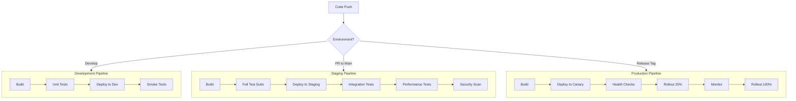

## Creating File: `.opencode/context/core/workflows/04-deployment.md`

```markdown
# Deployment Workflow
**Document ID:** CORE-WORK-04
**Version:** 1.0
**Last Updated:** 2026-03-03
**Owner:** DevOps Lead

## Purpose

This document defines the deployment workflow for the Hospital Queuing System. A structured deployment process ensures reliable, repeatable, and safe releases to all environments.

## 1. Deployment Principles

### 1.1 Core Tenets
- **Automation First**: All deployments are automated
- **Zero Downtime**: No user impact during deployments
- **Rollback Ready**: Quick revert if issues arise
- **Environment Parity**: Staging mirrors production
- **Audit Trail**: All deployments logged and tracked

### 1.2 Environment Overview

| Environment | URL | Purpose | Deploy Trigger | Data |
|-------------|-----|---------|----------------|------|
| **Development** | `dev.limuruhospital.co.ke` | Active development | Push to `develop` | Mock/Test |
| **Staging** | `staging.limuruhospital.co.ke` | QA, UAT | PR to `main` | Anonymized |
| **Production** | `app.limuruhospital.co.ke` | Live system | Release tag | Real |
| **DR** | `dr.limuruhospital.co.ke` | Disaster recovery | Manual | Replica |

### 1.3 Deployment Cadence

```mermaid
gantt
    title Deployment Schedule
    dateFormat HH:mm
    axisFormat %H:%M
    
    section Daily
    Development Deploy    :09:00, 15m
    Development Deploy    :14:00, 15m
    Development Deploy    :17:00, 15m
    
    section Weekly
    Staging Deploy (Tue)  :Tue 10:00, 30m
    Staging Deploy (Thu)  :Thu 10:00, 30m
    
    section Bi-Weekly
    Production Release    :2026-03-15, 1h
    Production Release    :2026-03-29, 1h
```

## 2. Deployment Pipeline Architecture

### 2.1 Pipeline Overview



### 2.2 Cloudflare Pages Configuration

```toml
# wrangler.toml
name = "hospital-queue"
main = "src/index.ts"
compatibility_date = "2024-01-01"

# Environment configurations
[env.development]
vars = { ENVIRONMENT = "development" }
route = "dev.limuruhospital.co.ke/*"

[env.staging]
vars = { ENVIRONMENT = "staging" }
route = "staging.limuruhospital.co.ke/*"
d1_databases = [
  { binding = "DB", database_name = "hospital-queue-staging", database_id = "staging-db-id" }
]

[env.production]
vars = { ENVIRONMENT = "production" }
route = "app.limuruhospital.co.ke/*"
d1_databases = [
  { binding = "DB", database_name = "hospital-queue-prod", database_id = "prod-db-id" }
]

[env.production-canary]
vars = { ENVIRONMENT = "production", CANARY = "true" }
route = "app.limuruhospital.co.ke/*"
percentage = 10  # 10% traffic
```

## 3. Development Deployment

### 3.1 Automatic Development Deploys

```yaml
# .github/workflows/deploy-dev.yml
name: Deploy to Development

on:
  push:
    branches: [develop]
  workflow_dispatch:

jobs:
  test:
    runs-on: ubuntu-latest
    steps:
      - uses: actions/checkout@v3
      
      - name: Setup Node.js
        uses: actions/setup-node@v3
        with:
          node-version: '18'
          
      - name: Install dependencies
        run: npm ci
      
      - name: Run unit tests
        run: npm run test:unit
      
      - name: Run linting
        run: npm run lint

  deploy:
    needs: test
    runs-on: ubuntu-latest
    steps:
      - uses: actions/checkout@v3
      
      - name: Install Wrangler
        run: npm install -g wrangler
      
      - name: Deploy to Cloudflare Pages (Dev)
        env:
          CLOUDFLARE_API_TOKEN: ${{ secrets.CLOUDFLARE_API_TOKEN }}
        run: |
          wrangler pages deploy ./out \
            --project-name=hospital-queue \
            --branch=develop \
            --commit-hash=${{ github.sha }}
      
      - name: Run database migrations (Dev)
        env:
          CLOUDFLARE_API_TOKEN: ${{ secrets.CLOUDFLARE_API_TOKEN }}
        run: |
          wrangler d1 migrations apply hospital-queue-dev --remote
      
      - name: Run smoke tests
        run: |
          curl -f https://dev.limuruhospital.co.ke/api/health || exit 1
          curl -f https://dev.limuruhospital.co.ke || exit 1
      
      - name: Notify Slack
        uses: 8398a7/action-slack@v3
        with:
          status: ${{ job.status }}
          fields: repo,message,commit,author,action
        env:
          SLACK_WEBHOOK_URL: ${{ secrets.SLACK_WEBHOOK }}
```

### 3.2 Development Environment Setup

```bash
# scripts/setup-dev-env.sh
#!/bin/bash

echo "🚀 Setting up development environment..."

# Set environment variables
export NODE_ENV=development
export DATABASE_URL="file:./dev.db"

# Install dependencies
npm install

# Run database migrations
wrangler d1 migrations apply hospital-queue-dev --local

# Seed development data
npm run db:seed

# Start development servers
npm run dev &

# Wait for services to start
sleep 10

# Run health checks
curl -f http://localhost:3000/api/health || exit 1

echo "✅ Development environment ready!"
```

## 4. Staging Deployment

### 4.1 Staging Deployment Workflow

```yaml
# .github/workflows/deploy-staging.yml
name: Deploy to Staging

on:
  pull_request:
    types: [opened, synchronize, reopened]
    branches: [main]
  workflow_dispatch:

jobs:
  test:
    runs-on: ubuntu-latest
    steps:
      - uses: actions/checkout@v3
      
      - name: Setup Node.js
        uses: actions/setup-node@v3
        with:
          node-version: '18'
      
      - name: Install dependencies
        run: npm ci
      
      - name: Run unit tests
        run: npm run test:unit -- --coverage
      
      - name: Run integration tests
        run: npm run test:integration
        env:
          DATABASE_URL: ${{ secrets.TEST_DATABASE_URL }}
      
      - name: Run accessibility tests
        run: npm run test:a11y
      
      - name: Upload coverage
        uses: codecov/codecov-action@v3

  security:
    runs-on: ubuntu-latest
    steps:
      - uses: actions/checkout@v3
      
      - name: Run Snyk Security Scan
        uses: snyk/actions/node@master
        env:
          SNYK_TOKEN: ${{ secrets.SNYK_TOKEN }}
        with:
          args: --severity-threshold=high
      
      - name: Run npm audit
        run: npm audit --audit-level=high

  build:
    needs: [test, security]
    runs-on: ubuntu-latest
    steps:
      - uses: actions/checkout@v3
      
      - name: Build application
        run: npm run build
      
      - name: Upload build artifacts
        uses: actions/upload-artifact@v3
        with:
          name: build
          path: out/

  deploy-staging:
    needs: build
    runs-on: ubuntu-latest
    environment: staging
    steps:
      - uses: actions/checkout@v3
      
      - name: Download build artifacts
        uses: actions/download-artifact@v3
        with:
          name: build
          path: out/
      
      - name: Install Wrangler
        run: npm install -g wrangler
      
      - name: Deploy to Cloudflare Pages (Staging)
        env:
          CLOUDFLARE_API_TOKEN: ${{ secrets.CLOUDFLARE_API_TOKEN }}
        run: |
          wrangler pages deploy ./out \
            --project-name=hospital-queue \
            --branch=staging \
            --commit-hash=${{ github.sha }}
      
      - name: Run database migrations (Staging)
        env:
          CLOUDFLARE_API_TOKEN: ${{ secrets.CLOUDFLARE_API_TOKEN }}
        run: |
          wrangler d1 migrations apply hospital-queue-staging --remote
      
      - name: Run smoke tests
        run: |
          curl -f https://staging.limuruhospital.co.ke/api/health || exit 1
          curl -f https://staging.limuruhospital.co.ke || exit 1
      
      - name: Run performance tests
        run: |
          npm run test:performance
        env:
          BASE_URL: https://staging.limuruhospital.co.ke
      
      - name: Update deployment status
        uses: bobheadxi/deployments@v1
        with:
          step: finish
          token: ${{ secrets.GITHUB_TOKEN }}
          status: ${{ job.status }}
          deployment_id: ${{ steps.deployment.outputs.deployment_id }}
          env_url: https://staging.limuruhospital.co.ke
      
      - name: Notify Slack
        uses: 8398a7/action-slack@v3
        with:
          status: ${{ job.status }}
          fields: repo,message,commit,author,action
          text: "Staging deployment complete: https://staging.limuruhospital.co.ke"
        env:
          SLACK_WEBHOOK_URL: ${{ secrets.SLACK_WEBHOOK }}
```

### 4.2 Staging Environment Verification

```typescript
// scripts/verify-staging.ts
import { testConfig } from '../config/test.config';

async function verifyStagingDeployment() {
  console.log('🔍 Verifying staging deployment...');
  
  const checks = [
    {
      name: 'Homepage loads',
      url: 'https://staging.limuruhospital.co.ke',
      expected: 200
    },
    {
      name: 'API health',
      url: 'https://staging.limuruhospital.co.ke/api/health',
      expected: 200
    },
    {
      name: 'Database connection',
      url: 'https://staging.limuruhospital.co.ke/api/db/health',
      expected: 200
    },
    {
      name: 'Authentication',
      url: 'https://staging.limuruhospital.co.ke/api/auth/status',
      expected: 200
    },
    {
      name: 'Queue service',
      url: 'https://staging.limuruhospital.co.ke/api/queue/MED',
      expected: 200
    }
  ];
  
  const results = [];
  
  for (const check of checks) {
    try {
      const response = await fetch(check.url);
      const passed = response.status === check.expected;
      
      console.log(`${passed ? '✅' : '❌'} ${check.name}: ${response.status}`);
      
      results.push({
        name: check.name,
        passed,
        status: response.status
      });
    } catch (error) {
      console.log(`❌ ${check.name}: Failed - ${error.message}`);
      results.push({
        name: check.name,
        passed: false,
        error: error.message
      });
    }
  }
  
  const failed = results.filter(r => !r.passed);
  
  if (failed.length > 0) {
    console.error(`❌ ${failed.length} checks failed`);
    process.exit(1);
  } else {
    console.log('✅ All checks passed!');
  }
}

verifyStagingDeployment().catch(console.error);
```

## 5. Production Deployment

### 5.1 Production Release Process

```yaml
# .github/workflows/deploy-production.yml
name: Deploy to Production

on:
  push:
    tags:
      - 'v*'
  workflow_dispatch:
    inputs:
      dry_run:
        description: 'Dry run (skip actual deployment)'
        required: false
        default: false
        type: boolean

jobs:
  validate-release:
    runs-on: ubuntu-latest
    steps:
      - uses: actions/checkout@v3
        with:
          fetch-depth: 0
      
      - name: Validate version tag
        run: |
          TAG=${GITHUB_REF#refs/tags/}
          if ! [[ $TAG =~ ^v[0-9]+\.[0-9]+\.[0-9]+$ ]]; then
            echo "Invalid tag format: $TAG"
            exit 1
          fi
          
          # Check if tag matches package.json
          VERSION=$(node -p "require('./package.json').version")
          if [ "v$VERSION" != "$TAG" ]; then
            echo "Tag $TAG does not match package.json version v$VERSION"
            exit 1
          fi
      
      - name: Check CHANGELOG
        run: |
          TAG=${GITHUB_REF#refs/tags/}
          if ! grep -q "## [$VERSION]" CHANGELOG.md; then
            echo "Version $VERSION not found in CHANGELOG.md"
            exit 1
          fi

  build-production:
    needs: validate-release
    runs-on: ubuntu-latest
    steps:
      - uses: actions/checkout@v3
      
      - name: Setup Node.js
        uses: actions/setup-node@v3
        with:
          node-version: '18'
      
      - name: Install dependencies
        run: npm ci
      
      - name: Build application
        run: npm run build
        env:
          NEXT_PUBLIC_API_URL: https://api.limuruhospital.co.ke
          NEXT_PUBLIC_ENVIRONMENT: production
      
      - name: Upload build artifacts
        uses: actions/upload-artifact@v3
        with:
          name: production-build
          path: out/
          retention-days: 7

  canary-deploy:
    needs: build-production
    runs-on: ubuntu-latest
    environment: 
      name: production
      url: https://app.limuruhospital.co.ke
    if: ${{ !github.event.inputs.dry_run }}
    steps:
      - uses: actions/checkout@v3
      
      - name: Download build artifacts
        uses: actions/download-artifact@v3
        with:
          name: production-build
          path: out/
      
      - name: Install Wrangler
        run: npm install -g wrangler
      
      - name: Deploy canary (10% traffic)
        env:
          CLOUDFLARE_API_TOKEN: ${{ secrets.CLOUDFLARE_API_TOKEN }}
        run: |
          wrangler pages deploy ./out \
            --project-name=hospital-queue \
            --branch=production \
            --commit-hash=${{ github.sha }} \
            --percentage=10
      
      - name: Run database migrations
        env:
          CLOUDFLARE_API_TOKEN: ${{ secrets.CLOUDFLARE_API_TOKEN }}
        run: |
          wrangler d1 migrations apply hospital-queue-prod --remote
      
      - name: Wait for canary health
        run: |
          for i in {1..30}; do
            HEALTH=$(curl -s https://app.limuruhospital.co.ke/api/health)
            if [[ $HEALTH == *"healthy"* ]]; then
              echo "✅ Canary is healthy"
              exit 0
            fi
            echo "Waiting for canary to be healthy... ($i/30)"
            sleep 10
          done
          echo "❌ Canary health check failed"
          exit 1
      
      - name: Monitor canary (15 minutes)
        run: |
          echo "Monitoring canary for 15 minutes..."
          sleep 900
          
          # Check error rates
          ERROR_RATE=$(curl -s https://api.cloudflare.com/client/v4/accounts/${{ secrets.CF_ACCOUNT_ID }}/analytics)
          # ... parse and validate error rate

  full-rollout:
    needs: canary-deploy
    runs-on: ubuntu-latest
    environment: production
    steps:
      - name: Rollout to 100%
        env:
          CLOUDFLARE_API_TOKEN: ${{ secrets.CLOUDFLARE_API_TOKEN }}
        run: |
          wrangler pages deploy ./out \
            --project-name=hospital-queue \
            --branch=production \
            --commit-hash=${{ github.sha }} \
            --percentage=100
      
      - name: Final health check
        run: |
          curl -f https://app.limuruhospital.co.ke/api/health || exit 1
      
      - name: Create GitHub Release
        uses: softprops/action-gh-release@v1
        with:
          body_path: CHANGELOG.md
          files: |
            out/
          draft: false
          prerelease: false
      
      - name: Notify Slack
        uses: 8398a7/action-slack@v3
        with:
          status: ${{ job.status }}
          fields: repo,message,commit,author,action
          text: "🚀 Production release ${{ github.ref_name }} is live!"
        env:
          SLACK_WEBHOOK_URL: ${{ secrets.SLACK_WEBHOOK }}
```

### 5.2 Blue-Green Deployment

```typescript
// scripts/blue-green-deploy.ts
interface Deployment {
  id: string;
  version: string;
  active: boolean;
  url: string;
  healthy: boolean;
}

export class BlueGreenDeployer {
  private current: Deployment;
  private next: Deployment;
  
  constructor(private cloudflare: any) {
    this.current = { id: 'blue', active: true, healthy: true, url: '' };
    this.next = { id: 'green', active: false, healthy: false, url: '' };
  }
  
  async deploy(version: string) {
    console.log(`🚀 Starting blue-green deployment for version ${version}`);
    
    // 1. Deploy to inactive environment
    await this.deployToInactive(version);
    
    // 2. Run health checks
    const healthy = await this.healthCheck(this.next);
    
    if (!healthy) {
      console.error('❌ Health check failed, aborting deployment');
      await this.cleanup(this.next);
      return false;
    }
    
    // 3. Switch traffic
    await this.switchTraffic();
    
    // 4. Verify new environment
    const verified = await this.verifyDeployment(this.next);
    
    if (!verified) {
      console.error('❌ Verification failed, rolling back');
      await this.rollback();
      return false;
    }
    
    // 5. Clean up old environment
    await this.cleanup(this.current);
    
    console.log('✅ Blue-green deployment successful');
    return true;
  }
  
  private async deployToInactive(version: string) {
    const target = this.current.active ? this.next : this.current;
    
    // Deploy to Cloudflare
    await this.cloudflare.deploy({
      environment: target.id,
      version,
      percentage: 0
    });
    
    // Run database migrations
    await this.cloudflare.migrate(target.id);
    
    target.healthy = true;
    target.version = version;
  }
  
  private async switchTraffic() {
    // Switch 100% traffic to new environment
    await this.cloudflare.updateRoute({
      blue: this.current.active ? 0 : 100,
      green: this.current.active ? 100 : 0
    });
    
    // Update active flag
    this.current.active = !this.current.active;
    this.next.active = !this.next.active;
  }
  
  private async rollback() {
    console.log('↩️ Rolling back to previous version');
    
    // Switch traffic back
    await this.cloudflare.updateRoute({
      blue: this.current.active ? 100 : 0,
      green: this.current.active ? 0 : 100
    });
    
    // Clean up failed deployment
    await this.cleanup(this.next);
  }
}
```

## 6. Database Migrations

### 6.1 Migration Workflow

```typescript
// migrations/202603030001_add_patient_email.sql
-- Migration: Add email column to patients
-- Date: 2026-03-03
-- Author: DevOps Team

-- Up migration
ALTER TABLE patients ADD COLUMN email TEXT UNIQUE;
CREATE INDEX idx_patients_email ON patients(email);

-- Down migration
-- DROP INDEX idx_patients_email;
-- ALTER TABLE patients DROP COLUMN email;
```

```typescript
// scripts/run-migrations.ts
import { exec } from 'child_process';
import { promisify } from 'util';

const execAsync = promisify(exec);

interface Migration {
  name: string;
  applied: boolean;
  timestamp: string;
}

export async function runMigrations(environment: string) {
  console.log(`📦 Running migrations for ${environment}...`);
  
  // Get current migration status
  const { stdout } = await execAsync(
    `wrangler d1 migrations list hospital-queue-${environment} --remote`
  );
  
  const pending = parseMigrationStatus(stdout);
  
  if (pending.length === 0) {
    console.log('✅ No pending migrations');
    return;
  }
  
  console.log(`Found ${pending.length} pending migrations:`);
  pending.forEach(m => console.log(`  - ${m.name}`));
  
  // Backup database before migrations
  await backupDatabase(environment);
  
  // Apply migrations
  for (const migration of pending) {
    console.log(`Applying ${migration.name}...`);
    
    try {
      await execAsync(
        `wrangler d1 migrations apply hospital-queue-${environment} --remote`
      );
      console.log(`✅ Applied ${migration.name}`);
    } catch (error) {
      console.error(`❌ Failed to apply ${migration.name}`, error);
      
      // Rollback last migration
      await rollbackLastMigration(environment);
      throw error;
    }
  }
  
  console.log('✅ All migrations completed');
}

async function backupDatabase(environment: string) {
  const timestamp = new Date().toISOString().replace(/[:.]/g, '-');
  const backupFile = `backups/${environment}-${timestamp}.sqlite`;
  
  await execAsync(
    `wrangler d1 backup create hospital-queue-${environment} --output ${backupFile}`
  );
  
  console.log(`💾 Database backed up to ${backupFile}`);
}

async function rollbackLastMigration(environment: string) {
  console.log('↩️ Rolling back last migration...');
  
  await execAsync(
    `wrangler d1 migrations rollback hospital-queue-${environment} --remote`
  );
}
```

### 6.2 Migration Safety Checks

```typescript
// scripts/validate-migration.ts
export async function validateMigration(environment: string) {
  const checks = [
    {
      name: 'Database connectivity',
      check: async () => {
        const result = await db.prepare('SELECT 1').first();
        return !!result;
      }
    },
    {
      name: 'Required tables exist',
      check: async () => {
        const tables = ['patients', 'visits', 'doctors'];
        for (const table of tables) {
          const result = await db
            .prepare(`SELECT name FROM sqlite_master WHERE type='table' AND name=?`)
            .bind(table)
            .first();
          if (!result) return false;
        }
        return true;
      }
    },
    {
      name: 'Foreign keys enabled',
      check: async () => {
        const result = await db.prepare('PRAGMA foreign_keys').first();
        return result.foreign_keys === 1;
      }
    },
    {
      name: 'No missing indexes',
      check: async () => {
        const indexes = await db
          .prepare(`SELECT name FROM sqlite_master WHERE type='index'`)
          .all();
        return indexes.results.length > 0;
      }
    }
  ];
  
  for (const check of checks) {
    try {
      const passed = await check.check();
      console.log(`${passed ? '✅' : '❌'} ${check.name}`);
      if (!passed) return false;
    } catch (error) {
      console.error(`❌ ${check.name}: ${error.message}`);
      return false;
    }
  }
  
  return true;
}
```

## 7. Configuration Management

### 7.1 Environment Variables

```typescript
// config/environment.ts
import { z } from 'zod';

const envSchema = z.object({
  // Cloudflare
  CLOUDFLARE_ACCOUNT_ID: z.string(),
  CLOUDFLARE_API_TOKEN: z.string(),
  
  // Database
  DATABASE_URL: z.string().url(),
  
  // Authentication
  JWT_SECRET: z.string().min(32),
  DEFAULT_PASSWORD: z.string().default('#Limuru_Cottage_Hospital@2026'),
  
  // API
  API_URL: z.string().url(),
  NODE_ENV: z.enum(['development', 'staging', 'production']),
  
  // External services
  SMTP_HOST: z.string().optional(),
  SMTP_PORT: z.string().optional(),
  SMTP_USER: z.string().optional(),
  SMTP_PASSWORD: z.string().optional(),
  
  // Monitoring
  SENTRY_DSN: z.string().url().optional(),
  DATADOG_API_KEY: z.string().optional(),
});

export type Environment = z.infer<typeof envSchema>;

export function validateEnvironment(env: Record<string, string>): Environment {
  try {
    return envSchema.parse(env);
  } catch (error) {
    console.error('❌ Invalid environment configuration:', error.errors);
    process.exit(1);
  }
}
```

### 7.2 Secret Management

```bash
# scripts/manage-secrets.sh
#!/bin/bash

set -e

ENVIRONMENT=$1
ACTION=$2
SECRET_NAME=$3
SECRET_VALUE=$4

case $ACTION in
  list)
    echo "📋 Listing secrets for $ENVIRONMENT..."
    wrangler secret list --env $ENVIRONMENT
    ;;
    
  put)
    echo "🔐 Setting secret $SECRET_NAME for $ENVIRONMENT..."
    echo $SECRET_VALUE | wrangler secret put $SECRET_NAME --env $ENVIRONMENT
    ;;
    
  delete)
    echo "🗑️ Deleting secret $SECRET_NAME from $ENVIRONMENT..."
    wrangler secret delete $SECRET_NAME --env $ENVIRONMENT
    ;;
    
  sync)
    echo "🔄 Syncing secrets from GitHub to Cloudflare..."
    
    # Get secrets from GitHub Actions secrets
    gh secret list --repo limuru-hospital/queuing-system | while read line; do
      name=$(echo $line | cut -d' ' -f1)
      value=$(gh secret view $name --repo limuru-hospital/queuing-system)
      echo $value | wrangler secret put $name --env $ENVIRONMENT
    done
    ;;
    
  *)
    echo "Usage: $0 <environment> <list|put|delete|sync> [secret-name] [secret-value]"
    exit 1
    ;;
esac
```

## 8. Health Checks and Monitoring

### 8.1 Health Check Endpoints

```typescript
// app/api/health/route.ts
import { NextResponse } from 'next/server';
import { db } from '@/lib/db';
import { redis } from '@/lib/redis';

export async function GET() {
  const health = {
    status: 'healthy',
    timestamp: new Date().toISOString(),
    version: process.env.npm_package_version,
    environment: process.env.NODE_ENV,
    checks: {} as Record<string, any>
  };
  
  let overallHealthy = true;
  
  // Check database
  try {
    const dbStart = Date.now();
    await db.prepare('SELECT 1').first();
    health.checks.database = {
      status: 'healthy',
      latency: Date.now() - dbStart
    };
  } catch (error) {
    health.checks.database = {
      status: 'unhealthy',
      error: error.message
    };
    overallHealthy = false;
  }
  
  // Check Redis (if used)
  try {
    const redisStart = Date.now();
    await redis.ping();
    health.checks.redis = {
      status: 'healthy',
      latency: Date.now() - redisStart
    };
  } catch (error) {
    health.checks.redis = {
      status: 'unhealthy',
      error: error.message
    };
    overallHealthy = false;
  }
  
  // Check disk space
  // Check external services
  // etc.
  
  if (!overallHealthy) {
    health.status = 'degraded';
  }
  
  return NextResponse.json(health, {
    status: overallHealthy ? 200 : 503
  });
}
```

### 8.2 Deployment Monitoring

```typescript
// scripts/monitor-deployment.ts
interface DeploymentMetrics {
  errorRate: number;
  responseTime: number;
  cpuUsage: number;
  memoryUsage: number;
  activeConnections: number;
}

export class DeploymentMonitor {
  private baseline: DeploymentMetrics;
  private threshold: DeploymentMetrics;
  
  constructor() {
    this.baseline = {
      errorRate: 0.01,      // 1%
      responseTime: 200,    // ms
      cpuUsage: 70,         // %
      memoryUsage: 80,      // %
      activeConnections: 1000
    };
    
    this.threshold = {
      errorRate: 0.05,      // 5%
      responseTime: 500,    // ms
      cpuUsage: 85,         // %
      memoryUsage: 90,      // %
      activeConnections: 2000
    };
  }
  
  async monitor(metrics: DeploymentMetrics, duration: number) {
    console.log(`📊 Monitoring deployment for ${duration} minutes...`);
    
    const startTime = Date.now();
    const anomalies = [];
    
    while (Date.now() - startTime < duration * 60 * 1000) {
      // Collect current metrics
      const current = await this.collectMetrics();
      
      // Check for anomalies
      for (const [metric, value] of Object.entries(current)) {
        if (value > this.threshold[metric]) {
          anomalies.push({
            metric,
            value,
            threshold: this.threshold[metric],
            timestamp: new Date().toISOString()
          });
        }
      }
      
      // Log metrics
      console.log(`📈 ${new Date().toISOString()}:`, current);
      
      // Wait before next collection
      await new Promise(r => setTimeout(r, 30000)); // 30 seconds
    }
    
    if (anomalies.length > 0) {
      console.error('❌ Anomalies detected:', anomalies);
      return false;
    }
    
    console.log('✅ Deployment healthy');
    return true;
  }
  
  private async collectMetrics(): Promise<DeploymentMetrics> {
    // Collect from Cloudflare Analytics
    const cfMetrics = await this.getCloudflareMetrics();
    
    // Collect from application logs
    const appMetrics = await this.getApplicationMetrics();
    
    return {
      errorRate: cfMetrics.errorRate,
      responseTime: cfMetrics.avgResponseTime,
      cpuUsage: cfMetrics.cpu,
      memoryUsage: cfMetrics.memory,
      activeConnections: appMetrics.connections
    };
  }
}
```

## 9. Rollback Procedures

### 9.1 Automated Rollback

```typescript
// scripts/rollback.ts
export class RollbackManager {
  constructor(private cloudflare: any, private db: any) {}
  
  async rollback(toVersion?: string) {
    console.log('↩️ Starting rollback procedure...');
    
    // 1. Stop new traffic
    await this.drainTraffic();
    
    // 2. Rollback database
    await this.rollbackDatabase();
    
    // 3. Redeploy previous version
    const version = toVersion || await this.getPreviousVersion();
    await this.deployVersion(version);
    
    // 4. Verify rollback
    const healthy = await this.verifyDeployment();
    
    if (healthy) {
      console.log('✅ Rollback successful');
      
      // 5. Notify team
      await this.notifyRollback(version);
    } else {
      console.error('❌ Rollback failed - manual intervention required');
      await this.escalate();
    }
  }
  
  private async drainTraffic() {
    // Set traffic to 0% on current version
    await this.cloudflare.updateRoute({
      current: 0
    });
    
    // Wait for in-flight requests to complete
    await new Promise(r => setTimeout(r, 60000)); // 1 minute
  }
  
  private async rollbackDatabase() {
    // Find latest backup
    const backups = await this.listBackups();
    const latest = backups[0];
    
    // Restore backup
    await this.db.restore(latest);
    
    // Verify data integrity
    await this.verifyDataIntegrity();
  }
  
  private async getPreviousVersion(): Promise<string> {
    const deployments = await this.cloudflare.listDeployments();
    return deployments[1].version; // Previous version
  }
}

// Emergency rollback script
// scripts/emergency-rollback.sh
#!/bin/bash

echo "🚨 EMERGENCY ROLLBACK INITIATED"

# Set maintenance mode
curl -X POST https://api.cloudflare.com/client/v4/zones/$ZONE_ID/settings/maintenance \
  -H "Authorization: Bearer $CLOUDFLARE_TOKEN" \
  -d '{"value":"on"}'

# Revert to previous version
wrangler pages rollback --project-name=hospital-queue --environment=production

# Restore database
wrangler d1 backup restore hospital-queue-prod --backup=$LATEST_BACKUP

# Verify system
npm run verify:production

# Disable maintenance mode
curl -X POST https://api.cloudflare.com/client/v4/zones/$ZONE_ID/settings/maintenance \
  -H "Authorization: Bearer $CLOUDFLARE_TOKEN" \
  -d '{"value":"off"}'

echo "✅ Emergency rollback complete"
```

### 9.2 Rollback Decision Matrix

| Issue Type | Severity | Action | Timeframe |
|------------|----------|--------|-----------|
| **Security Breach** | Critical | Immediate rollback | < 5 min |
| **Data Loss** | Critical | Immediate rollback | < 5 min |
| **Major Feature Broken** | High | Rollback | < 15 min |
| **Performance Degradation** | Medium | Investigate/Rollback | < 1 hour |
| **Minor UI Issues** | Low | Fix forward | Next release |
| **Documentation** | Low | Fix forward | Next release |

## 10. Post-Deployment Verification

### 10.1 Smoke Test Suite

```typescript
// tests/smoke/smoke.test.ts
import { test, expect } from '@playwright/test';

test.describe('Production Smoke Tests', () => {
  test('homepage loads', async ({ page }) => {
    const response = await page.goto('/');
    expect(response?.status()).toBe(200);
    await expect(page.locator('h1')).toBeVisible();
  });

  test('kiosk page loads', async ({ page }) => {
    await page.goto('/kiosk');
    await expect(page.locator('text=Get Ticket')).toBeVisible();
  });

  test('queue status endpoint', async ({ request }) => {
    const response = await request.get('/api/queue/MED');
    expect(response.ok()).toBeTruthy();
    
    const data = await response.json();
    expect(data).toHaveProperty('waiting');
    expect(data).toHaveProperty('patients');
  });

  test('database connection', async ({ request }) => {
    const response = await request.get('/api/health');
    expect(response.ok()).toBeTruthy();
    
    const health = await response.json();
    expect(health.checks.database.status).toBe('healthy');
  });

  test('authentication flow', async ({ page }) => {
    await page.goto('/login');
    await page.fill('input[name="email"]', 'test@example.com');
    await page.fill('input[name="password"]', 'TestPass123!');
    await page.click('button:has-text("Login")');
    
    await expect(page).toHaveURL(/.*dashboard/);
  });
});
```

### 10.2 Deployment Summary

```typescript
// scripts/deployment-summary.ts
interface DeploymentSummary {
  version: string;
  timestamp: string;
  environment: string;
  deployedBy: string;
  commit: string;
  features: string[];
  fixes: string[];
  migrations: string[];
  health: {
    status: 'healthy' | 'degraded' | 'failed';
    checks: Record<string, any>;
  };
}

export async function generateDeploymentSummary(): Promise<DeploymentSummary> {
  const version = process.env.npm_package_version;
  const commit = process.env.GITHUB_SHA;
  
  // Parse CHANGELOG for this version
  const changelog = await parseChangelog(version);
  
  // Run health checks
  const health = await runHealthChecks();
  
  const summary: DeploymentSummary = {
    version,
    timestamp: new Date().toISOString(),
    environment: process.env.NODE_ENV,
    deployedBy: process.env.GITHUB_ACTOR,
    commit,
    features: changelog.features,
    fixes: changelog.fixes,
    migrations: await getAppliedMigrations(),
    health
  };
  
  // Save summary
  await saveDeploymentSummary(summary);
  
  // Send notifications
  await notifyDeployment(summary);
  
  return summary;
}
```

## 11. Deployment Checklist

### 11.1 Pre-Deployment Checklist

```markdown
# Production Deployment Checklist v${VERSION}

## 24 Hours Before
- [ ] All tests passing in staging
- [ ] Performance tests completed
- [ ] Security scan passed
- [ ] Accessibility audit passed
- [ ] Changelog updated
- [ ] Documentation updated
- [ ] Release candidate tagged

## 4 Hours Before
- [ ] Database backup verified
- [ ] Rollback plan reviewed
- [ ] Monitoring tools ready
- [ ] On-call team notified
- [ ] Stakeholders informed

## Deployment Window
- [ ] Maintenance mode ready (if needed)
- [ ] Canary deployment started
- [ ] Health checks passing
- [ ] Error rates normal
- [ ] Performance metrics stable

## Post-Deployment
- [ ] Smoke tests passed
- [ ] User acceptance verified
- [ ] Monitoring dashboards green
- [ ] Rollback not required
- [ ] Deployment documented
- [ ] Team notified
```

### 11.2 Post-Deployment Review

```markdown
# Deployment Review: v${VERSION}

## Summary
- **Date**: ${new Date().toISOString()}
- **Duration**: 45 minutes
- **Status**: Successful
- **Deployed By**: @team-lead

## Metrics
- **Zero Downtime**: ✅ Yes
- **Error Rate**: 0.02% (normal)
- **Response Time**: +5ms (acceptable)
- **User Impact**: None reported

## Issues Encountered
1. Database migration took longer than expected (2 minutes vs 30 seconds)
   - Action: Optimize migration script for next release

2. Canary health check timeout on first attempt
   - Action: Increase timeout to 60 seconds

## Lessons Learned
- Run database migrations during low-traffic hours
- Add more granular health checks
- Improve rollback documentation

## Next Steps
- [ ] Update migration optimization ticket
- [ ] Review monitoring alerts
- [ ] Schedule retrospective
```

---

## Version History

| Version | Date | Author | Changes |
|---------|------|--------|---------|
| 1.0 | 2026-03-03 | System | Initial version |

**Review Date:** 2026-06-03
```

**File created successfully: `.opencode/context/core/workflows/04-deployment.md`**

Please confirm if I should proceed with the next file: `.opencode/context/core/workflows/05-incident.md`
