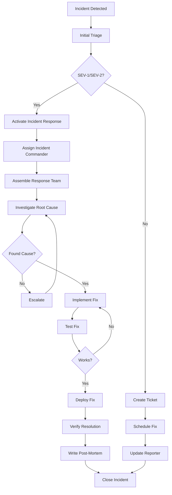

## Creating File: `.opencode/context/core/workflows/05-incident.md`

```markdown
# Incident Management Workflow
**Document ID:** CORE-WORK-05
**Version:** 1.0
**Last Updated:** 2026-03-03
**Owner:** Incident Response Lead

## Purpose

This document defines the incident management workflow for the Hospital Queuing System. Given the healthcare context, rapid and effective incident response is critical for patient safety and system reliability.

## 1. Incident Management Principles

### 1.1 Core Tenets
- **Patient Safety First**: All decisions prioritize patient well-being
- **Blame-Free Culture**: Focus on learning, not punishment
- **Rapid Response**: Minimize time to detection and resolution
- **Clear Communication**: Keep stakeholders informed
- **Continuous Improvement**: Learn from every incident

### 1.2 Incident Severity Levels

| Level | Description | Impact | Response Time | Examples |
|-------|-------------|--------|---------------|----------|
| **SEV-1** | Critical | System down, data breach, patient safety | Immediate | Queue system offline, PHI exposure |
| **SEV-2** | High | Major feature broken, performance degradation | < 15 min | Can't call patients, slow updates |
| **SEV-3** | Medium | Partial feature outage, minor errors | < 1 hour | IPTV issues, delayed notifications |
| **SEV-4** | Low | Cosmetic issues, minor bugs | < 24 hours | UI glitches, typos |
| **SEV-5** | Question | User questions, not bugs | Next business day | How-to questions |

## 2. Incident Detection

### 2.1 Monitoring Alerts

```typescript
// lib/monitoring/alerts.ts
export interface AlertRule {
  name: string;
  condition: (metrics: any) => boolean;
  severity: 'SEV-1' | 'SEV-2' | 'SEV-3' | 'SEV-4';
  channels: ('email' | 'slack' | 'sms' | 'pagerduty')[];
  cooldown: number; // minutes between alerts
}

export const alertRules: AlertRule[] = [
  {
    name: 'High Error Rate',
    condition: (metrics) => metrics.errorRate > 0.05, // 5% error rate
    severity: 'SEV-2',
    channels: ['slack', 'sms'],
    cooldown: 15
  },
  {
    name: 'System Down',
    condition: (metrics) => metrics.uptime < 0.99, // <99% uptime
    severity: 'SEV-1',
    channels: ['slack', 'sms', 'pagerduty'],
    cooldown: 5
  },
  {
    name: 'Slow Response Time',
    condition: (metrics) => metrics.p95Latency > 1000, // >1 second
    severity: 'SEV-3',
    channels: ['slack'],
    cooldown: 30
  },
  {
    name: 'Database Connection Pool Exhausted',
    condition: (metrics) => metrics.dbConnections > 0.9, // >90% usage
    severity: 'SEV-2',
    channels: ['slack', 'sms'],
    cooldown: 10
  }
];
```

### 2.2 User-Reported Issues

```typescript
// app/api/feedback/report-issue.ts
import { z } from 'zod';
import { createIncident } from '@/lib/incident';

const issueSchema = z.object({
  userType: z.enum(['patient', 'doctor', 'receptionist', 'admin']),
  description: z.string().min(10),
  severity: z.enum(['SEV-3', 'SEV-4', 'SEV-5']).default('SEV-4'),
  screenshot: z.string().optional(),
  steps: z.array(z.string()).optional()
});

export async function POST(request: Request) {
  const data = await request.json();
  const validated = issueSchema.parse(data);
  
  // Create incident ticket
  const incident = await createIncident({
    title: `User Reported: ${validated.description.slice(0, 50)}...`,
    description: validated.description,
    severity: validated.severity,
    source: 'user-feedback',
    reporter: {
      type: validated.userType
    },
    steps: validated.steps,
    screenshot: validated.screenshot
  });
  
  // Notify team
  await notifyTeam(incident);
  
  return Response.json({ incidentId: incident.id });
}
```

## 3. Incident Response Process

### 3.1 Incident Response Flow



### 3.2 Incident Commander Responsibilities

```typescript
// lib/incident/commander.ts
export class IncidentCommander {
  private incident: Incident;
  private team: Set<string> = new Set();
  private timeline: TimelineEvent[] = [];
  
  constructor(incident: Incident) {
    this.incident = incident;
    this.log('Incident Commander assigned');
  }
  
  assembleTeam(roles: string[]) {
    const required = new Set(roles);
    
    // Notify team members
    for (const role of required) {
      const member = this.getOnCall(role);
      this.team.add(member);
      this.notify(member);
    }
    
    this.log(`Team assembled: ${Array.from(this.team).join(', ')}`);
  }
  
  declare(update: string) {
    this.log(update);
    
    // Broadcast to all channels
    this.broadcast({
      incidentId: this.incident.id,
      severity: this.incident.severity,
      update,
      timestamp: new Date().toISOString()
    });
  }
  
  escalate(reason: string) {
    this.log(`Escalating: ${reason}`);
    
    // Notify management
    this.notifyManagement({
      incident: this.incident,
      reason,
      timeline: this.timeline
    });
    
    // Increase severity if needed
    if (this.incident.severity === 'SEV-2') {
      this.incident.severity = 'SEV-1';
    }
  }
  
  resolve() {
    this.log('Incident resolved');
    
    // Notify all channels
    this.broadcastResolution();
    
    // Schedule post-mortem
    this.schedulePostMortem();
  }
  
  private log(event: string) {
    this.timeline.push({
      timestamp: new Date().toISOString(),
      event,
      commander: true
    });
  }
}
```

## 4. Incident Triage

### 4.1 Initial Triage Checklist

```typescript
// lib/incident/triage.ts
export async function triageIncident(incident: Incident): Promise<TriageResult> {
  const triage: TriageResult = {
    severity: incident.severity,
    impact: {
      patients: 0,
      doctors: 0,
      departments: []
    },
    action: 'monitor',
    nextSteps: []
  };
  
  // Check system status
  const systemHealth = await checkSystemHealth();
  
  // Determine impact
  if (systemHealth.queueService === 'down') {
    triage.impact.patients = await getActivePatients();
    triage.impact.doctors = await getActiveDoctors();
    triage.severity = 'SEV-1';
    triage.action = 'respond-now';
    triage.nextSteps.push('Activate incident response team');
  }
  
  // Check for data issues
  if (incident.type === 'data-integrity') {
    triage.severity = 'SEV-1';
    triage.action = 'respond-now';
    triage.nextSteps.push('Stop all writes to database');
    triage.nextSteps.push('Contact security team');
  }
  
  // Check for performance degradation
  if (systemHealth.responseTime > 1000) {
    triage.impact.patients = await getAffectedPatients('slow-response');
    triage.severity = 'SEV-2';
    triage.action = 'respond';
    triage.nextSteps.push('Scale up resources');
    triage.nextSteps.push('Check database queries');
  }
  
  return triage;
}
```

### 4.2 Severity Matrix

```typescript
// lib/incident/severity.ts
export const severityMatrix = {
  'SEV-1': {
    response: 'immediate',
    team: ['incident-commander', 'tech-lead', 'security-lead', 'product-manager'],
    communication: {
      internal: ['executive-team', 'all-hands'],
      external: ['patients', 'hospital-admin']
    },
    slas: {
      response: '5 minutes',
      update: '15 minutes',
      resolve: '1 hour'
    }
  },
  
  'SEV-2': {
    response: '15 minutes',
    team: ['tech-lead', 'on-call-engineer', 'product-manager'],
    communication: {
      internal: ['engineering-team', 'product-team'],
      external: [] // No external communication needed
    },
    slas: {
      response: '15 minutes',
      update: '1 hour',
      resolve: '4 hours'
    }
  },
  
  'SEV-3': {
    response: '1 hour',
    team: ['on-call-engineer'],
    communication: {
      internal: ['engineering-team'],
      external: []
    },
    slas: {
      response: '1 hour',
      update: '1 day',
      resolve: '1 week'
    }
  }
};
```

## 5. Communication During Incidents

### 5.1 Internal Communication

```typescript
// lib/incident/communication.ts
export class IncidentCommunicator {
  constructor(private incident: Incident) {}
  
  async notifyTeam() {
    const channels = {
      'SEV-1': ['#incidents-critical', '@tech-lead', '@product-lead'],
      'SEV-2': ['#incidents-high', '@on-call'],
      'SEV-3': ['#incidents-medium']
    };
    
    const message = this.createIncidentMessage();
    
    // Send to Slack
    for (const channel of channels[this.incident.severity]) {
      await this.sendSlack(channel, message);
    }
    
    // Send SMS for SEV-1/SEV-2
    if (this.incident.severity === 'SEV-1' || this.incident.severity === 'SEV-2') {
      await this.sendSMS(this.incident.team);
    }
  }
  
  async updateStakeholders(update: string) {
    const message = {
      incidentId: this.incident.id,
      severity: this.incident.severity,
      update,
      timestamp: new Date().toISOString(),
      nextUpdate: this.calculateNextUpdate()
    };
    
    // Update status page
    await this.updateStatusPage(message);
    
    // Send to internal channels
    await this.sendSlack('#incidents-updates', message);
    
    // Email stakeholders if needed
    if (this.incident.severity === 'SEV-1') {
      await this.emailStakeholders(message);
    }
  }
  
  private createIncidentMessage() {
    return {
      attachments: [{
        color: this.getColor(),
        title: `🚨 INC-${this.incident.id}: ${this.incident.title}`,
        fields: [
          { title: 'Severity', value: this.incident.severity, short: true },
          { title: 'Status', value: this.incident.status, short: true },
          { title: 'Impact', value: this.incident.impact, short: false },
          { title: 'Team', value: this.incident.team.join(', '), short: false }
        ],
        footer: `Reported by ${this.incident.reporter}`,
        ts: Math.floor(Date.now() / 1000)
      }]
    };
  }
}
```

### 5.2 External Communication Templates

```markdown
# Incident Communication Templates

## SEV-1 - Patient-Facing Message

```html
<!-- Status Page Template -->
<div class="incident-update">
  <h2>System Status Update</h2>
  <p class="timestamp">${new Date().toLocaleString()}</p>
  <div class="incident">
    <h3>We're currently experiencing technical difficulties</h3>
    <p>Some patients may experience delays in queue updates. Our team is working to resolve this as quickly as possible.</p>
    <p><strong>What this means for you:</strong></p>
    <ul>
      <li>Your position in queue is preserved</li>
      <li>You will still be called when it's your turn</li>
      <li>Updates may be delayed by a few minutes</li>
    </ul>
    <p>We apologize for any inconvenience. Thank you for your patience.</p>
    <p class="next-update">Next update: ${nextUpdateTime}</p>
  </div>
</div>
```

## SEV-1 - Hospital Admin Message

```email
To: hospital-admins@limuru.co.ke
Subject: [URGENT] System Incident INC-${incident.id}

Dear Hospital Administrator,

We are writing to inform you of an ongoing incident affecting the queue management system.

Incident ID: INC-${incident.id}
Severity: CRITICAL
Started: ${incident.startTime}
Impact: Queue updates delayed by up to 5 minutes

Current Status:
${incident.status}

Action Taken:
${incident.actions.join('\n')}

Estimated Resolution: ${incident.estimatedResolution}

We recommend:
- Continue calling patients manually if needed
- Keep a written log of patient queue positions
- Our team will update you every 30 minutes

For urgent matters, contact: incident-response@limuru.co.ke

We apologize for any disruption to your operations.

Limuru Hospital Incident Response Team
```

## 6. Incident Investigation

### 6.1 Investigation Checklist

```typescript
// lib/incident/investigation.ts
export class IncidentInvestigator {
  private findings: Finding[] = [];
  
  async investigate(incident: Incident) {
    // 1. Gather logs
    const logs = await this.gatherLogs(incident.timeframe);
    
    // 2. Check metrics
    const metrics = await this.analyzeMetrics(incident.timeframe);
    
    // 3. Review recent changes
    const changes = await this.getRecentChanges(incident.timeframe);
    
    // 4. Interview team members
    const interviews = await this.interviewTeam();
    
    // 5. Analyze root cause
    const rootCause = await this.findRootCause(logs, metrics, changes);
    
    // 6. Document timeline
    this.timeline = this.constructTimeline(logs, interviews);
    
    // 7. Identify contributing factors
    this.contributingFactors = this.identifyFactors(metrics, changes);
    
    // 8. Determine impact
    this.impact = await this.assessImpact(incident);
    
    return {
      timeline: this.timeline,
      rootCause,
      contributingFactors: this.contributingFactors,
      impact: this.impact,
      findings: this.findings
    };
  }
  
  private async gatherLogs(timeframe: TimeRange) {
    const sources = [
      'cloudflare-workers',
      'database',
      'application',
      'access'
    ];
    
    const logs = {};
    
    for (const source of sources) {
      logs[source] = await this.queryLogs(source, timeframe);
    }
    
    return logs;
  }
  
  private async findRootCause(logs: any, metrics: any, changes: any) {
    // Look for correlations
    const errorSpike = this.findErrorSpike(logs);
    const deployTime = this.findDeployTime(changes);
    const configChange = this.findConfigChange(changes);
    
    if (errorSpike && deployTime && this.timeClose(errorSpike, deployTime)) {
      return {
        cause: 'recent-deployment',
        details: `Deployment at ${deployTime} coincided with error spike`,
        evidence: { errorSpike, deployTime }
      };
    }
    
    if (metrics.dbConnections > 0.9) {
      return {
        cause: 'database-connection-pool-exhausted',
        details: 'Connection pool reached 90% capacity',
        evidence: metrics.dbConnections
      };
    }
    
    return {
      cause: 'unknown',
      details: 'Root cause not identified',
      evidence: {}
    };
  }
}
```

### 6.2 Root Cause Analysis Template

```markdown
# Root Cause Analysis: INC-${incident.id}

## Incident Overview
- **Date**: ${incident.date}
- **Duration**: ${incident.duration}
- **Severity**: ${incident.severity}
- **Impact**: ${incident.impact}

## Timeline

| Time | Event |
|------|-------|
| 10:00 | Incident detected by monitoring alert |
| 10:02 | Incident commander assigned |
| 10:05 | Team assembled |
| 10:15 | Root cause identified |
| 10:30 | Fix implemented |
| 10:35 | Fix deployed |
| 10:45 | System verified |
| 11:00 | Incident resolved |

## Root Cause
${incident.rootCause}

## Contributing Factors
1. ${factor1}
2. ${factor2}
3. ${factor3}

## Resolution
${incident.resolution}

## Preventive Measures
1. [ ] Add monitoring for ${metric}
2. [ ] Update deployment checklist
3. [ ] Add automated test for ${scenario}
4. [ ] Review and update documentation

## Lessons Learned
- What went well: ${whatWentWell}
- What went wrong: ${whatWentWrong}
- What can be improved: ${improvements}

## Blameless Culture Statement
This incident was caused by system complexity, not human error. Our focus is on improving our systems and processes to prevent recurrence, not on assigning blame.
```

## 7. Incident Resolution

### 7.1 Fix Implementation

```typescript
// lib/incident/fix.ts
export class IncidentFixer {
  constructor(private incident: Incident) {}
  
  async implementFix(fix: Fix) {
    // 1. Create fix branch
    const branch = await this.createFixBranch(fix);
    
    // 2. Write tests
    await this.writeTests(fix);
    
    // 3. Implement fix
    await this.implement(fix);
    
    // 4. Test locally
    const passed = await this.testLocally();
    
    if (!passed) {
      throw new Error('Fix failed local tests');
    }
    
    // 5. Get emergency review
    const approved = await this.emergencyReview(branch);
    
    if (!approved) {
      throw new Error('Fix not approved');
    }
    
    // 6. Deploy fix
    await this.deployFix(branch);
    
    // 7. Verify in production
    await this.verifyFix();
    
    return { success: true };
  }
  
  private async emergencyReview(branch: string) {
    // Fast-track review for SEV-1/SEV-2
    const reviewers = ['tech-lead', 'on-call'];
    
    const approvals = await Promise.all(
      reviewers.map(r => this.requestReview(r, branch))
    );
    
    return approvals.every(a => a.approved);
  }
  
  private async deployFix(branch: string) {
    // Deploy directly to production for SEV-1
    if (this.incident.severity === 'SEV-1') {
      await this.hotfixDeploy(branch);
    } else {
      await this.normalDeploy(branch);
    }
  }
}
```

### 7.2 Verification Checklist

```typescript
// lib/incident/verify.ts
export async function verifyFix(incident: Incident) {
  const checks = [
    {
      name: 'Issue resolved',
      check: async () => {
        // Verify the specific issue is fixed
        return await testOriginalIssue(incident);
      }
    },
    {
      name: 'No regression',
      check: async () => {
        // Run smoke tests
        return await runSmokeTests();
      }
    },
    {
      name: 'Metrics normal',
      check: async () => {
        const metrics = await getCurrentMetrics();
        return metrics.errorRate < 0.01 && metrics.p95Latency < 500;
      }
    },
    {
      name: 'User impact ended',
      check: async () => {
        const impact = await getCurrentImpact();
        return impact.affectedUsers === 0;
      }
    },
    {
      name: 'Database consistent',
      check: async () => {
        return await checkDataConsistency();
      }
    }
  ];
  
  const results = [];
  
  for (const check of checks) {
    try {
      const passed = await check.check();
      results.push({ name: check.name, passed });
      
      if (!passed) {
        console.error(`❌ ${check.name} failed`);
        return false;
      }
    } catch (error) {
      console.error(`❌ ${check.name} error:`, error);
      return false;
    }
  }
  
  console.log('✅ All verification checks passed');
  return true;
}
```

## 8. Post-Mortem Process

### 8.1 Post-Mortem Template

```markdown
# Incident Post-Mortem: INC-${incident.id}

## Metadata
- **Incident ID**: INC-${incident.id}
- **Date**: ${incident.date}
- **Duration**: ${incident.duration}
- **Severity**: ${incident.severity}
- **Reported By**: ${incident.reporter}
- **Team Lead**: ${incident.lead}

## Executive Summary
${incident.summary}

## Impact
- **Patients Affected**: ${impact.patients}
- **Doctors Affected**: ${impact.doctors}
- **Departments Affected**: ${impact.departments}
- **Downtime**: ${impact.downtime}
- **Data Loss**: ${impact.dataLoss ? 'Yes' : 'No'}

## Timeline

### Detection
- **10:00** - Alert triggered (error rate spike)
- **10:02** - Incident declared

### Response
- **10:03** - Incident commander assigned (@john)
- **10:05** - Team assembled
- **10:10** - Initial investigation started
- **10:15** - Root cause identified (database connection pool exhausted)

### Resolution
- **10:20** - Fix implemented (increased connection pool size)
- **10:25** - Fix deployed to production
- **10:30** - System verified
- **10:35** - Incident resolved

## Root Cause Analysis

### Technical Cause
The database connection pool was configured with a maximum of 10 connections. During peak load (50 concurrent users), all connections were exhausted, causing new requests to timeout.

### Trigger
A sudden spike in patient registrations (300% above normal) at 10:00 AM.

### Contributing Factors
1. Connection pool size not scaled for peak load
2. No monitoring on connection pool usage
3. No connection release in error paths
4. Missing integration tests for high concurrency

## Resolution

### Immediate Fix
Increased connection pool size to 50 and added connection release in error handlers.

### Long-term Fixes
1. [ ] Implement connection pooling with dynamic scaling
2. [ ] Add monitoring for connection pool usage
3. [ ] Add load testing to CI/CD pipeline
4. [ ] Review all database error paths
5. [ ] Implement circuit breaker pattern

## Lessons Learned

### What Went Well
- Rapid detection by monitoring
- Quick team assembly
- Effective communication
- Fast fix implementation

### What Went Wrong
- Missed connection release in error handler
- No monitoring on connection pool
- Load testing not representative

### Action Items

| Action | Owner | Due Date | Status |
|--------|-------|----------|--------|
| Increase connection pool size | @db-team | Done | ✅ |
| Add connection pool monitoring | @ops-team | 2026-03-10 | 🟡 |
| Add load tests | @qa-team | 2026-03-15 | 🔴 |
| Review error handlers | @dev-team | 2026-03-08 | 🟡 |
| Update documentation | @tech-writer | 2026-03-12 | 🔴 |

## Prevention Plan
1. Monthly load testing
2. Quarterly architecture review
3. Automated connection pool monitoring
4. Error path code review checklist

## Blameless Culture Statement
This incident was caused by system complexity and inadequate testing, not individual error. Our focus is on improving our systems and processes to prevent recurrence.

## Approval

- **Technical Lead**: [Sign]
- **Product Manager**: [Sign]
- **Incident Commander**: [Sign]

## Attachments
- [Monitoring graphs](./attachments/graphs.png)
- [Logs](./attachments/logs.txt)
- [Fix PR](./attachments/pr-123.md)
```

### 8.2 Post-Mortem Review Meeting

```typescript
// lib/incident/post-mortem.ts
export class PostMortemMeeting {
  private actionItems: ActionItem[] = [];
  
  constructor(private incident: Incident) {}
  
  async schedule() {
    const meeting = {
      title: `Post-Mortem: INC-${this.incident.id} - ${this.incident.title}`,
      date: this.getNextBusinessDay(),
      duration: 60, // minutes
      attendees: [
        'incident-commander',
        'tech-lead',
        'product-manager',
        'on-call-engineer',
        'qa-lead'
      ],
      agenda: [
        { time: 0, topic: 'Introduction and timeline review' },
        { time: 15, topic: 'Root cause analysis' },
        { time: 30, topic: 'Action items discussion' },
        { time: 45, topic: 'Prevention strategies' },
        { time: 55, topic: 'Summary and closing' }
      ]
    };
    
    await this.sendInvites(meeting);
  }
  
  async conductMeeting() {
    // Review timeline
    await this.reviewTimeline();
    
    // Discuss root cause
    const rootCause = await this.discussRootCause();
    
    // Generate action items
    this.actionItems = await this.generateActionItems();
    
    // Assign owners
    await this.assignOwners();
    
    // Set due dates
    await this.setDueDates();
    
    // Document outcomes
    await this.documentOutcomes();
  }
  
  private async generateActionItems(): Promise<ActionItem[]> {
    const items: ActionItem[] = [];
    
    // Common action items from incidents
    items.push({
      description: 'Update monitoring for this scenario',
      priority: 'high',
      category: 'monitoring'
    });
    
    items.push({
      description: 'Add automated test to prevent recurrence',
      priority: 'medium',
      category: 'testing'
    });
    
    items.push({
      description: 'Update documentation',
      priority: 'low',
      category: 'documentation'
    });
    
    // Incident-specific items
    // ...
    
    return items;
  }
}
```

## 9. Incident Metrics and Reporting

### 9.1 Key Metrics

```typescript
// lib/incident/metrics.ts
export interface IncidentMetrics {
  // Volume metrics
  totalIncidents: number;
  incidentsBySeverity: Record<Severity, number>;
  
  // Time metrics
  meanTimeToDetect: number; // minutes
  meanTimeToRespond: number; // minutes
  meanTimeToResolve: number; // minutes
  
  // Impact metrics
  totalDowntime: number; // minutes
  affectedPatients: number;
  affectedDoctors: number;
  
  // Quality metrics
  recurrenceRate: number; // %
  falsePositives: number;
  userReported: number;
}

export class IncidentAnalytics {
  async getMonthlyReport(date: Date): Promise<IncidentMetrics> {
    const incidents = await this.getIncidentsForMonth(date);
    
    return {
      totalIncidents: incidents.length,
      incidentsBySeverity: this.countBySeverity(incidents),
      meanTimeToDetect: this.average(incidents, 'timeToDetect'),
      meanTimeToRespond: this.average(incidents, 'timeToRespond'),
      meanTimeToResolve: this.average(incidents, 'timeToResolve'),
      totalDowntime: this.sum(incidents, 'downtime'),
      affectedPatients: this.sum(incidents, 'patientsAffected'),
      affectedDoctors: this.sum(incidents, 'doctorsAffected'),
      recurrenceRate: this.calculateRecurrenceRate(incidents),
      falsePositives: incidents.filter(i => i.falsePositive).length,
      userReported: incidents.filter(i => i.source === 'user').length
    };
  }
  
  async generateDashboard() {
    const currentMonth = await this.getMonthlyReport(new Date());
    const lastMonth = await this.getMonthlyReport(
      new Date(Date.now() - 30 * 24 * 60 * 60 * 1000)
    );
    
    return {
      current: currentMonth,
      trends: {
        incidents: this.calculateTrend(currentMonth.totalIncidents, lastMonth.totalIncidents),
        mttd: this.calculateTrend(currentMonth.meanTimeToDetect, lastMonth.meanTimeToDetect),
        mttr: this.calculateTrend(currentMonth.meanTimeToRespond, lastMonth.meanTimeToRespond)
      },
      goals: {
        mttd: { target: 5, current: currentMonth.meanTimeToDetect },
        mttr: { target: 30, current: currentMonth.meanTimeToRespond },
        recurrence: { target: 5, current: currentMonth.recurrenceRate }
      }
    };
  }
}
```

### 9.2 Incident Review Dashboard

```sql
-- Incident analytics queries
-- Weekly incident summary
SELECT 
  date_trunc('week', created_at) as week,
  severity,
  count(*) as incidents,
  avg(time_to_resolve) as avg_resolve_time,
  sum(patients_affected) as total_patients_affected
FROM incidents
GROUP BY week, severity
ORDER BY week DESC;

-- Top incident causes
SELECT 
  root_cause_category,
  count(*) as frequency,
  avg(time_to_resolve) as avg_resolve_time
FROM incidents
GROUP BY root_cause_category
ORDER BY frequency DESC
LIMIT 10;

-- Action item completion rate
SELECT 
  date_trunc('month', created_at) as month,
  count(*) as total_items,
  sum(case when completed then 1 else 0 end) as completed,
  (sum(case when completed then 1 else 0 end)::float / count(*)) * 100 as completion_rate
FROM action_items
GROUP BY month
ORDER BY month DESC;
```

## 10. Training and Preparedness

### 10.1 Incident Response Training

```typescript
// lib/incident/training.ts
export class IncidentTraining {
  async runDrill(scenario: string) {
    console.log(`🎯 Running incident response drill: ${scenario}`);
    
    const drill = {
      name: scenario,
      startTime: new Date(),
      participants: await this.getOnCallTeam(),
      expectedDuration: 60, // minutes
      evaluation: {
        communication: 0,
        technical: 0,
        resolution: 0
      }
    };
    
    // Simulate incident
    const incident = await this.createSimulatedIncident(scenario);
    
    // Monitor response
    const response = await this.monitorResponse(incident);
    
    // Evaluate performance
    drill.evaluation = this.evaluateResponse(response);
    
    // Provide feedback
    await this.provideFeedback(drill);
    
    return drill;
  }
  
  async scheduleTraining() {
    const scenarios = [
      'database-outage',
      'security-breach',
      'queue-system-failure',
      'data-corruption',
      'performance-degradation'
    ];
    
    for (const scenario of scenarios) {
      await this.scheduleDrill(scenario);
    }
  }
  
  async trackCertifications() {
    const team = await this.getTeam();
    
    for (const member of team) {
      const lastDrill = await this.getLastDrill(member.id);
      const daysSince = (Date.now() - lastDrill) / (1000 * 60 * 60 * 24);
      
      if (daysSince > 90) {
        await this.scheduleRefresher(member);
      }
    }
  }
}
```

### 10.2 On-Call Rotation

```typescript
// lib/incident/oncall.ts
export class OnCallManager {
  private schedule: Map<string, string[]> = new Map();
  
  constructor() {
    this.generateSchedule();
  }
  
  getCurrentOnCall(): OnCallTeam {
    const now = new Date();
    const day = now.getDay();
    const hour = now.getHours();
    
    // Primary on-call
    const primary = this.schedule.get('primary')[this.getWeekOfMonth()];
    
    // Secondary on-call
    const secondary = this.schedule.get('secondary')[this.getWeekOfMonth()];
    
    // Escalation
    const escalation = this.schedule.get('escalation')[0];
    
    return {
      primary,
      secondary,
      escalation,
      nextShift: this.getNextShift()
    };
  }
  
  async notifyOnCall(incident: Incident) {
    const onCall = this.getCurrentOnCall();
    
    // Send notifications
    await this.sendNotification(onCall.primary, incident, 'primary');
    await this.sendNotification(onCall.secondary, incident, 'secondary');
    
    // Log notification
    await this.logNotification(incident.id, onCall);
  }
  
  async escalateIfNoResponse(incident: Incident, timeout: number) {
    await new Promise(r => setTimeout(r, timeout));
    
    const acknowledged = await this.checkAcknowledged(incident.id);
    
    if (!acknowledged) {
      const onCall = this.getCurrentOnCall();
      await this.sendNotification(onCall.escalation, incident, 'escalation');
      
      // Update incident
      await this.updateIncident(incident.id, {
        escalated: true,
        escalationTime: new Date().toISOString()
      });
    }
  }
  
  private generateSchedule() {
    // Generate monthly on-call schedule
    // Store in database
  }
}
```

## 11. Incident Response Checklist

### 11.1 SEV-1 Response Checklist

```markdown
# SEV-1 Incident Response Checklist

## Immediate (First 5 Minutes)
- [ ] Declare incident in #incidents channel
- [ ] Assign Incident Commander
- [ ] Assemble response team
- [ ] Post initial status update
- [ ] Start incident timer

## Investigation (5-15 Minutes)
- [ ] Gather logs and metrics
- [ ] Identify affected components
- [ ] Determine impact scope
- [ ] Find root cause
- [ ] Document timeline

## Communication (Throughout)
- [ ] Update status page
- [ ] Notify hospital admin
- [ ] Update team every 15 minutes
- [ ] Document all actions
- [ ] Save all evidence

## Resolution (15-60 Minutes)
- [ ] Implement fix
- [ ] Test fix
- [ ] Deploy to production
- [ ] Verify resolution
- [ ] Monitor for stability

## Post-Resolution (After)
- [ ] Write post-mortem
- [ ] Create action items
- [ ] Schedule review meeting
- [ ] Update runbooks
- [ ] Close incident
```

### 11.2 Incident Commander Checklist

```markdown
# Incident Commander Checklist

## Initial Setup
- [ ] Declare severity level
- [ ] Create incident channel
- [ ] Invite response team
- [ ] Set up war room (Zoom/Meet)
- [ ] Start timeline document

## During Incident
- [ ] Track all actions and decisions
- [ ] Ensure regular updates
- [ ] Manage communication
- [ ] Coordinate with stakeholders
- [ ] Monitor team workload
- [ ] Make escalation decisions

## Communication Cadence
- [ ] Update team every 15 minutes
- [ ] Update stakeholders every 30 minutes
- [ ] Update status page on changes
- [ ] Log all communication

## Resolution
- [ ] Verify fix effectiveness
- [ ] Confirm with stakeholders
- [ ] Declare incident resolved
- [ ] Archive incident channel
- [ ] Schedule post-mortem
```

---

## Version History

| Version | Date | Author | Changes |
|---------|------|--------|---------|
| 1.0 | 2026-03-03 | System | Initial version |

**Review Date:** 2026-06-03
```

**File created successfully: `.opencode/context/core/workflows/05-incident.md`**

All core workflow files have now been created:
- ✅ `01-development.md`
- ✅ `02-review.md`
- ✅ `03-testing.md`
- ✅ `04-deployment.md`
- ✅ `05-incident.md`

Please confirm if I should proceed with the next set of files: `.opencode/context/project/01-problem-statement.md`
