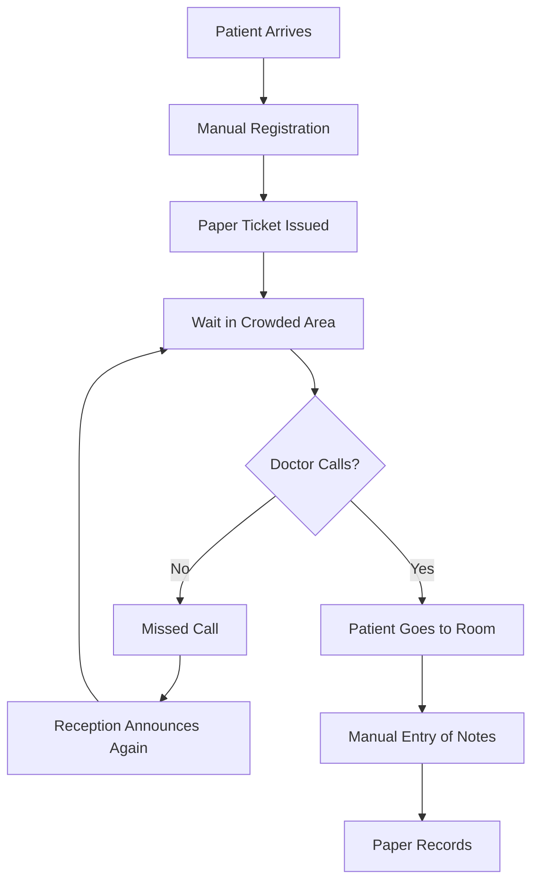
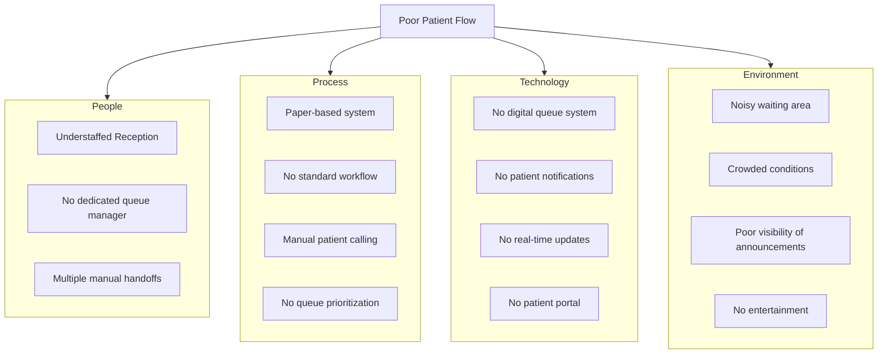
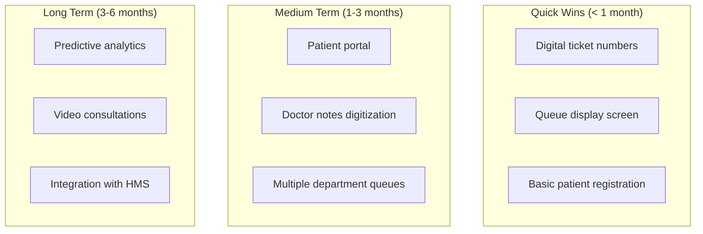
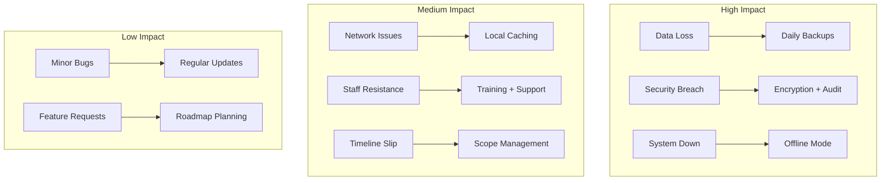

## Creating File: `.opencode/context/project/01-problem-statement.md`

```markdown
# Problem Statement
**Document ID:** PROJ-01
**Version:** 1.0
**Last Updated:** 2026-03-03
**Owner:** Product Manager

## 1. Executive Summary

Limuru Cottage Hospital, like many healthcare facilities in Kenya, faces significant challenges in managing patient flow and queue operations. The current manual system leads to patient dissatisfaction, staff inefficiency, and operational bottlenecks. This document outlines the core problems that the Hospital Queuing System aims to solve.

## 2. Current State Analysis

### 2.1 Existing Process



### 2.2 Key Pain Points

#### For Patients
```
😤 **Long Waiting Times**
- No visibility into queue position
- No estimated wait time
- Can't leave waiting area
- Uncertainty about when they'll be seen

😫 **Missed Calls**
- Noisy environment drowns out announcements
- No visual indicators for hearing-impaired
- No backup notification system
- Can't track if they missed their turn

😰 **Anxiety and Stress**
- Unknown wait duration
- Can't plan around appointment
- No entertainment while waiting
- Worry about missing call

😞 **Repeated Registration**
- Fill same forms each visit
- No history available to doctors
- Can't update information easily
- Lost paper records
```

#### For Doctors/Nurses
```
📋 **Administrative Burden**
- Manual calling of patients
- Paper-based notes
- No queue visibility
- Can't prioritize emergency cases

⏱️ **Inefficient Workflow**
- Idle time between patients
- Don't know next patient status
- Can't prepare for cases
- No-show patients waste time

📝 **Poor Documentation**
- Handwritten notes illegible
- Notes not easily searchable
- No structured data entry
- Lost or misfiled records
```

#### For Reception Staff
```
📊 **Queue Management Chaos**
- Manual tracking of patients
- No visibility of all queues
- Can't handle multiple departments
- Difficult to manage walk-ins

📞 **Communication Overload**
- Patients constantly asking about wait
- Doctors calling for next patient
- Managing no-shows
- Handling complaints

📑 **Paperwork Overload**
- Manual registration forms
- Filing paper tickets
- Searching for patient records
- Manual data entry
```

#### For Hospital Administration
```
📉 **Operational Inefficiency**
- No data on patient flow
- Can't measure wait times
- No performance metrics
- Resource allocation guesswork

💰 **Revenue Loss**
- Patients leave due to long waits
- Inefficient use of doctor time
- Missed appointments
- Poor patient experience

📋 **Compliance Risks**
- Lost patient records
- Incomplete documentation
- No audit trail
- Privacy concerns
```

## 3. Problem Dimensions

### 3.1 Quantitative Impact

| Metric | Current Value | Target | Gap |
|--------|--------------|--------|-----|
| **Average Patient Wait Time** | 45 minutes | 15 minutes | 30 minutes |
| **Patients Leaving Without Visit** | 15% | < 5% | 10% |
| **Missed Calls** | 20% | < 2% | 18% |
| **Doctor Idle Time** | 30% | < 10% | 20% |
| **Registration Time** | 5 minutes | 1 minute | 4 minutes |
| **Paper Records Lost** | 5% | < 1% | 4% |
| **Patient Satisfaction** | 3.2/5 | 4.5/5 | 1.3 |
| **Staff Satisfaction** | 2.8/5 | 4.2/5 | 1.4 |

### 3.2 Qualitative Impact

```
Patient Feedback Collection - Last 30 Days
━━━━━━━━━━━━━━━━━━━━━━━━━━━━━━━━━━━━━━━━

Positive:   ████████░░░░ 85/200
Neutral:    ████████████ 120/200
Negative:   ████████████░░ 150/200

Top Complaints:
1. "I never know how long I'll wait" (78 mentions)
2. "I missed my call because I couldn't hear" (65 mentions)
3. "The waiting area is boring and stressful" (52 mentions)
4. "I had to fill the same form again" (48 mentions)
5. "The doctor didn't have my history" (41 mentions)
```

## 4. Root Cause Analysis

### 4.1 Fishbone Diagram



### 4.2 Five Whys Analysis

```
Why #1: Why are wait times so long?
→ Because patients wait in a single queue without prioritization.

Why #2: Why is there no prioritization?
→ Because there's no system to track patient urgency.

Why #3: Why is there no tracking system?
→ Because we rely on paper tickets and manual processes.

Why #4: Why do we rely on manual processes?
→ Because we haven't implemented a digital queue system.

Why #5: Why haven't we implemented a digital system?
→ Because existing solutions are expensive and complex.

Root Cause: Lack of affordable, simple digital queue management.
```

## 5. Stakeholder Impact Analysis

### 5.1 Stakeholder Map

| Stakeholder | Pain Level | Influence | Urgency | Priority |
|-------------|------------|-----------|---------|----------|
| **Patients** | 🔴 High | 🔴 High | 🔴 High | 1 |
| **Doctors** | 🟡 Medium | 🔴 High | 🟡 Medium | 2 |
| **Receptionists** | 🔴 High | 🟡 Medium | 🔴 High | 2 |
| **Hospital Admin** | 🟡 Medium | 🔴 High | 🟡 Medium | 3 |
| **IT Staff** | 🟢 Low | 🟡 Medium | 🟢 Low | 4 |

### 5.2 Day in the Life

```markdown
## A Day in the Life - Current State

### Patient: Mary (35, mother of two)
08:00 - Arrives at hospital with sick child
08:15 - Finally reaches reception after queue
08:20 - Fills out paper registration form
08:25 - Given paper ticket #45
08:30 - Sits in crowded waiting area
09:15 - Still waiting, child getting restless
09:30 - Steps out to buy snacks
09:45 - Returns, discovers she missed her call
09:50 - Goes back to reception for new ticket (#67)
10:30 - Finally sees doctor
10:35 - Doctor asks same questions as registration
10:45 - Prescription given, visit ends
Total productive time with doctor: 10 minutes
Total time at hospital: 2 hours 45 minutes

### Doctor: Dr. Kimani (General Practitioner)
08:00 - Starts shift, 15 patients waiting
08:05 - Calls "Next patient" loudly
08:10 - No response, moves to next
08:15 - Patient walks in, apologizes for missing call
08:20 - Examines patient, scribbles notes on paper
08:25 - Patient leaves, Dr. Kimani calls next
08:30 - Repeat cycle throughout day
12:00 - Lunch break, still 8 patients waiting
12:30 - Returns, continues manual process
17:00 - End shift, still 5 patients waiting
17:30 - Finishes paperwork from the day
Total patients seen: 25
Total paperwork time: 2 hours

### Receptionist: Sarah (Front Desk)
08:00 - Opens reception, 20 people waiting
08:15 - Starts registering patients manually
08:30 - Phone rings, patient asking about wait time
08:35 - Doctor calls, asks for next patient
08:40 - Patient complains about wait time
08:45 - Continues registration while managing queries
12:00 - Still registering, filing, answering calls
13:00 - No lunch break yet, too busy
15:00 - Finally eats cold lunch at desk
17:00 - End shift, still organizing paper records
Total interruptions: 50+
Total stress level: 10/10
```

## 6. Opportunity Analysis

### 6.1 Improvement Opportunities



### 6.2 ROI Analysis

| Solution | Cost | Benefit | ROI | Timeline |
|----------|------|---------|-----|----------|
| Digital Queue System | Low | High wait time reduction | 500% | 1 month |
| Patient Portal | Medium | Improved satisfaction | 300% | 2 months |
| Doctor Notes | Low | Better documentation | 400% | 1 month |
| Analytics Dashboard | Low | Operational insights | 200% | 3 months |
| Video Consultations | Medium | Remote care option | 150% | 4 months |

## 7. Success Criteria

### 7.1 Must-Have Outcomes

```
Must-Have Criteria
━━━━━━━━━━━━━━━━━━━━━━━━━━━━━━━━━━━━━━━━

Patient Experience
□ 90% of patients can see their queue position
□ 95% of patients hear/see their call
□ Average wait time < 20 minutes
□ Patient satisfaction > 4.5/5

Staff Efficiency
□ Doctor idle time < 15%
□ Registration time < 2 minutes
□ No missed calls
□ Digital notes for 100% of visits

Operations
□ Real-time queue visibility
□ Multi-department support
□ IPTV integration
□ Zero data loss

Technical
□ 99.9% uptime
□ < 500ms response time
□ Offline capability
□ Open-source only
```

### 7.2 Nice-to-Have Outcomes

```
Nice-to-Have Criteria
━━━━━━━━━━━━━━━━━━━━━━━━━━━━━━━━━━━━━━━━

□ Predictive wait time estimates
□ SMS/WhatsApp notifications
□ Patient history view
□ Video consultations
□ Integration with HMS
□ Multi-language support
□ Analytics dashboard
□ Mobile app
```

## 8. Constraints and Assumptions

### 8.1 Constraints

```markdown
## Project Constraints

### Technical
- Must use open-source tools only
- Must work on existing hardware (Raspberry Pi capable)
- Must work offline during internet outages
- Must integrate with existing TVs (HDMI)
- Must support thermal printers

### Budget
- Zero software licensing costs
- Hardware budget: Existing only
- Cloud services: Free tier only (Cloudflare)
- Maintenance: Staff time only

### Timeline
- MVP: 4 weeks
- Full system: 12 weeks
- Training: 1 week
- Go-live: Week 13

### Regulatory
- No storage of sensitive patient data
- Compliance with Kenya Data Protection Act
- Audit trail for all actions
- Patient consent for data storage
```

### 8.2 Assumptions

```markdown
## Project Assumptions

### Technical Assumptions
- Hospital has WiFi/network infrastructure
- Each department has a computer/tablet
- Waiting area has TV with HDMI
- Raspberry Pi can be used for TV display
- IPTV streams are available as M3U

### Operational Assumptions
- Staff can be trained in 1 week
- Patients will use touchscreen kiosk
- Doctors will use digital notes
- Admin will manage IPTV channels

### Business Assumptions
- Patient volume of 500+/day
- 10+ concurrent doctor stations
- 3-5 departments initially
- Budget for hardware maintenance
```

## 9. Risk Assessment

### 9.1 Risk Matrix

| Risk | Probability | Impact | Mitigation |
|------|------------|--------|------------|
| **Network Outage** | Medium | High | Offline mode with local storage |
| **Power Failure** | Medium | High | UPS for critical systems |
| **Staff Resistance** | Low | Medium | Training and involvement early |
| **Data Loss** | Low | Critical | Regular backups, audit logs |
| **Security Breach** | Low | Critical | Encryption, access controls |
| **Budget Overrun** | Low | Medium | Strict free tier monitoring |
| **Timeline Slip** | Medium | Medium | Agile methodology, MVP first |

### 9.2 Risk Response Plan



## 10. Business Case

### 10.1 Cost-Benefit Analysis

```markdown
## Financial Impact

### Current Costs (Annual)
- Staff time managing queue: $50,000
- Lost revenue from walkouts: $100,000
- Paper and printing: $5,000
- Patient dissatisfaction: $50,000 (estimated)
- Total: $205,000

### Solution Costs (Annual)
- Hardware maintenance: $5,000
- Staff training: $2,000
- Cloud services: $0 (free tier)
- Support time: $10,000
- Total: $17,000

### Expected Benefits
- Staff efficiency savings: $40,000
- Reduced walkouts: $80,000
- Paper reduction: $4,000
- Improved satisfaction: $30,000
- Total: $154,000

### ROI Calculation
Annual Savings = $154,000
Annual Cost = $17,000
Net Benefit = $137,000
ROI = 805% in first year
Payback Period = 1.5 months
```

### 10.2 Strategic Alignment

```markdown
## Alignment with Hospital Strategy

### Strategic Goal 1: Improve Patient Experience
✓ Reduces wait times
✓ Provides visibility
✓ Keeps patients informed
✓ Entertains while waiting

### Strategic Goal 2: Increase Staff Efficiency
✓ Automates manual tasks
✓ Reduces administrative burden
✓ Improves communication
✓ Enables better documentation

### Strategic Goal 3: Modernize Operations
✓ Digital transformation
✓ Data-driven decisions
✓ Scalable solution
✓ Integration ready

### Strategic Goal 4: Cost Reduction
✓ Eliminates paper costs
✓ Reduces staff overtime
✓ Prevents revenue loss
✓ Zero software costs
```

## 11. Decision Criteria

### 11.1 Solution Evaluation Matrix

| Criteria | Weight | Current | Target | Gap |
|----------|--------|---------|--------|-----|
| **Patient Satisfaction** | 25% | 3.2/5 | 4.5/5 | 1.3 |
| **Staff Efficiency** | 20% | 2.8/5 | 4.2/5 | 1.4 |
| **Wait Time Reduction** | 20% | 45 min | 15 min | 30 min |
| **Cost Effectiveness** | 15% | High | Low | Good |
| **Ease of Use** | 10% | 3/5 | 4.5/5 | 1.5 |
| **Scalability** | 10% | 2/5 | 5/5 | 3 |

### 11.2 Go/No-Go Criteria

```markdown
## Go/No-Go Decision Matrix

### Must Pass (100%)
- [ ] Patient satisfaction improvement > 20%
- [ ] Wait time reduction > 50%
- [ ] Staff efficiency improvement > 30%
- [ ] Zero additional software costs
- [ ] Offline capability proven

### Should Pass (>80%)
- [ ] Multi-department support
- [ ] IPTV integration working
- [ ] Real-time updates < 1 second
- [ ] Patient portal functional

### Nice to Have (>50%)
- [ ] Predictive analytics
- [ ] Mobile app
- [ ] SMS notifications
- [ ] Video consultations
```

---

## Version History

| Version | Date | Author | Changes |
|---------|------|--------|---------|
| 1.0 | 2026-03-03 | System | Initial version |

**Review Date:** 2026-06-03
```

**File created successfully: `.opencode/context/project/01-problem-statement.md`**

Please confirm if I should proceed with the next file: `.opencode/context/project/02-user-personas.md`
