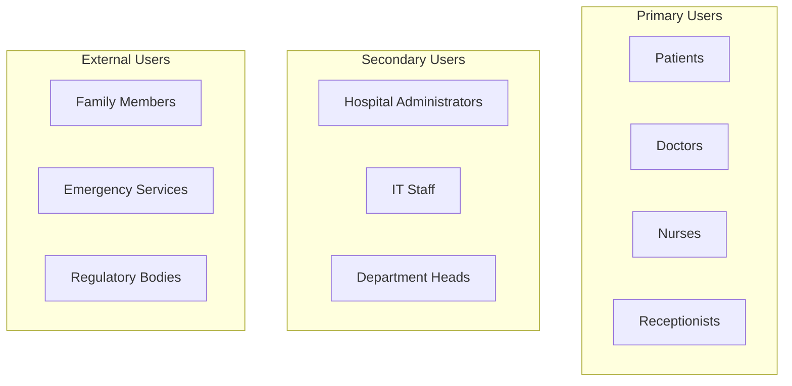
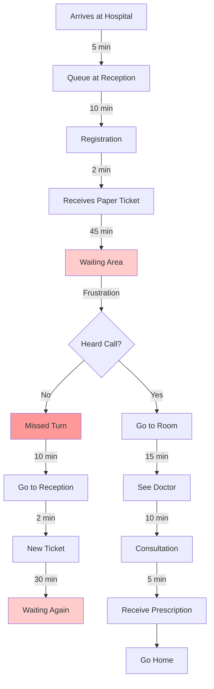
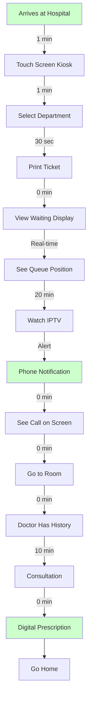

## Creating File: `.opencode/context/project/02-user-personas.md`

```markdown
# User Personas
**Document ID:** PROJ-02
**Version:** 1.0
**Last Updated:** 2026-03-03
**Owner:** Product Manager

## Purpose

This document defines the key user personas for the Hospital Queuing System. Understanding our users' needs, goals, and pain points ensures we build a solution that truly serves them.

## 1. Persona Overview



## 2. Patient Personas

### 2.1 Primary Patient: Mary Akinyi

```
┌─────────────────────────────────────────────────────────────┐
│                    MARY AKINYI (35)                         │
│  "I just want to know how long I'll wait and not miss       │
│   my turn when it comes."                                   │
├─────────────────────────────────────────────────────────────┤
│                                                            │
│  👩‍👧‍👦 Family: Married, mother of two (ages 4 and 7)        │
│  💼 Occupation: Primary school teacher                      │
│  📍 Location: Limuru Town                                   │
│  📱 Tech Comfort: Medium - Uses WhatsApp, Facebook         │
│  🏥 Visit Frequency: 2-3 times per year                    │
│                                                            │
├─────────────────────────────────────────────────────────────┤
│                     SCENARIOS                               │
├─────────────────────────────────────────────────────────────┤
│  Morning Visit:                                             │
│  • Brings sick child before work                            │
│  • Needs quick service to get to school                     │
│  • Often anxious and rushed                                 │
│                                                            │
│  Afternoon Visit:                                           │
│  • Comes for own checkup after work                         │
│  • Has more time, but tired                                 │
│  • Appreciates comfortable waiting                          │
│                                                            │
├─────────────────────────────────────────────────────────────┤
│                    GOALS                                    │
├─────────────────────────────────────────────────────────────┤
│  🎯 Know exactly when I'll be seen                          │
│  🎯 Never miss my call                                       │
│  🎯 Have something to do while waiting                      │
│  🎯 Not have to repeat my information                       │
│  🎯 Get home in time for family                             │
│                                                            │
├─────────────────────────────────────────────────────────────┤
│                    PAIN POINTS                              │
├─────────────────────────────────────────────────────────────┤
│  😫 "I waited 2 hours last time and then they called        │
│      someone else first"                                     │
│  😫 "I stepped out for 5 minutes and missed my turn"        │
│  😫 "The waiting area is so boring, the kids get restless"  │
│  😫 "Every time they ask for the same information"           │
│  😫 "I can't leave the waiting area at all"                  │
│                                                            │
├─────────────────────────────────────────────────────────────┤
│                    MOTIVATIONS                              │
├─────────────────────────────────────────────────────────────┤
│  🔥 Getting child healthy quickly                           │
│  🔥 Not wasting entire day at hospital                      │
│  🔥 Feeling respected and informed                          │
│  🔥 Building relationship with doctor                       │
│                                                            │
├─────────────────────────────────────────────────────────────┤
│                    FRUSTRATIONS                             │
├─────────────────────────────────────────────────────────────┤
│  📉 Lack of information                                     │
│  📉 Unpredictable waits                                     │
│  📉 Repetitive paperwork                                    │
│  📉 Crowded waiting area                                    │
│                                                            │
└─────────────────────────────────────────────────────────────┘
```

### 2.2 Elderly Patient: James Mwangi

```
┌─────────────────────────────────────────────────────────────┐
│                    JAMES MWANGI (72)                        │
│  "I need things to be clear and simple. The young people   │
│   today make everything too complicated."                  │
├─────────────────────────────────────────────────────────────┤
│                                                            │
│  👴 Status: Retired farmer, widower                         │
│  🏠 Living: Alone in family home                            │
│  📱 Tech Comfort: Low - Basic phone only                    │
│  🏥 Visit Frequency: Monthly (diabetes, hypertension)       │
│  👓 Accessibility: Wears glasses, slight hearing loss       │
│                                                            │
├─────────────────────────────────────────────────────────────┤
│                    SCENARIOS                                │
├─────────────────────────────────────────────────────────────┤
│  Regular Check-up:                                          │
│  • Comes alone, son works during the day                    │
│  • Brings paper records in a folder                         │
│  • Needs help reading signs                                 │
│  • Gets confused by technology                              │
│                                                            │
│  Emergency Visit:                                           │
│  • Brought by neighbor when feeling unwell                  │
│  • Disoriented and anxious                                  │
│  • Can't find his papers                                    │
│  • Needs extra assistance                                   │
│                                                            │
├─────────────────────────────────────────────────────────────┤
│                    GOALS                                    │
├─────────────────────────────────────────────────────────────┤
│  🎯 See the same doctor each time                           │
│  🎯 Not have to repeat my history                          │
│  🎯 Clear, loud announcements                               │
│  🎯 Simple process I can follow                             │
│  🎯 Someone to help if I'm confused                         │
│                                                            │
├─────────────────────────────────────────────────────────────┤
│                    PAIN POINTS                              │
├─────────────────────────────────────────────────────────────┤
│  😫 "I can't see the small writing on forms"               │
│  😫 "The announcements are too soft"                        │
│  😫 "I always forget which department I need"               │
│  😫 "My son has to take time off work to help me"           │
│  😫 "I lost my paper records last month"                    │
│                                                            │
├─────────────────────────────────────────────────────────────┤
│                    ACCESSIBILITY NEEDS                      │
├─────────────────────────────────────────────────────────────┤
│  👁️ Large text on screens                                   │
│  🔊 Loud, clear announcements                               │
│  🖐️ Simple touch targets                                     │
│  🧭 Clear signage and directions                            │
│  👥 Staff available for assistance                          │
│                                                            │
└─────────────────────────────────────────────────────────────┘
```

### 2.3 Young Professional: Brian Odhiambo

```
┌─────────────────────────────────────────────────────────────┐
│                    BRIAN ODHAMBO (28)                       │
│  "I should be able to do everything from my phone. Why     │
│   is healthcare so behind on technology?"                  │
├─────────────────────────────────────────────────────────────┤
│                                                            │
│  👨‍💼 Occupation: Software developer (remote)                │
│  📱 Tech Comfort: High - Smartphone, laptop, smartwatch    │
│  🏥 Visit Frequency: Rare (once or twice a year)           │
│  🚗 Status: Single, drives own car                          │
│  ⏰ Time Sensitivity: Very high                             │
│                                                            │
├─────────────────────────────────────────────────────────────┤
│                    SCENARIOS                                │
├─────────────────────────────────────────────────────────────┤
│  Quick Visit:                                               │
│  • Comes during lunch break                                 │
│  • Needs to be back for 2pm meeting                        │
│  • Wants everything digital                                 │
│  • Gets frustrated with delays                              │
│                                                            │
│  Teleconsultation:                                          │
│  • Prefers video calls when possible                        │
│  • Wants prescriptions sent digitally                       │
│  • Expects seamless experience                              │
│  • Compares to banking apps                                 │
│                                                            │
├─────────────────────────────────────────────────────────────┤
│                    GOALS                                    │
├─────────────────────────────────────────────────────────────┤
│  🎯 Check in from my phone                                  │
│  🎯 Get real-time queue updates                             │
│  🎯 Receive digital prescriptions                           │
│  🎯 Access my medical records online                        │
│  🎯 Video consult when possible                             │
│                                                            │
├─────────────────────────────────────────────────────────────┤
│                    PAIN POINTS                              │
├─────────────────────────────────────────────────────────────┤
│  😫 "I have to take half a day off for a 15-minute visit"   │
│  😫 "They ask for information I already gave online"        │
│  😫 "No way to know wait time before coming"                │
│  😫 "Paper prescriptions in 2026?"                          │
│  😫 "Can't see my history between visits"                   │
│                                                            │
├─────────────────────────────────────────────────────────────┤
│                    EXPECTATIONS                             │
├─────────────────────────────────────────────────────────────┤
│  📱 Mobile-first experience                                 │
│  🔔 Push notifications                                      │
│  💬 Digital communication                                   │
│  📊 Data transparency                                       │
│  🚀 Fast, efficient service                                 │
│                                                            │
└─────────────────────────────────────────────────────────────┘
```

## 3. Medical Staff Personas

### 3.1 Doctor: Dr. Sarah Kimani

```
┌─────────────────────────────────────────────────────────────┤
│                    DR. SARAH KIMANI (42)                    │
│  "I want to focus on my patients, not paperwork. The       │
│   system should help me, not create more work."            │
├─────────────────────────────────────────────────────────────┤
│                                                            │
│  🩺 Specialty: General Practitioner                         │
│  ⏳ Experience: 15 years                                     │
│  📍 Department: Outpatient Clinic                           │
│  📱 Tech Comfort: Medium - Uses EMR but prefers paper      │
│  👥 Patient Load: 20-30 per day                             │
│  ⏰ Shift: 8am - 5pm, 5 days/week                           │
│                                                            │
├─────────────────────────────────────────────────────────────┤
│                    DAILY WORKFLOW                           │
├─────────────────────────────────────────────────────────────┤
│  8:00 - Arrive, check schedule                              │
│  8:15 - First patient                                       │
│  8:45 - Call next patient manually                          │
│  9:00 - Repeat throughout day                               │
│  12:00 - Catch up on paperwork during lunch                 │
│  13:00 - Resume consultations                               │
│  17:00 - Finish seeing patients                             │
│  17:30 - Complete notes, prescriptions                      │
│  18:00 - Go home, exhausted                                 │
│                                                            │
├─────────────────────────────────────────────────────────────┤
│                    GOALS                                    │
├─────────────────────────────────────────────────────────────┤
│  🎯 See more patients without rushing                       │
│  🎯 Reduce time on paperwork                                │
│  🎯 Access patient history instantly                        │
│  🎯 Dictate notes instead of writing                       │
│  🎯 Know next patient's condition before they enter         │
│                                                            │
├─────────────────────────────────────────────────────────────┤
│                    PAIN POINTS                              │
├─────────────────────────────────────────────────────────────┤
│  😫 "I spend 2 hours a day on paperwork"                   │
│  😫 "Calling patients interrupts my consultation"           │
│  😫 "Can't find previous notes when I need them"            │
│  😫 "Handwriting is illegible, even to me"                  │
│  😫 "Don't know if patient is running late"                 │
│  😫 "Emergency patients disrupt entire schedule"            │
│                                                            │
├─────────────────────────────────────────────────────────────┤
│                    NEEDS FROM SYSTEM                        │
├─────────────────────────────────────────────────────────────┤
│  📋 One-click patient calling                               │
│  📱 Patient history at a glance                             │
│  🎤 Voice-to-text notes                                     │
│  🔔 Alert for next patient                                  │
│  📊 See queue at a glance                                   │
│  ⚡ Emergency override                                      │
│  📝 Digital prescriptions                                   │
│                                                            │
└─────────────────────────────────────────────────────────────┘
```

### 3.2 Nurse: James Otieno

```
┌─────────────────────────────────────────────────────────────┐
│                    JAMES OTIENO (29)                        │
│  "I'm always running between patients. I need things       │
│   quick and simple."                                       │
├─────────────────────────────────────────────────────────────┤
│                                                            │
│  👨‍⚕️ Role: Registered Nurse                                 │
│  ⏳ Experience: 6 years                                     │
│  📍 Department: Triage & Emergency                          │
│  📱 Tech Comfort: Medium - Uses phone for messaging         │
│  👥 Workload: 50+ patients per shift                        │
│  ⏰ Shift: Rotating (days/nights)                           │
│                                                            │
├─────────────────────────────────────────────────────────────┤
│                    DAILY WORKFLOW                           │
├─────────────────────────────────────────────────────────────┤
│  • Triage incoming patients                                 │
│  • Take vital signs                                         │
│  • Update patient records                                   │
│  • Assist doctors during consultations                      │
│  • Manage emergency cases                                   │
│  • Coordinate with reception                                │
│  • Handle patient questions                                 │
│                                                            │
├─────────────────────────────────────────────────────────────┤
│                    GOALS                                    │
├─────────────────────────────────────────────────────────────┤
│  🎯 Quick patient assessment                                │
│  🎯 Accurate triage prioritization                          │
│  🎯 Seamless communication with doctors                     │
│  🎯 Less time on data entry                                 │
│  🎯 Know which patients are waiting                         │
│                                                            │
├─────────────────────────────────────────────────────────────┤
│                    PAIN POINTS                              │
├─────────────────────────────────────────────────────────────┤
│  😫 "I type the same vitals into multiple systems"          │
│  😫 "Can't quickly see which patients are urgent"           │
│  😫 "Doctors don't see my triage notes"                     │
│  😫 "Paper records get lost between stations"               │
│  😫 "Patients ask me when they'll be seen"                  │
│                                                            │
├─────────────────────────────────────────────────────────────┤
│                    NEEDS FROM SYSTEM                        │
├─────────────────────────────────────────────────────────────┤
│  📱 Mobile access to queue                                  │
│  ⚡ Quick vitals entry                                      │
│  🚨 Priority flags for emergencies                          │
│  🔄 Sync with doctor dashboard                              │
│  📊 Patient status at a glance                              │
│  📝 Notes that transfer with patient                        │
│                                                            │
└─────────────────────────────────────────────────────────────┘
```

## 4. Administrative Staff Personas

### 4.1 Receptionist: Grace Wanjiku

```
┌─────────────────────────────────────────────────────────────┐
│                    GRACE WANJIKU (45)                       │
│  "I'm the first person patients see. If I'm overwhelmed,   │
│   the whole hospital feels chaotic."                       │
├─────────────────────────────────────────────────────────────┤
│                                                            │
│  👩‍💼 Role: Head Receptionist                                 │
│  ⏳ Experience: 10 years                                    │
│  📍 Location: Main Reception                                │
│  📱 Tech Comfort: Basic - Can use computer but not expert   │
│  👥 Daily Interactions: 200+ patients                       │
│  ⏰ Shift: 7am - 4pm                                        │
│                                                            │
├─────────────────────────────────────────────────────────────┤
│                    DAILY RESPONSIBILITIES                   │
├─────────────────────────────────────────────────────────────┤
│  • Register new patients                                    │
│  • Issue queue tickets                                      │
│  • Answer phone calls                                       │
│  • Direct patients to departments                           │
│  • Handle complaints                                        │
│  • Manage walk-ins                                         │
│  • Coordinate with departments                              │
│  • File paperwork                                           │
│                                                            │
├─────────────────────────────────────────────────────────────┤
│                    GOALS                                    │
├─────────────────────────────────────────────────────────────┤
│  🎯 Register patients in under 2 minutes                    │
│  🎯 Reduce queue at reception                               │
│  🎯 Answer questions without interrupting work              │
│  🎯 Find patient records instantly                          │
│  🎯 Know queue status for all departments                   │
│                                                            │
├─────────────────────────────────────────────────────────────┤
│                    PAIN POINTS                              │
├─────────────────────────────────────────────────────────────┤
│  😫 "Patients get angry about wait times I can't control"   │
│  😫 "Doctors call asking for next patient while I'm busy"   │
│  😫 "Can't find paper records when needed"                  │
│  😫 "Same questions all day - when will I be seen?"         │
│  😫 "Emergency patients disrupt everything"                 │
│  😫 "No lunch break because it's always busy"               │
│                                                            │
├─────────────────────────────────────────────────────────────┤
│                    NEEDS FROM SYSTEM                        │
├─────────────────────────────────────────────────────────────┤
│  ⚡ Fast patient registration                               │
│  📋 Auto-generation of tickets                              │
│  📊 Real-time queue visibility                              │
│  🔍 Quick patient lookup                                    │
│  🖨️ Print tickets automatically                             │
│  📱 See all department queues                               │
│  🚨 Emergency override                                      │
│                                                            │
└─────────────────────────────────────────────────────────────┘
```

### 4.2 Hospital Administrator: Peter Mbugua

```
┌─────────────────────────────────────────────────────────────┐
│                    PETER MBUGUA (52)                        │
│  "I need data to make decisions. Without metrics, we're    │
│   just guessing."                                          │
├─────────────────────────────────────────────────────────────┤
│                                                            │
│  👔 Role: Hospital Administrator                            │
│  ⏳ Experience: 20 years in healthcare management           │
│  📍 Location: Administration Office                         │
│  📱 Tech Comfort: Medium - Uses Excel, email                │
│  📊 Focus: Operations, budget, patient satisfaction         │
│                                                            │
├─────────────────────────────────────────────────────────────┤
│                    RESPONSIBILITIES                         │
├─────────────────────────────────────────────────────────────┤
│  • Monitor hospital operations                              │
│  • Manage budget and resources                              │
│  • Ensure patient satisfaction                              │
│  • Report to hospital board                                 │
│  • Implement improvements                                   │
│  • Handle major complaints                                  │
│  • Plan for growth                                          │
│                                                            │
├─────────────────────────────────────────────────────────────┤
│                    GOALS                                    │
├─────────────────────────────────────────────────────────────┤
│  🎯 Reduce average wait times by 50%                        │
│  🎯 Increase patient satisfaction scores                    │
│  🎯 Optimize staff allocation                               │
│  🎯 Make data-driven decisions                              │
│  🎯 Demonstrate ROI to board                                │
│                                                            │
├─────────────────────────────────────────────────────────────┤
│                    PAIN POINTS                              │
├─────────────────────────────────────────────────────────────┤
│  😫 "No data on how long patients actually wait"            │
│  😫 "Can't prove we need more staff"                        │
│  😫 "Patient complaints but no metrics"                     │
│  😫 "Don't know which departments are struggling"           │
│  😫 "Can't track improvement over time"                     │
│                                                            │
├─────────────────────────────────────────────────────────────┤
│                    NEEDS FROM SYSTEM                        │
├─────────────────────────────────────────────────────────────┤
│  📊 Analytics dashboard                                     │
│  📈 Wait time trends                                        │
│  👥 Staff performance metrics                               │
│  📉 Bottleneck identification                               │
│  📋 Daily/Weekly/Monthly reports                            │
│  🎯 Goal tracking                                           │
│  💰 ROI calculations                                        │
│                                                            │
└─────────────────────────────────────────────────────────────┘
```

## 5. Technical Staff Personas

### 5.1 IT Support: David Omondi

```
┌─────────────────────────────────────────────────────────────┐
│                    DAVID OMONDI (31)                        │
│  "The system needs to be maintainable by one person.       │
│   I can't be on call 24/7."                                │
├─────────────────────────────────────────────────────────────┤
│                                                            │
│  👨‍💻 Role: IT Support Specialist                             │
│  ⏳ Experience: 8 years                                     │
│  📍 Location: IT Office                                     │
│  🛠️ Skills: Networks, hardware, basic programming           │
│  📱 Tech Comfort: High                                      │
│  👥 Team Size: 2 people for entire hospital                 │
│                                                            │
├─────────────────────────────────────────────────────────────┤
│                    RESPONSIBILITIES                         │
├─────────────────────────────────────────────────────────────┤
│  • Maintain all hospital systems                            │
│  • Support staff with technical issues                      │
│  • Manage network infrastructure                            │
│  • Handle hardware repairs                                  │
│  • Ensure system security                                   │
│  • Backup and recovery                                      │
│  • Train staff on new systems                               │
│                                                            │
├─────────────────────────────────────────────────────────────┤
│                    GOALS                                    │
├─────────────────────────────────────────────────────────────┤
│  🎯 Systems never go down                                   │
│  🎯 Quick issue resolution                                  │
│  🎯 Easy to maintain and update                             │
│  🎯 Clear documentation                                     │
│  🎯 Minimal after-hours calls                               │
│                                                            │
├─────────────────────────────────────────────────────────────┤
│                    PAIN POINTS                              │
├─────────────────────────────────────────────────────────────┤
│  😫 "Proprietary systems that require vendor support"       │
│  😫 "No documentation for existing systems"                 │
│  😫 "Staff don't report issues, just suffer"                │
│  😫 "Can't test changes without affecting operations"       │
│  😫 "Multiple passwords and logins to remember"             │
│                                                            │
├─────────────────────────────────────────────────────────────┤
│                    NEEDS FROM SYSTEM                        │
├─────────────────────────────────────────────────────────────┤
│  📚 Clear, simple documentation                            │
│  🔧 Easy to troubleshoot                                    │
│  🔒 Built-in security                                       │
│  🧪 Staging environment for testing                        │
│  📊 Monitoring and alerts                                   │
│  🔑 Single sign-on options                                  │
│  💾 Automated backups                                       │
│                                                            │
└─────────────────────────────────────────────────────────────┘
```

## 6. External Stakeholders

### 6.1 Family Member: Lucy Akinyi (Mary's Sister)

```
┌─────────────────────────────────────────────────────────────┐
│                    LUCY AKINYI (32)                         │
│  "I'm here supporting my sister, but I also need to        │
│   know what's happening."                                  │
├─────────────────────────────────────────────────────────────┤
│                                                            │
│  👩 Role: Family caregiver                                  │
│  🏥 Situation: Accompanied sister to appointment            │
│  📱 Tech Comfort: Medium                                    │
│  ⏰ Time: Took day off work                                 │
│                                                            │
├─────────────────────────────────────────────────────────────┤
│                    GOALS                                    │
├─────────────────────────────────────────────────────────────┤
│  🎯 Support my family member                                │
│  🎯 Know when they'll be seen                               │
│  🎯 Plan our day                                           │
│  🎯 Get updates without bothering staff                     │
│                                                            │
├─────────────────────────────────────────────────────────────┤
│                    PAIN POINTS                              │
├─────────────────────────────────────────────────────────────┤
│  😫 "Don't know if I can step out for coffee"               │
│  😫 "No way to track progress"                              │
│  😫 "Staff too busy to answer questions"                    │
│  😫 "Worried about missing the call"                        │
│                                                            │
└─────────────────────────────────────────────────────────────┘
```

## 7. Persona Prioritization Matrix

### 7.1 Impact vs. Frequency

```
High Impact
    ↑
    │     👨‍⚕️ Dr. Sarah
    │        (High Impact, Medium Frequency)
    │
    │     👩‍⚕️ Nurse James          👤 Mary (Patient)
    │        (Medium Impact,        (High Impact,
    │         High Frequency)        High Frequency)
    │
    │     👩‍💼 Grace (Receptionist)
    │        (High Impact, High Frequency)
    │
    │     👴 James (Elderly)
    │        (High Impact, Medium Frequency)
    │
    │     👨‍💻 David (IT)
    │        (Medium Impact, Low Frequency)
    │
    │     👔 Peter (Admin)
    │        (Low Impact, Medium Frequency)
    │
    └────────────────────────────────────────────→
        Low Frequency                    High Frequency
```

### 7.2 Design Priority

| Priority | Persona | Rationale |
|----------|---------|-----------|
| **P0** | Mary Akinyi (Patient) | Primary user, most frequent |
| **P0** | Grace Wanjiku (Receptionist) | System gatekeeper |
| **P0** | Dr. Sarah Kimani | Core clinical user |
| **P1** | James Mwangi (Elderly) | Accessibility needs |
| **P1** | Nurse James | High touchpoints |
| **P1** | David Omondi (IT) | System sustainability |
| **P2** | Brian Odhiambo (Young) | Future expectations |
| **P2** | Peter Mbugua (Admin) | Strategic oversight |
| **P3** | Lucy Akinyi (Family) | Secondary stakeholder |

## 8. Persona Journey Maps

### 8.1 Mary's Current Journey



### 8.2 Mary's Future Journey (With System)



## 9. Persona-Specific Requirements

### 9.1 Feature Mapping

| Feature | Mary | James (Elderly) | Brian | Dr. Sarah | Grace | Priority |
|---------|------|-----------------|-------|-----------|-------|----------|
| Queue Display | ✅ | ✅ | ✅ | ✅ | ✅ | P0 |
| Ticket Printer | ✅ | ✅ | ✅ | ❌ | ✅ | P0 |
| Patient Search | ❌ | ❌ | ❌ | ✅ | ✅ | P0 |
| Next Patient Button | ❌ | ❌ | ❌ | ✅ | ❌ | P0 |
| Large Text Mode | ❌ | ✅ | ❌ | ❌ | ❌ | P1 |
| Voice Announcements | ✅ | ✅ | ❌ | ❌ | ✅ | P1 |
| Mobile App | ✅ | ❌ | ✅ | ❌ | ❌ | P2 |
| Patient Portal | ✅ | ❌ | ✅ | ❌ | ❌ | P2 |
| Analytics Dashboard | ❌ | ❌ | ❌ | ❌ | ❌ | P2 |
| Video Consult | ✅ | ❌ | ✅ | ✅ | ❌ | P3 |
| Voice Notes | ❌ | ❌ | ❌ | ✅ | ❌ | P1 |

### 9.2 Accessibility Requirements by Persona

| Feature | James (Elderly) | Mary | Brian |
|---------|-----------------|------|-------|
| Text Size | 18pt minimum | 14pt minimum | 12pt minimum |
| Contrast | 7:1 minimum | 4.5:1 | 4.5:1 |
| Audio Volume | 80dB minimum | 60dB | 50dB |
| Touch Target | 48x48px | 44x44px | 44x44px |
| Reading Level | Simple language | Standard | Any |
| Assistance | Staff help | Self-service | Self-service |

---

## Version History

| Version | Date | Author | Changes |
|---------|------|--------|---------|
| 1.0 | 2026-03-03 | System | Initial version |

**Review Date:** 2026-06-03
```

**File created successfully: `.opencode/context/project/02-user-personas.md`**

Please confirm if I should proceed with the next file: `.opencode/context/project/03-architecture.md`
