## Creating File: `.opencode/context/project/03-architecture.md`

```markdown
# System Architecture
**Document ID:** PROJ-03
**Version:** 1.0
**Last Updated:** 2026-03-03
**Owner:** System Architect

## Purpose

This document defines the system architecture for the Hospital Queuing System. It provides a comprehensive overview of the technical architecture, component interactions, and design decisions.

## 1. Architecture Overview

### 1.1 High-Level Architecture

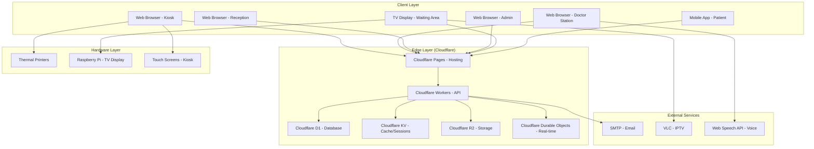

### 1.2 Technology Stack

```
┌─────────────────────────────────────────────────────────────┐
│                    TECHNOLOGY STACK                         │
├─────────────────────────────────────────────────────────────┤
│                                                             │
│  FRONTEND                               BACKEND             │
│  ┌───────────────────┐                 ┌──────────────────┐ │
│  │ Next.js 14        │                 │ Cloudflare Workers│ │
│  │ React 18          │                 │ TypeScript       │ │
│  │ TypeScript        │                 │ D1 SQLite        │ │
│  │ Tailwind CSS      │                 │ KV Store         │ │
│  │ tRPC              │                 │ R2 Storage       │ │
│  │ Socket.IO Client  │                 │ Durable Objects  │ │
│  └───────────────────┘                 └──────────────────┘ │
│                                                             │
│  STATE MANAGEMENT                     TESTING               │
│  ┌───────────────────┐                 ┌──────────────────┐ │
│  │ Zustand           │                 │ Vitest           │ │
│  │ React Query       │                 │ Playwright       │ │
│  │ LocalStorage      │                 │ Testing Library  │ │
│  │ IndexedDB         │                 │ k6               │ │
│  └───────────────────┘                 └──────────────────┘ │
│                                                             │
│  DEPLOYMENT                             MONITORING          │
│  ┌───────────────────┐                 ┌──────────────────┐ │
│  │ Cloudflare Pages  │                 │ Cloudflare Analytics│
│  │ GitHub Actions    │                 │ Custom Metrics   │ │
│  │ Wrangler CLI      │                 │ Error Tracking   │ │
│  └───────────────────┘                 └──────────────────┘ │
│                                                             │
└─────────────────────────────────────────────────────────────┘
```

## 2. Component Architecture

### 2.1 Frontend Architecture

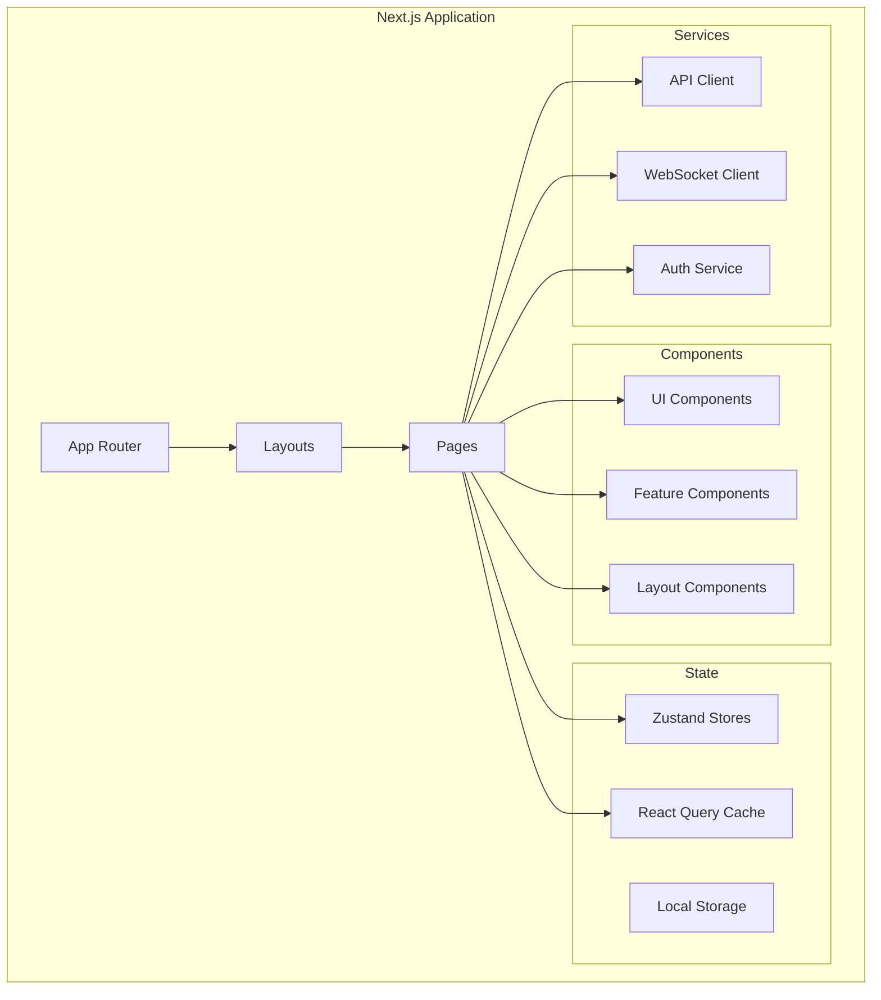

### 2.2 Backend Architecture

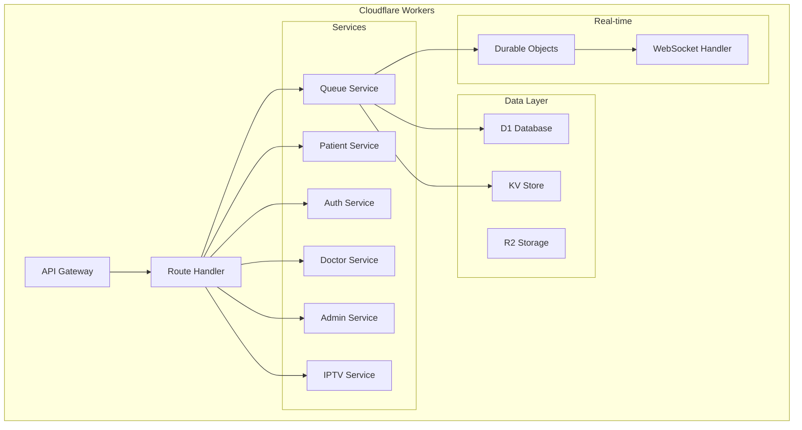

## 3. Data Architecture

### 3.1 Database Schema

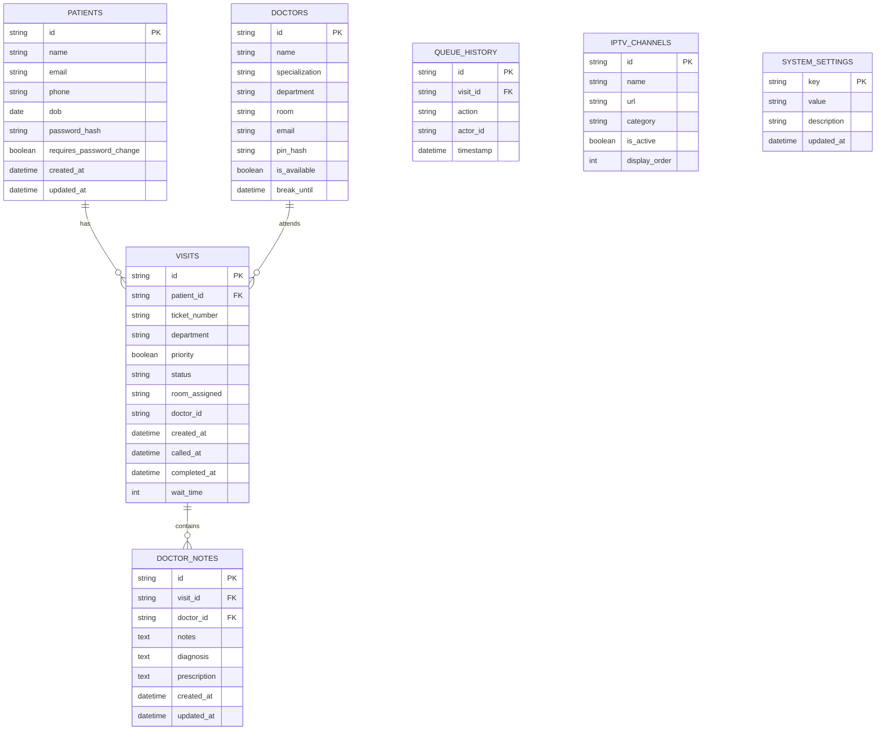

### 3.2 Data Flow

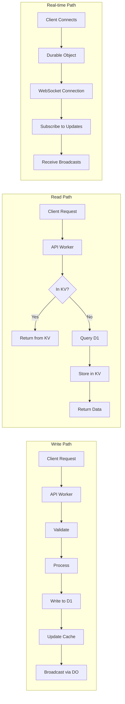

## 4. Security Architecture

### 4.1 Security Layers

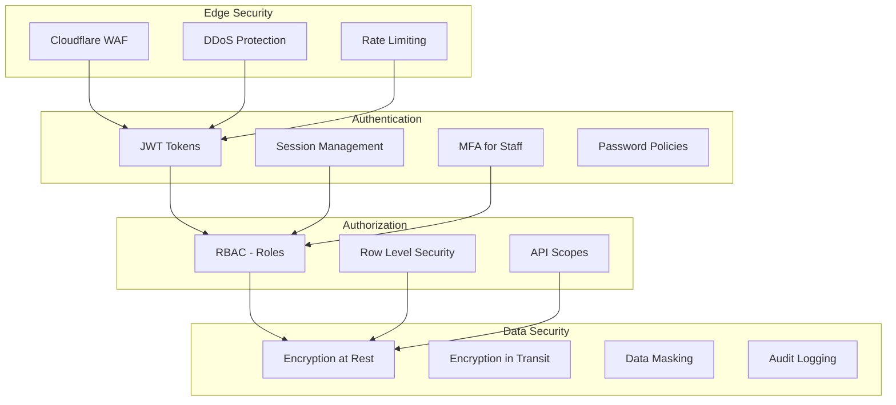

### 4.2 Authentication Flow

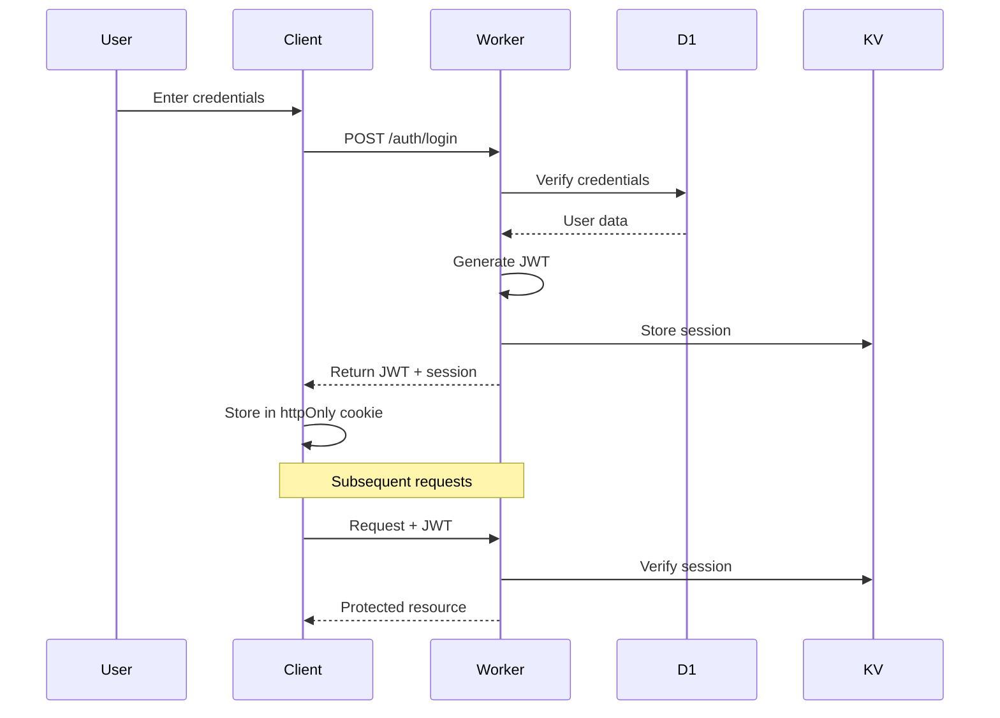

## 5. Real-time Architecture

### 5.1 Durable Objects Design

```mermaid
graph TD
    subgraph "Queue Room DO"
        A[State: patients[]]
        B[State: doctors[]]
        C[State: connections[]]
        
        D[Method: addPatient]
        E[Method: callNext]
        F[Method: transfer]
        
        G[Broadcast to all]
    end
    
    subgraph "Connections"
        H[WebSocket 1 - Doctor]
        I[WebSocket 2 - Display]
        J[WebSocket 3 - Reception]
    end
    
    H <--> G
    I <--> G
    J <--> G
    
    D --> G
    E --> G
    F --> G
```

### 5.2 Real-time Update Flow

```sequence
participant Doctor
participant DO as Durable Object
participant Display
participant Patient

Doctor->>DO: callNext(patientId)
DO->>DO: Update state
DO->>Display: Broadcast "patient called"
DO->>Patient: WebSocket update
Display-->>Patient: Show on screen
Patient->>Patient: Receive notification
```

## 6. Offline Architecture

### 6.1 Offline-First Design

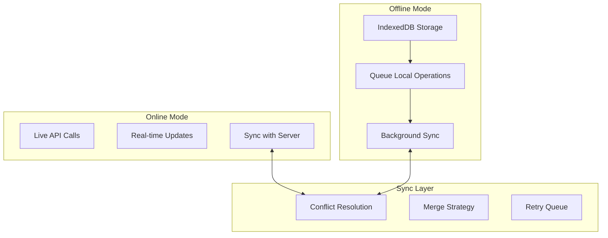

### 6.2 Offline Storage Schema

```typescript
// IndexedDB Schema
interface OfflineStore {
  patients: {
    keyPath: 'id',
    indexes: ['name', 'phone']
  },
  
  queueOperations: {
    keyPath: 'id',
    autoIncrement: true,
    indexes: ['synced']
  },
  
  pendingCalls: {
    keyPath: 'id',
    indexes: ['timestamp']
  },
  
  doctorNotes: {
    keyPath: 'id',
    indexes: ['patientId', 'synced']
  }
}
```

## 7. Integration Architecture

### 7.1 IPTV Integration

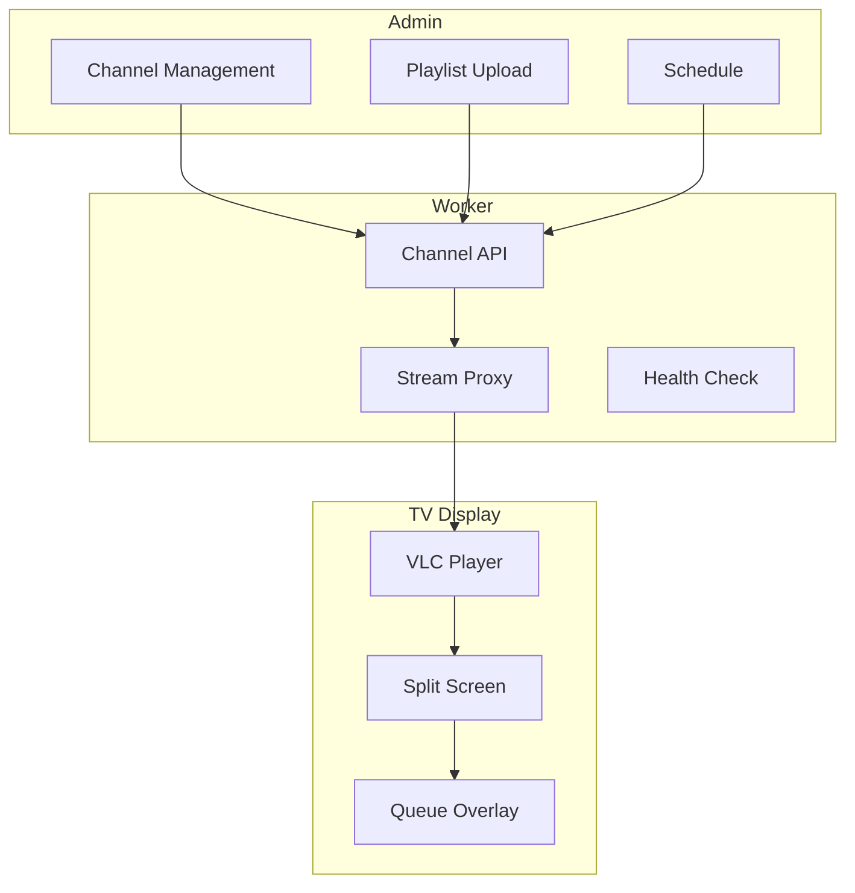

### 7.2 External API Integration

```yaml
# API Integration Points

HMS Integration:
  - endpoint: /api/hms/patients
  - method: POST
  - purpose: Sync patient data
  - frequency: Real-time
  - auth: API Key

SMS Gateway:
  - provider: Africa's Talking
  - purpose: Send notifications
  - fallback: Email
  
Email Service:
  - provider: Resend.com
  - purpose: Password reset
  - daily limit: 100 (free tier)
```

## 8. Deployment Architecture

### 8.1 Environment Structure

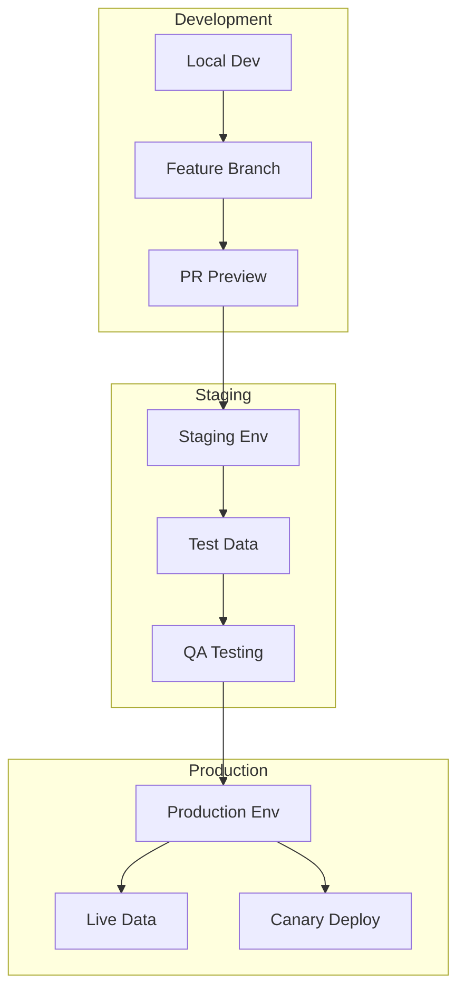

### 8.2 CI/CD Pipeline

```yaml
# Deployment Pipeline
stages:
  - test:
      - unit tests
      - integration tests
      - linting
      - type check
  
  - build:
      - next build
      - worker build
      - asset optimization
  
  - deploy-staging:
      - wrangler deploy --env=staging
      - d1 migrations apply
      - smoke tests
  
  - deploy-production:
      - canary deploy (10%)
      - health check
      - full rollout
      - post-deploy tests
```

## 9. Scalability Architecture

### 9.1 Horizontal Scaling

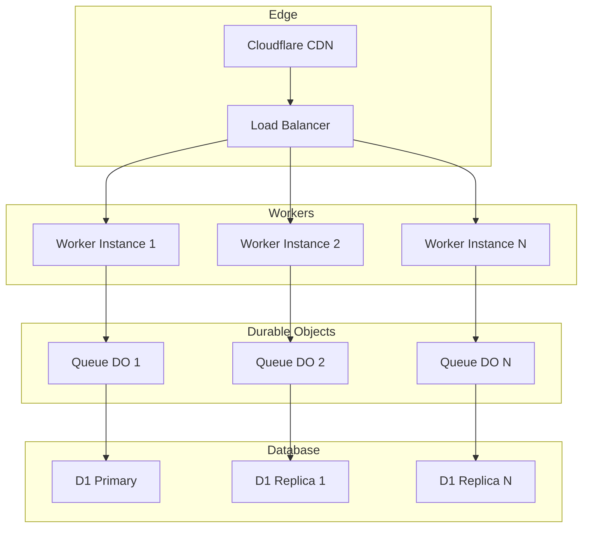

### 9.2 Caching Strategy

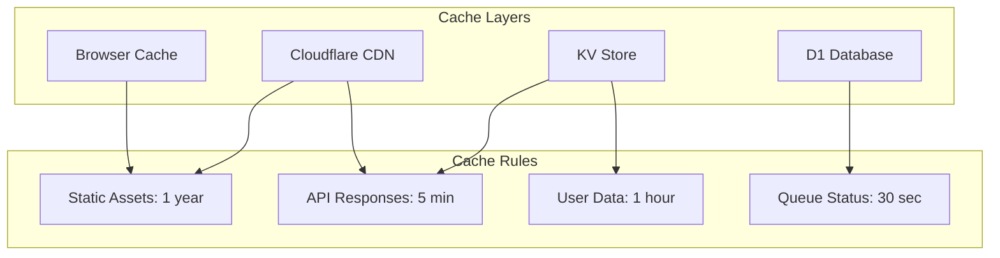

## 10. Monitoring Architecture

### 10.1 Metrics Collection

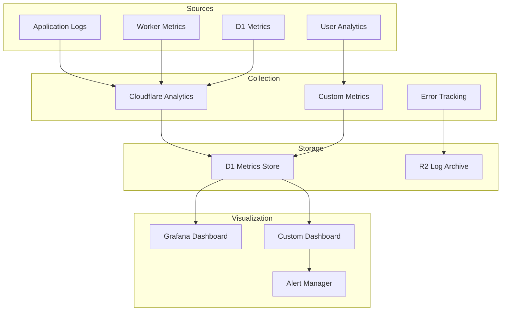

### 10.2 Key Metrics

```typescript
interface SystemMetrics {
  // Performance
  responseTime: Histogram;
  cpuUsage: Gauge;
  memoryUsage: Gauge;
  requestCount: Counter;
  
  // Business
  activeQueues: Gauge;
  patientsWaiting: Gauge;
  averageWaitTime: Histogram;
  callsPerHour: Counter;
  
  // Health
  errorRate: Gauge;
  uptime: Gauge;
  dbConnections: Gauge;
  
  // User
  activeUsers: Gauge;
  pageViews: Counter;
  userSatisfaction: Gauge;
}
```

## 11. Disaster Recovery

### 11.1 Backup Strategy

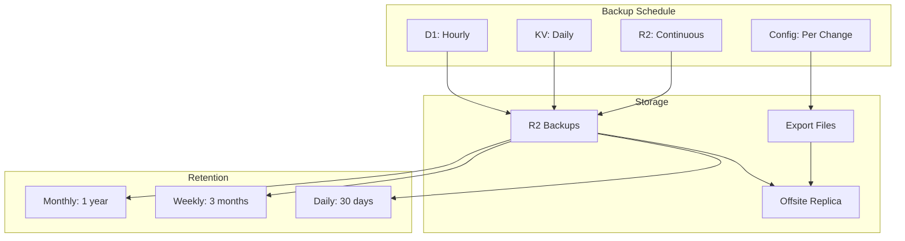

### 11.2 Recovery Procedures

```yaml
Recovery Scenarios:

Database Corruption:
  - Detect: Monitor alerts
  - Act: Stop writes
  - Restore: Latest backup
  - Verify: Data integrity
  - RTO: 15 minutes
  - RPO: 1 hour

Region Failure:
  - Detect: Cloudflare alert
  - Act: Failover to DR
  - Restore: From replica
  - Verify: Health checks
  - RTO: 5 minutes
  - RPO: < 1 minute

Data Breach:
  - Detect: Security alert
  - Act: Isolate system
  - Investigate: Root cause
  - Notify: Stakeholders
  - Recover: Clean restore
  - RTO: 4 hours
  - RPO: 24 hours
```

## 12. Performance Architecture

### 12.1 Performance Targets

| Component | Target | Measurement |
|-----------|--------|-------------|
| API Response (P95) | < 200ms | Worker timing |
| Page Load (FCP) | < 1.5s | Lighthouse |
| Database Query | < 50ms | Query timing |
| WebSocket Latency | < 500ms | Custom metric |
| Cache Hit Ratio | > 80% | KV metrics |
| Concurrent Users | 500+ | Load test |
| Daily Requests | 100k+ | Analytics |

### 12.2 Optimization Techniques

```typescript
// 1. Edge Caching
const cacheConfig = {
  static: {
    ttl: 31536000, // 1 year
    staleWhileRevalidate: 86400
  },
  api: {
    ttl: 300, // 5 minutes
    varyByUser: true
  },
  queue: {
    ttl: 30, // 30 seconds
    broadcastUpdates: true
  }
};

// 2. Database Optimization
const dbOptimizations = {
  indexes: [
    'visits(status, created_at)',
    'patients(email)',
    'visits(patient_id, status)'
  ],
  queries: {
    prepared: true,
    batchSize: 100,
    timeout: 5000
  }
};

// 3. Asset Optimization
const assetOptimizations = {
  images: {
    formats: ['webp', 'avif'],
    sizes: [640, 750, 828, 1080],
    quality: 85
  },
  fonts: {
    display: 'swap',
    preload: true
  },
  scripts: {
    defer: true,
    async: true
  }
};
```

## 13. Security Architecture Details

### 13.1 Encryption Standards

```typescript
// Encryption at Rest
const encryptionAtRest = {
  database: 'AES-256',
  backups: 'AES-256',
  logs: 'AES-256',
  keys: 'HSM via Cloudflare'
};

// Encryption in Transit
const encryptionInTransit = {
  tls: 'TLS 1.3',
  hsts: true,
  certificates: 'Cloudflare managed'
};

// Data Masking Rules
const dataMasking = {
  phone: '+(***) ***-****',
  email: 'u***@***.com',
  name: '****',
  id: 'partial: last 4 only'
};
```

### 13.2 Access Control Matrix

| Resource | Patient | Doctor | Reception | Admin |
|----------|---------|--------|-----------|-------|
| Own Profile | CRUD | CRUD | R | CRUD |
| Other Profiles | - | R | R | CRUD |
| Own Visits | R | R | R | CRUD |
| All Visits | - | R | R | CRUD |
| Queue Status | R | R | R | CRUD |
| Call Patient | - | C | - | C |
| Add to Queue | - | C | C | C |
| System Config | - | - | - | CRUD |
| IPTV Control | - | - | - | CRUD |
| Analytics | - | - | - | R |

## 14. Technology Decisions

### 14.1 Why Cloudflare?

```markdown
## Decision: Cloudflare Stack

### Reasons
1. **Free Tier Generous**: 100k requests/day, 5GB D1, unlimited sites
2. **Global Edge Network**: Low latency worldwide
3. **Integrated Stack**: Pages, Workers, D1, KV, R2 together
4. **No Server Management**: Serverless, auto-scaling
5. **Built-in Security**: DDoS, WAF, rate limiting
6. **Developer Experience**: Wrangler CLI, quick deploys

### Trade-offs
- ❌ SQLite limitations (D1)
- ❌ Worker CPU time limits (10-50ms)
- ❌ Cold starts possible
- ✅ Cost: $0
- ✅ Simplicity: No infrastructure
- ✅ Speed: Edge deployment
```

### 14.2 Why Next.js?

```markdown
## Decision: Next.js 14

### Reasons
1. **App Router**: Modern React patterns
2. **Server Components**: Reduced client JS
3. **API Routes**: Integrated backend
4. **Image Optimization**: Built-in
5. **Font Optimization**: Automatic
6. **TypeScript**: First-class support

### Trade-offs
- ❌ Build time for large sites
- ❌ Learning curve for App Router
- ✅ SEO benefits
- ✅ Performance
- ✅ Developer experience
```

### 14.3 Why tRPC?

```markdown
## Decision: tRPC

### Reasons
1. **Type Safety**: End-to-end types
2. **No Schema Duplication**: Single source of truth
3. **Autocomplete**: Great DX
4. **Lightweight**: No REST/GraphQL overhead
5. **Works with Next.js**: Perfect integration

### Trade-offs
- ❌ Learning curve
- ❌ Not as widely known as REST
- ✅ TypeScript integration
- ✅ Bundle size
- ✅ Developer speed
```

## 15. Architecture Decision Records

### ADR-001: Use D1 for Primary Database

```markdown
# ADR-001: Database Choice

## Context
Need a simple, serverless database that works with Cloudflare free tier.

## Decision
Use Cloudflare D1 (SQLite-based) for primary database.

## Rationale
- Free tier: 5GB storage, 5M reads/month
- SQL familiar to team
- Integrated with Workers
- Automatic backups

## Consequences
- SQLite limitations (no stored procedures)
- Need to manage migrations carefully
- Good for our scale (<10GB data)
```

### ADR-002: Real-time with Durable Objects

```markdown
# ADR-002: Real-time Updates

## Context
Need instant updates across all clients when queue changes.

## Decision
Use Cloudflare Durable Objects with WebSockets.

## Rationale
- WebSockets for bidirectional communication
- Durable Objects for state management
- Broadcast updates efficiently
- Free tier includes 1M requests/month

## Consequences
- More complex than polling
- Need to handle reconnection
- Better user experience
- Lower latency
```

---

## Version History

| Version | Date | Author | Changes |
|---------|------|--------|---------|
| 1.0 | 2026-03-03 | System | Initial version |

**Review Date:** 2026-06-03
```

**File created successfully: `.opencode/context/project/03-architecture.md`**

Please confirm if I should proceed with the next file: `.opencode/context/project/04-stack.md`
