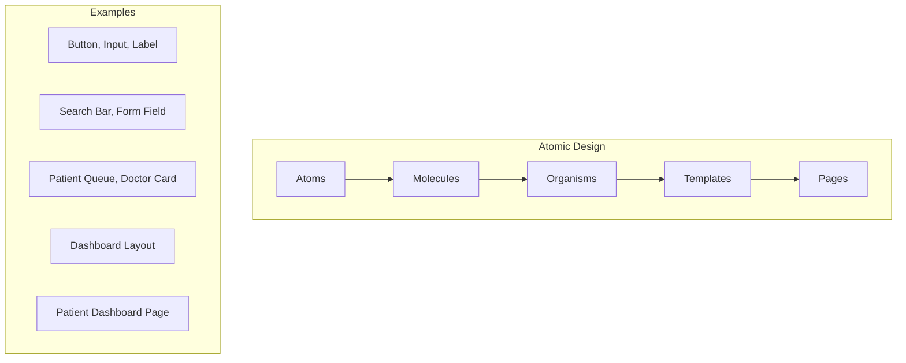

## Creating File: `.opencode/context/project/05-patterns.md`

```markdown
# Project Patterns
**Document ID:** PROJ-05
**Version:** 1.0
**Last Updated:** 2026-03-03
**Owner:** Tech Lead

## Purpose

This document defines the design patterns, coding patterns, and architectural patterns used throughout the Hospital Queuing System. Consistent patterns ensure maintainability, scalability, and developer productivity.

## 1. Design Patterns

### 1.1 Component Patterns

#### Atomic Design Pattern



**Implementation:**
```typescript
// components/atoms/Button.tsx
interface ButtonProps {
  variant: 'primary' | 'secondary' | 'danger';
  size: 'sm' | 'md' | 'lg';
  children: React.ReactNode;
  onClick?: () => void;
  disabled?: boolean;
}

export const Button: React.FC<ButtonProps> = ({
  variant,
  size,
  children,
  onClick,
  disabled
}) => {
  const baseClasses = 'rounded font-semibold transition-colors focus:outline-none focus:ring-2';
  
  const variants = {
    primary: 'bg-primary-600 text-white hover:bg-primary-700 focus:ring-primary-500',
    secondary: 'bg-gray-200 text-gray-800 hover:bg-gray-300 focus:ring-gray-500',
    danger: 'bg-red-600 text-white hover:bg-red-700 focus:ring-red-500'
  };
  
  const sizes = {
    sm: 'px-3 py-1.5 text-sm',
    md: 'px-4 py-2 text-base',
    lg: 'px-6 py-3 text-lg'
  };
  
  return (
    <button
      className={`${baseClasses} ${variants[variant]} ${sizes[size]}`}
      onClick={onClick}
      disabled={disabled}
    >
      {children}
    </button>
  );
};

// components/molecules/SearchBar.tsx
interface SearchBarProps {
  onSearch: (query: string) => void;
  placeholder?: string;
}

export const SearchBar: React.FC<SearchBarProps> = ({
  onSearch,
  placeholder = 'Search...'
}) => {
  const [query, setQuery] = useState('');
  
  const handleSubmit = (e: React.FormEvent) => {
    e.preventDefault();
    onSearch(query);
  };
  
  return (
    <form onSubmit={handleSubmit} className="flex gap-2">
      <Input
        type="text"
        value={query}
        onChange={(e) => setQuery(e.target.value)}
        placeholder={placeholder}
        className="flex-1"
      />
      <Button type="submit" variant="primary" size="md">
        Search
      </Button>
    </form>
  );
};

// components/organisms/PatientQueue.tsx
interface PatientQueueProps {
  patients: Patient[];
  onCallPatient: (patientId: string) => void;
}

export const PatientQueue: React.FC<PatientQueueProps> = ({
  patients,
  onCallPatient
}) => {
  return (
    <div className="bg-white rounded-lg shadow">
      <div className="px-4 py-3 border-b">
        <h2 className="text-lg font-semibold">Current Queue</h2>
      </div>
      <div className="divide-y">
        {patients.map((patient, index) => (
          <QueueItem
            key={patient.id}
            patient={patient}
            position={index + 1}
            onCall={() => onCallPatient(patient.id)}
          />
        ))}
      </div>
    </div>
  );
};
```

#### Compound Component Pattern

```typescript
// components/compound/Card.tsx
import { createContext, useContext } from 'react';

interface CardContextType {
  variant: 'default' | 'elevated' | 'outlined';
}

const CardContext = createContext<CardContextType>({ variant: 'default' });

const Card = ({ children, variant = 'default' }) => {
  return (
    <CardContext.Provider value={{ variant }}>
      <div className={cardVariants[variant]}>
        {children}
      </div>
    </CardContext.Provider>
  );
};

Card.Header = ({ children, className = '' }) => {
  const { variant } = useContext(CardContext);
  return (
    <div className={`p-4 border-b ${variant === 'elevated' ? 'bg-gray-50' : ''} ${className}`}>
      {children}
    </div>
  );
};

Card.Body = ({ children, className = '' }) => {
  return <div className={`p-4 ${className}`}>{children}</div>;
};

Card.Footer = ({ children, className = '' }) => {
  const { variant } = useContext(CardContext);
  return (
    <div className={`p-4 border-t ${variant === 'elevated' ? 'bg-gray-50' : ''} ${className}`}>
      {children}
    </div>
  );
};

// Usage
<Card variant="elevated">
  <Card.Header>
    <h2>Patient Information</h2>
  </Card.Header>
  <Card.Body>
    <p>Name: John Doe</p>
    <p>Age: 45</p>
  </Card.Body>
  <Card.Footer>
    <Button>Edit</Button>
  </Card.Footer>
</Card>
```

#### Render Props Pattern

```typescript
// components/patterns/DataFetcher.tsx
interface DataFetcherProps<T> {
  url: string;
  children: (data: {
    data: T | null;
    loading: boolean;
    error: Error | null;
    refetch: () => void;
  }) => React.ReactNode;
}

export function DataFetcher<T>({ url, children }: DataFetcherProps<T>) {
  const [data, setData] = useState<T | null>(null);
  const [loading, setLoading] = useState(true);
  const [error, setError] = useState<Error | null>(null);
  
  const fetchData = useCallback(async () => {
    setLoading(true);
    try {
      const response = await fetch(url);
      const json = await response.json();
      setData(json);
    } catch (err) {
      setError(err as Error);
    } finally {
      setLoading(false);
    }
  }, [url]);
  
  useEffect(() => {
    fetchData();
  }, [fetchData]);
  
  return children({ data, loading, error, refetch: fetchData });
}

// Usage
<DataFetcher<Patient[]> url="/api/queue">
  {({ data, loading, error }) => {
    if (loading) return <Spinner />;
    if (error) return <ErrorMessage error={error} />;
    return <PatientList patients={data} />;
  }}
</DataFetcher>
```

### 1.2 Hook Patterns

#### Custom Hook Pattern

```typescript
// hooks/useQueue.ts
interface UseQueueOptions {
  department: string;
  autoRefresh?: boolean;
  refreshInterval?: number;
}

export function useQueue({ 
  department, 
  autoRefresh = true, 
  refreshInterval = 30000 
}: UseQueueOptions) {
  const [queue, setQueue] = useState<Patient[]>([]);
  const [loading, setLoading] = useState(true);
  const [error, setError] = useState<Error | null>(null);
  const [lastUpdated, setLastUpdated] = useState<Date | null>(null);
  
  const fetchQueue = useCallback(async () => {
    try {
      setLoading(true);
      const data = await api.queue.get(department);
      setQueue(data);
      setLastUpdated(new Date());
    } catch (err) {
      setError(err as Error);
    } finally {
      setLoading(false);
    }
  }, [department]);
  
  useEffect(() => {
    fetchQueue();
    
    if (autoRefresh) {
      const interval = setInterval(fetchQueue, refreshInterval);
      return () => clearInterval(interval);
    }
  }, [fetchQueue, autoRefresh, refreshInterval]);
  
  const addPatient = useCallback(async (patient: Omit<Patient, 'id'>) => {
    const newPatient = await api.queue.add(patient);
    setQueue(prev => [...prev, newPatient]);
    return newPatient;
  }, []);
  
  const callPatient = useCallback(async (patientId: string, room: string) => {
    await api.queue.call(patientId, room);
    setQueue(prev => prev.filter(p => p.id !== patientId));
  }, []);
  
  return {
    queue,
    loading,
    error,
    lastUpdated,
    addPatient,
    callPatient,
    refresh: fetchQueue
  };
}

// Usage
function QueueDashboard({ department }: { department: string }) {
  const { 
    queue, 
    loading, 
    callPatient,
    addPatient 
  } = useQueue({ department, autoRefresh: true });
  
  if (loading) return <LoadingSpinner />;
  
  return (
    <div>
      <PatientList patients={queue} onCall={callPatient} />
      <AddPatientForm onAdd={addPatient} />
    </div>
  );
}
```

#### State Machine Pattern

```typescript
// hooks/usePatientVisit.ts
type VisitState = 'waiting' | 'called' | 'in-progress' | 'completed' | 'no-show';

interface VisitStateMachine {
  current: VisitState;
  canTransition: (to: VisitState) => boolean;
  transition: (to: VisitState) => void;
  history: VisitState[];
}

const transitions: Record<VisitState, VisitState[]> = {
  waiting: ['called', 'no-show'],
  called: ['in-progress', 'no-show'],
  'in-progress': ['completed', 'no-show'],
  completed: [],
  'no-show': []
};

export function useVisitState(initialState: VisitState = 'waiting'): VisitStateMachine {
  const [current, setCurrent] = useState<VisitState>(initialState);
  const [history, setHistory] = useState<VisitState[]>([initialState]);
  
  const canTransition = useCallback((to: VisitState) => {
    return transitions[current].includes(to);
  }, [current]);
  
  const transition = useCallback((to: VisitState) => {
    if (!canTransition(to)) {
      throw new Error(`Cannot transition from ${current} to ${to}`);
    }
    
    setCurrent(to);
    setHistory(prev => [...prev, to]);
  }, [current, canTransition]);
  
  return {
    current,
    canTransition,
    transition,
    history
  };
}

// Usage
function PatientVisit({ patientId }: { patientId: string }) {
  const { current, transition, canTransition } = useVisitState('waiting');
  
  const handleCall = () => {
    if (canTransition('called')) {
      transition('called');
      api.queue.call(patientId);
    }
  };
  
  return (
    <div>
      <StatusBadge status={current} />
      {current === 'waiting' && (
        <Button onClick={handleCall}>Call Patient</Button>
      )}
    </div>
  );
}
```

## 2. Architectural Patterns

### 2.1 Repository Pattern

```typescript
// repositories/PatientRepository.ts
export interface PatientRepository {
  findById(id: string): Promise<Patient | null>;
  findByEmail(email: string): Promise<Patient | null>;
  create(data: CreatePatientDTO): Promise<Patient>;
  update(id: string, data: UpdatePatientDTO): Promise<Patient>;
  delete(id: string): Promise<void>;
  search(query: string): Promise<Patient[]>;
}

export class D1PatientRepository implements PatientRepository {
  constructor(private db: D1Database) {}
  
  async findById(id: string): Promise<Patient | null> {
    const result = await this.db
      .prepare('SELECT * FROM patients WHERE id = ?')
      .bind(id)
      .first();
      
    return result ? this.mapToPatient(result) : null;
  }
  
  async findByEmail(email: string): Promise<Patient | null> {
    const result = await this.db
      .prepare('SELECT * FROM patients WHERE email = ?')
      .bind(email)
      .first();
      
    return result ? this.mapToPatient(result) : null;
  }
  
  async create(data: CreatePatientDTO): Promise<Patient> {
    const id = crypto.randomUUID();
    
    await this.db
      .prepare(`
        INSERT INTO patients (id, name, email, phone, dob, created_at)
        VALUES (?, ?, ?, ?, ?, ?)
      `)
      .bind(id, data.name, data.email, data.phone, data.dob, new Date().toISOString())
      .run();
      
    return this.findById(id) as Promise<Patient>;
  }
  
  async update(id: string, data: UpdatePatientDTO): Promise<Patient> {
    const updates = [];
    const values = [];
    
    for (const [key, value] of Object.entries(data)) {
      if (value !== undefined) {
        updates.push(`${key} = ?`);
        values.push(value);
      }
    }
    
    updates.push('updated_at = ?');
    values.push(new Date().toISOString());
    
    await this.db
      .prepare(`UPDATE patients SET ${updates.join(', ')} WHERE id = ?`)
      .bind(...values, id)
      .run();
      
    return this.findById(id) as Promise<Patient>;
  }
  
  async delete(id: string): Promise<void> {
    await this.db
      .prepare('DELETE FROM patients WHERE id = ?')
      .bind(id)
      .run();
  }
  
  async search(query: string): Promise<Patient[]> {
    const results = await this.db
      .prepare(`
        SELECT * FROM patients 
        WHERE name LIKE ? OR email LIKE ? OR phone LIKE ?
        LIMIT 20
      `)
      .bind(`%${query}%`, `%${query}%`, `%${query}%`)
      .all();
      
    return results.results.map(r => this.mapToPatient(r));
  }
  
  private mapToPatient(row: any): Patient {
    return {
      id: row.id,
      name: row.name,
      email: row.email,
      phone: row.phone,
      dob: row.dob,
      createdAt: new Date(row.created_at),
      updatedAt: row.updated_at ? new Date(row.updated_at) : undefined
    };
  }
}
```

### 2.2 Service Layer Pattern

```typescript
// services/QueueService.ts
export class QueueService {
  constructor(
    private patientRepo: PatientRepository,
    private visitRepo: VisitRepository,
    private notificationService: NotificationService
  ) {}
  
  async addToQueue(data: AddToQueueDTO): Promise<QueueEntry> {
    // Find or create patient
    let patient = await this.patientRepo.findByEmail(data.email);
    
    if (!patient) {
      patient = await this.patientRepo.create({
        name: data.name,
        email: data.email,
        phone: data.phone
      });
    }
    
    // Check for existing active visit
    const existing = await this.visitRepo.findActiveByPatient(patient.id);
    if (existing) {
      throw new Error('Patient already has an active visit');
    }
    
    // Create visit
    const visit = await this.visitRepo.create({
      patientId: patient.id,
      department: data.department,
      priority: data.priority || false
    });
    
    // Calculate position
    const position = await this.visitRepo.getPosition(visit.id);
    
    // Send notification
    if (patient.email) {
      await this.notificationService.sendQueueUpdate(
        patient.email,
        position
      );
    }
    
    return {
      patient,
      visit,
      position
    };
  }
  
  async callNext(doctorId: string, department: string): Promise<Visit> {
    // Get next patient
    const nextVisit = await this.visitRepo.findNextInQueue(department);
    
    if (!nextVisit) {
      throw new Error('No patients in queue');
    }
    
    // Update visit
    const updated = await this.visitRepo.update(nextVisit.id, {
      status: 'called',
      calledAt: new Date(),
      doctorId
    });
    
    // Get patient for notification
    const patient = await this.patientRepo.findById(updated.patientId);
    
    // Notify patient
    if (patient?.phone) {
      await this.notificationService.sendSMS(
        patient.phone,
        `Please go to Room ${doctorId}. Your doctor is ready.`
      );
    }
    
    return updated;
  }
  
  async getQueueStatus(department: string): Promise<QueueStatus> {
    const [waiting, called] = await Promise.all([
      this.visitRepo.findWaiting(department),
      this.visitRepo.findCalled(department)
    ]);
    
    const waitTime = await this.calculateWaitTime(department);
    
    return {
      waiting,
      called,
      waitTime,
      total: waiting.length
    };
  }
  
  private async calculateWaitTime(department: string): Promise<number> {
    const queue = await this.visitRepo.findWaiting(department);
    const avgTime = await this.visitRepo.getAverageConsultationTime(department);
    
    return queue.length * avgTime;
  }
}
```

### 2.3 Factory Pattern

```typescript
// factories/NotificationFactory.ts
export interface Notification {
  type: string;
  recipient: string;
  subject?: string;
  body: string;
  send(): Promise<void>;
}

export class EmailNotification implements Notification {
  type = 'email';
  subject?: string;
  
  constructor(
    public recipient: string,
    public body: string,
    subject?: string
  ) {
    this.subject = subject;
  }
  
  async send(): Promise<void> {
    // Send email via Resend
    await resend.emails.send({
      from: 'no-reply@limuruhospital.co.ke',
      to: this.recipient,
      subject: this.subject || 'Notification from Limuru Hospital',
      html: this.body
    });
  }
}

export class SMSNotification implements Notification {
  type = 'sms';
  
  constructor(
    public recipient: string,
    public body: string
  ) {}
  
  async send(): Promise<void> {
    // Send SMS via Africa's Talking
    await africastalking.SMS.send({
      to: this.recipient,
      message: this.body,
      from: 'LIMURU-HOSP'
    });
  }
}

export class PushNotification implements Notification {
  type = 'push';
  
  constructor(
    public recipient: string,
    public body: string,
    public title?: string
  ) {}
  
  async send(): Promise<void> {
    // Send push notification via Web Push
    const subscription = await getSubscription(this.recipient);
    if (subscription) {
      await webpush.sendNotification(subscription, JSON.stringify({
        title: this.title || 'Hospital Notification',
        body: this.body
      }));
    }
  }
}

export class NotificationFactory {
  static createNotification(
    type: 'email' | 'sms' | 'push',
    recipient: string,
    body: string,
    options?: { subject?: string; title?: string }
  ): Notification {
    switch (type) {
      case 'email':
        return new EmailNotification(recipient, body, options?.subject);
      case 'sms':
        return new SMSNotification(recipient, body);
      case 'push':
        return new PushNotification(recipient, body, options?.title);
      default:
        throw new Error(`Unknown notification type: ${type}`);
    }
  }
}

// Usage
const notification = NotificationFactory.createNotification(
  'email',
  'patient@example.com',
  '<h1>Your appointment is confirmed</h1>',
  { subject: 'Appointment Confirmation' }
);
await notification.send();
```

### 2.4 Observer Pattern (Event System)

```typescript
// events/EventSystem.ts
type EventHandler<T = any> = (event: T) => void | Promise<void>;

export class EventSystem {
  private static instance: EventSystem;
  private handlers: Map<string, Set<EventHandler>> = new Map();
  
  static getInstance(): EventSystem {
    if (!EventSystem.instance) {
      EventSystem.instance = new EventSystem();
    }
    return EventSystem.instance;
  }
  
  on<T>(event: string, handler: EventHandler<T>) {
    if (!this.handlers.has(event)) {
      this.handlers.set(event, new Set());
    }
    this.handlers.get(event)!.add(handler);
  }
  
  off<T>(event: string, handler: EventHandler<T>) {
    this.handlers.get(event)?.delete(handler);
  }
  
  async emit<T>(event: string, data: T) {
    const handlers = this.handlers.get(event);
    if (!handlers) return;
    
    const promises = Array.from(handlers).map(handler => handler(data));
    await Promise.all(promises);
  }
}

// events/QueueEvents.ts
export const QueueEvents = {
  PATIENT_ADDED: 'queue.patient.added',
  PATIENT_CALLED: 'queue.patient.called',
  PATIENT_COMPLETED: 'queue.patient.completed',
  QUEUE_UPDATED: 'queue.updated',
  WAIT_TIME_CHANGED: 'queue.wait-time.changed'
} as const;

// Event handlers
export function setupEventHandlers() {
  const events = EventSystem.getInstance();
  
  events.on(QueueEvents.PATIENT_ADDED, async (data) => {
    // Update displays
    await broadcastQueueUpdate(data.department);
    
    // Send notification
    if (data.patient.email) {
      const notification = NotificationFactory.createNotification(
        'email',
        data.patient.email,
        `You are #${data.position} in queue. Estimated wait: ${data.waitTime} minutes.`
      );
      await notification.send();
    }
  });
  
  events.on(QueueEvents.PATIENT_CALLED, async (data) => {
    // Update displays
    await broadcastQueueUpdate(data.department);
    
    // Update TV display
    await updateTVDisplay({
      called: data.patient,
      room: data.room
    });
    
    // Log for analytics
    await logQueueEvent('patient_called', data);
  });
}

// Emitting events
await events.emit(QueueEvents.PATIENT_ADDED, {
  patient,
  department: 'MED',
  position: 3,
  waitTime: 45
});
```

## 3. Data Patterns

### 3.1 Data Transfer Object (DTO) Pattern

```typescript
// dtos/PatientDTO.ts
import { z } from 'zod';

export const CreatePatientSchema = z.object({
  name: z.string().min(2).max(100),
  email: z.string().email().optional(),
  phone: z.string().regex(/^\+?[1-9]\d{1,14}$/).optional(),
  dob: z.string().datetime().optional()
});

export const UpdatePatientSchema = CreatePatientSchema.partial();

export const PatientResponseSchema = z.object({
  id: z.string().uuid(),
  name: z.string(),
  email: z.string().nullable(),
  phone: z.string().nullable(),
  dob: z.string().nullable(),
  createdAt: z.date(),
  updatedAt: z.date().optional()
});

export type CreatePatientDTO = z.infer<typeof CreatePatientSchema>;
export type UpdatePatientDTO = z.infer<typeof UpdatePatientSchema>;
export type PatientResponseDTO = z.infer<typeof PatientResponseSchema>;

// dtos/QueueDTO.ts
export const AddToQueueSchema = z.object({
  patientId: z.string().uuid().optional(),
  name: z.string().min(2),
  email: z.string().email().optional(),
  phone: z.string().optional(),
  department: z.enum(['MED', 'PED', 'CARD', 'EMER']),
  priority: z.boolean().default(false)
});

export const QueueEntrySchema = z.object({
  id: z.string().uuid(),
  patient: PatientResponseSchema,
  ticketNumber: z.string(),
  department: z.string(),
  position: z.number(),
  estimatedWait: z.number(),
  status: z.enum(['waiting', 'called']),
  joinedAt: z.date()
});

export type AddToQueueDTO = z.infer<typeof AddToQueueSchema>;
export type QueueEntryDTO = z.infer<typeof QueueEntrySchema>;
```

### 3.2 Repository Query Pattern

```typescript
// repositories/queries/PatientQueries.ts
export interface PatientQuery {
  name?: string;
  email?: string;
  phone?: string;
  createdAfter?: Date;
  createdBefore?: Date;
  limit?: number;
  offset?: number;
  sortBy?: 'name' | 'createdAt';
  sortOrder?: 'asc' | 'desc';
}

export class PatientQueryBuilder {
  private query: PatientQuery = {};
  
  withName(name: string): this {
    this.query.name = name;
    return this;
  }
  
  withEmail(email: string): this {
    this.query.email = email;
    return this;
  }
  
  createdBetween(start: Date, end: Date): this {
    this.query.createdAfter = start;
    this.query.createdBefore = end;
    return this;
  }
  
  paginate(limit: number, offset: number): this {
    this.query.limit = limit;
    this.query.offset = offset;
    return this;
  }
  
  sort(field: 'name' | 'createdAt', order: 'asc' | 'desc' = 'asc'): this {
    this.query.sortBy = field;
    this.query.sortOrder = order;
    return this;
  }
  
  build(): PatientQuery {
    return this.query;
  }
}

// Usage in repository
async findMany(query: PatientQuery): Promise<Patient[]> {
  let sql = 'SELECT * FROM patients WHERE 1=1';
  const params: any[] = [];
  
  if (query.name) {
    sql += ' AND name LIKE ?';
    params.push(`%${query.name}%`);
  }
  
  if (query.email) {
    sql += ' AND email = ?';
    params.push(query.email);
  }
  
  if (query.createdAfter) {
    sql += ' AND created_at >= ?';
    params.push(query.createdAfter.toISOString());
  }
  
  if (query.createdBefore) {
    sql += ' AND created_at <= ?';
    params.push(query.createdBefore.toISOString());
  }
  
  if (query.sortBy) {
    sql += ` ORDER BY ${query.sortBy} ${query.sortOrder || 'asc'}`;
  }
  
  if (query.limit) {
    sql += ' LIMIT ? OFFSET ?';
    params.push(query.limit, query.offset || 0);
  }
  
  const results = await this.db.prepare(sql).bind(...params).all();
  return results.results.map(this.mapToPatient);
}
```

## 4. UI/UX Patterns

### 4.1 Skeleton Loading Pattern

```typescript
// components/ui/Skeleton.tsx
interface SkeletonProps {
  className?: string;
  variant?: 'text' | 'circular' | 'rectangular';
  width?: string | number;
  height?: string | number;
  animate?: boolean;
}

export const Skeleton: React.FC<SkeletonProps> = ({
  className = '',
  variant = 'text',
  width,
  height,
  animate = true
}) => {
  const baseClasses = 'bg-gray-200 rounded';
  const animateClass = animate ? 'animate-pulse' : '';
  
  const variants = {
    text: 'h-4 rounded',
    circular: 'rounded-full',
    rectangular: 'rounded'
  };
  
  const style = {
    width: width ? (typeof width === 'number' ? `${width}px` : width) : undefined,
    height: height ? (typeof height === 'number' ? `${height}px` : height) : undefined
  };
  
  return (
    <div
      className={`${baseClasses} ${variants[variant]} ${animateClass} ${className}`}
      style={style}
    />
  );
};

// components/skeletons/PatientQueueSkeleton.tsx
export const PatientQueueSkeleton: React.FC = () => {
  return (
    <div className="space-y-4">
      <div className="flex justify-between items-center">
        <Skeleton width={200} height={32} />
        <Skeleton width={100} height={40} />
      </div>
      
      {[1, 2, 3, 4, 5].map((i) => (
        <div key={i} className="flex items-center space-x-4 p-4 border rounded">
          <Skeleton variant="circular" width={48} height={48} />
          <div className="flex-1 space-y-2">
            <Skeleton width="60%" height={20} />
            <Skeleton width="40%" height={16} />
          </div>
          <Skeleton width={80} height={32} />
        </div>
      ))}
    </div>
  );
};
```

### 4.2 Optimistic Update Pattern

```typescript
// hooks/useOptimisticQueue.ts
interface OptimisticUpdate<T> {
  action: 'add' | 'remove' | 'update';
  data: T;
  previousData?: T;
}

export function useOptimisticQueue(department: string) {
  const queryClient = useQueryClient();
  const queryKey = ['queue', department];
  
  const { data: queue } = useQuery({
    queryKey,
    queryFn: () => api.queue.get(department)
  });
  
  const { mutate: addPatient } = useMutation({
    mutationFn: (patient: AddToQueueDTO) => api.queue.add(patient),
    
    onMutate: async (newPatient) => {
      // Cancel outgoing refetches
      await queryClient.cancelQueries({ queryKey });
      
      // Snapshot previous value
      const previousQueue = queryClient.getQueryData(queryKey);
      
      // Optimistically update
      queryClient.setQueryData(queryKey, (old: QueueEntry[]) => [
        ...old,
        {
          ...newPatient,
          id: `temp-${Date.now()}`,
          position: old.length + 1,
          status: 'waiting',
          estimatedWait: (old.length + 1) * 15
        }
      ]);
      
      return { previousQueue };
    },
    
    onError: (err, newPatient, context) => {
      // Rollback on error
      queryClient.setQueryData(queryKey, context?.previousQueue);
      toast.error('Failed to add patient');
    },
    
    onSettled: () => {
      // Refetch to ensure consistency
      queryClient.invalidateQueries({ queryKey });
    }
  });
  
  const { mutate: callPatient } = useMutation({
    mutationFn: ({ patientId, room }: { patientId: string; room: string }) =>
      api.queue.call(patientId, room),
    
    onMutate: async ({ patientId }) => {
      await queryClient.cancelQueries({ queryKey });
      
      const previousQueue = queryClient.getQueryData(queryKey);
      
      queryClient.setQueryData(queryKey, (old: QueueEntry[]) =>
        old.filter(p => p.id !== patientId)
      );
      
      return { previousQueue };
    },
    
    onError: (err, variables, context) => {
      queryClient.setQueryData(queryKey, context?.previousQueue);
      toast.error('Failed to call patient');
    },
    
    onSettled: () => {
      queryClient.invalidateQueries({ queryKey });
    }
  });
  
  return {
    queue,
    addPatient,
    callPatient
  };
}
```

## 5. Error Handling Patterns

### 5.1 Result Pattern (Either)

```typescript
// lib/result.ts
export type Result<T, E = Error> = 
  | { success: true; data: T }
  | { success: false; error: E };

export function success<T>(data: T): Result<T> {
  return { success: true, data };
}

export function failure<E = Error>(error: E): Result<never, E> {
  return { success: false, error };
}

// Usage in service
async function findPatient(id: string): Promise<Result<Patient, NotFoundError>> {
  const patient = await patientRepo.findById(id);
  
  if (!patient) {
    return failure(new NotFoundError(`Patient ${id} not found`));
  }
  
  return success(patient);
}

// Usage in controller
const result = await findPatient(id);

if (result.success) {
  return Response.json(result.data);
} else {
  return Response.json(
    { error: result.error.message },
    { status: 404 }
  );
}
```

### 5.2 Try-Catch Wrapper Pattern

```typescript
// lib/async-wrapper.ts
export async function tryCatch<T, E = Error>(
  promise: Promise<T>
): Promise<[T | null, E | null]> {
  try {
    const data = await promise;
    return [data, null];
  } catch (error) {
    return [null, error as E];
  }
}

// Usage
const [data, error] = await tryCatch(api.queue.get('MED'));

if (error) {
  console.error('Failed to fetch queue:', error);
  return <ErrorMessage error={error} />;
}

return <QueueDisplay queue={data} />;
```

## 6. Performance Patterns

### 6.1 Virtual Scrolling Pattern

```typescript
// components/ui/VirtualList.tsx
import { useVirtualizer } from '@tanstack/react-virtual';

interface VirtualListProps<T> {
  items: T[];
  height: number;
  itemHeight: number;
  renderItem: (item: T, index: number) => React.ReactNode;
}

export function VirtualList<T>({
  items,
  height,
  itemHeight,
  renderItem
}: VirtualListProps<T>) {
  const parentRef = useRef<HTMLDivElement>(null);
  
  const virtualizer = useVirtualizer({
    count: items.length,
    getScrollElement: () => parentRef.current,
    estimateSize: () => itemHeight,
    overscan: 5
  });
  
  return (
    <div
      ref={parentRef}
      style={{ height, overflow: 'auto' }}
    >
      <div
        style={{
          height: `${virtualizer.getTotalSize()}px`,
          position: 'relative'
        }}
      >
        {virtualizer.getVirtualItems().map((virtualItem) => (
          <div
            key={virtualItem.key}
            style={{
              position: 'absolute',
              top: 0,
              left: 0,
              width: '100%',
              height: `${virtualItem.size}px`,
              transform: `translateY(${virtualItem.start}px)`
            }}
          >
            {renderItem(items[virtualItem.index], virtualItem.index)}
          </div>
        ))}
      </div>
    </div>
  );
}

// Usage
<VirtualList
  items={patients}
  height={600}
  itemHeight={80}
  renderItem={(patient) => (
    <PatientCard patient={patient} />
  )}
/>
```

### 6.2 Debounce Pattern

```typescript
// hooks/useDebounce.ts
export function useDebounce<T>(value: T, delay: number): T {
  const [debouncedValue, setDebouncedValue] = useState<T>(value);
  
  useEffect(() => {
    const timer = setTimeout(() => {
      setDebouncedValue(value);
    }, delay);
    
    return () => clearTimeout(timer);
  }, [value, delay]);
  
  return debouncedValue;
}

// hooks/useDebouncedSearch.ts
export function useDebouncedSearch<T>(
  searchFn: (query: string) => Promise<T[]>,
  delay: number = 300
) {
  const [query, setQuery] = useState('');
  const [results, setResults] = useState<T[]>([]);
  const [loading, setLoading] = useState(false);
  
  const debouncedQuery = useDebounce(query, delay);
  
  useEffect(() => {
    if (!debouncedQuery) {
      setResults([]);
      return;
    }
    
    setLoading(true);
    searchFn(debouncedQuery)
      .then(setResults)
      .finally(() => setLoading(false));
  }, [debouncedQuery, searchFn]);
  
  return {
    query,
    setQuery,
    results,
    loading
  };
}

// Usage
function PatientSearch() {
  const { query, setQuery, results, loading } = useDebouncedSearch(
    async (q) => {
      const response = await api.patients.search(q);
      return response.data;
    },
    500
  );
  
  return (
    <div>
      <Input
        value={query}
        onChange={(e) => setQuery(e.target.value)}
        placeholder="Search patients..."
      />
      {loading && <Spinner />}
      <PatientList patients={results} />
    </div>
  );
}
```

## 7. Security Patterns

### 7.1 RBAC (Role-Based Access Control) Pattern

```typescript
// lib/auth/rbac.ts
export type Role = 'patient' | 'doctor' | 'nurse' | 'receptionist' | 'admin';

export type Permission = 
  | 'patient:read'
  | 'patient:write'
  | 'patient:delete'
  | 'queue:read'
  | 'queue:call'
  | 'queue:add'
  | 'notes:write'
  | 'settings:manage';

const rolePermissions: Record<Role, Permission[]> = {
  patient: ['patient:read'],
  doctor: ['patient:read', 'patient:write', 'queue:read', 'queue:call', 'notes:write'],
  nurse: ['patient:read', 'queue:read', 'notes:write'],
  receptionist: ['patient:read', 'patient:write', 'queue:read', 'queue:add'],
  admin: ['patient:read', 'patient:write', 'patient:delete', 'queue:read', 'queue:call', 'queue:add', 'notes:write', 'settings:manage']
};

export function hasPermission(user: { role: Role }, permission: Permission): boolean {
  return rolePermissions[user.role]?.includes(permission) ?? false;
}

// Higher-order component for permission checking
export function withPermission<P extends object>(
  WrappedComponent: React.ComponentType<P>,
  requiredPermission: Permission
) {
  return function WithPermissionComponent(props: P) {
    const { user } = useAuth();
    
    if (!hasPermission(user, requiredPermission)) {
      return <Unauthorized />;
    }
    
    return <WrappedComponent {...props} />;
  };
}

// Usage
const PatientListWithPermission = withPermission(PatientList, 'patient:read');

// Middleware for API routes
export function requirePermission(permission: Permission) {
  return async (req: Request, next: () => Promise<Response>) => {
    const user = await getUser(req);
    
    if (!hasPermission(user, permission)) {
      return new Response('Forbidden', { status: 403 });
    }
    
    return next();
  };
}
```

## 8. Testing Patterns

### 8.1 Test Factory Pattern

```typescript
// test/factories/patient.factory.ts
import { faker } from '@faker-js/faker';

export class PatientFactory {
  static create(overrides: Partial<Patient> = {}): Patient {
    return {
      id: faker.string.uuid(),
      name: faker.person.fullName(),
      email: faker.internet.email(),
      phone: faker.phone.number(),
      dob: faker.date.past({ years: 50 }).toISOString().split('T')[0],
      createdAt: new Date(),
      ...overrides
    };
  }
  
  static createMany(count: number, overrides: Partial<Patient> = {}): Patient[] {
    return Array.from({ length: count }, () => this.create(overrides));
  }
  
  static createWithVisits(visitCount: number = 3): Patient & { visits: Visit[] } {
    const patient = this.create();
    const visits = VisitFactory.createMany(visitCount, { patientId: patient.id });
    
    return {
      ...patient,
      visits
    };
  }
}

// test/factories/visit.factory.ts
export class VisitFactory {
  static create(overrides: Partial<Visit> = {}): Visit {
    return {
      id: faker.string.uuid(),
      patientId: faker.string.uuid(),
      ticketNumber: `MED${faker.number.int({ min: 1, max: 999 })}`,
      department: faker.helpers.arrayElement(['MED', 'PED', 'CARD']),
      status: faker.helpers.arrayElement(['waiting', 'called', 'completed']),
      createdAt: new Date(),
      ...overrides
    };
  }
  
  static createMany(count: number, overrides: Partial<Visit> = {}): Visit[] {
    return Array.from({ length: count }, () => this.create(overrides));
  }
}

// Usage in tests
test('should calculate queue position', () => {
  const patients = PatientFactory.createMany(5);
  const visits = VisitFactory.createMany(10, { status: 'waiting' });
  
  const service = new QueueService();
  const position = service.calculatePosition(visits[0].id);
  
  expect(position).toBeDefined();
});
```

---

## Version History

| Version | Date | Author | Changes |
|---------|------|--------|---------|
| 1.0 | 2026-03-03 | System | Initial version |

**Review Date:** 2026-06-03
```

**File created successfully: `.opencode/context/project/05-patterns.md`**

Please confirm if I should proceed with the next file: `.opencode/context/project/06-glossary.md`
