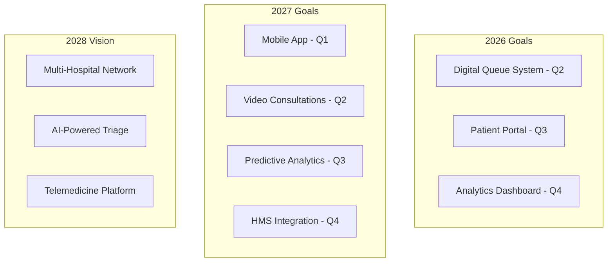
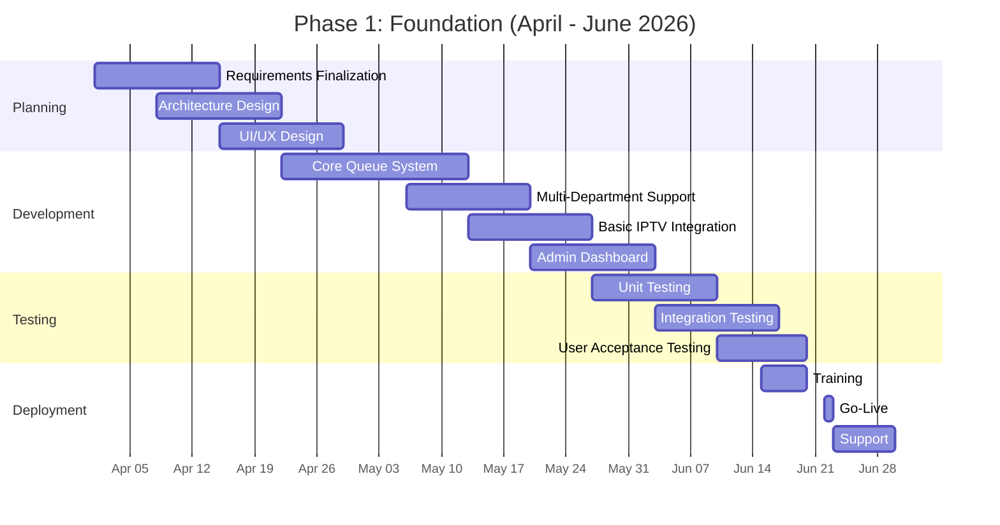
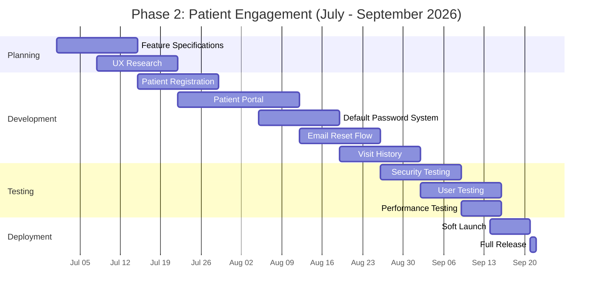
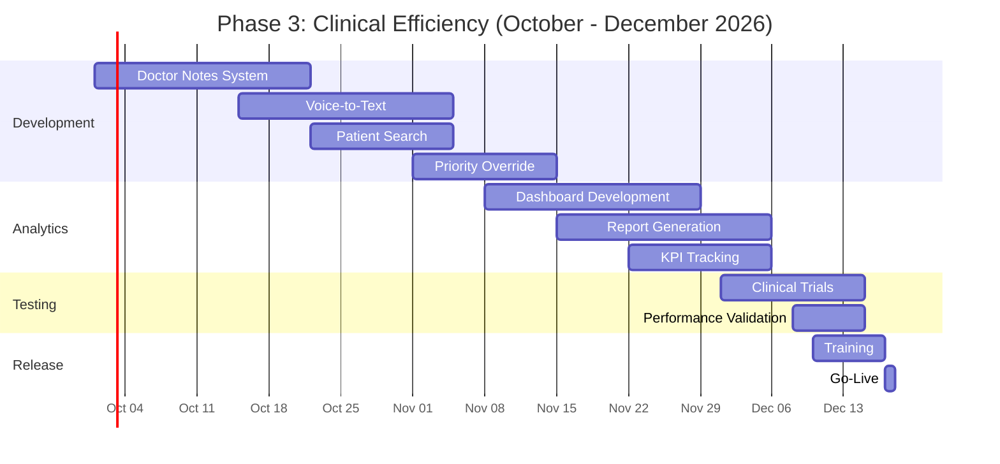
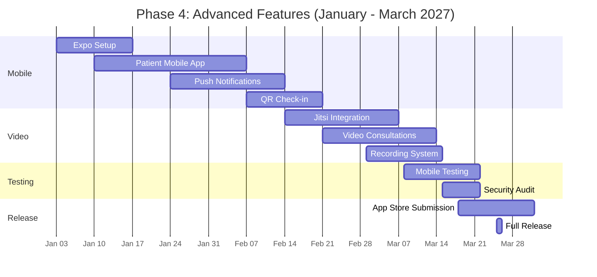
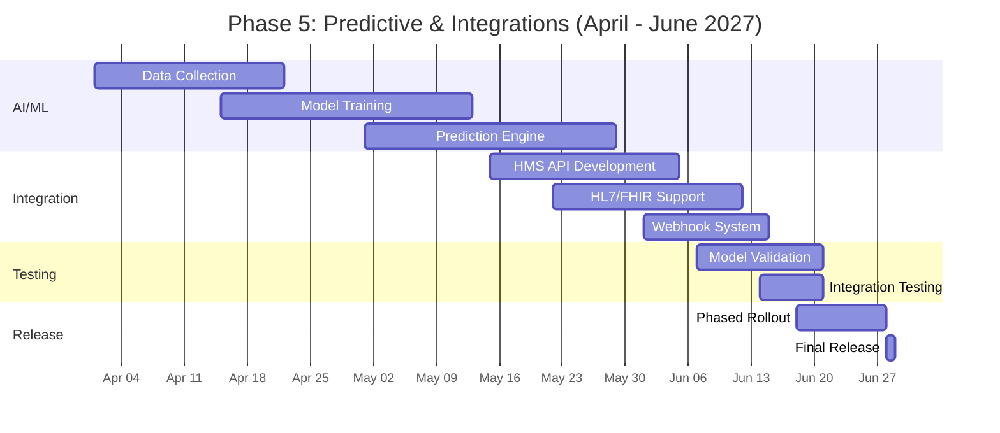
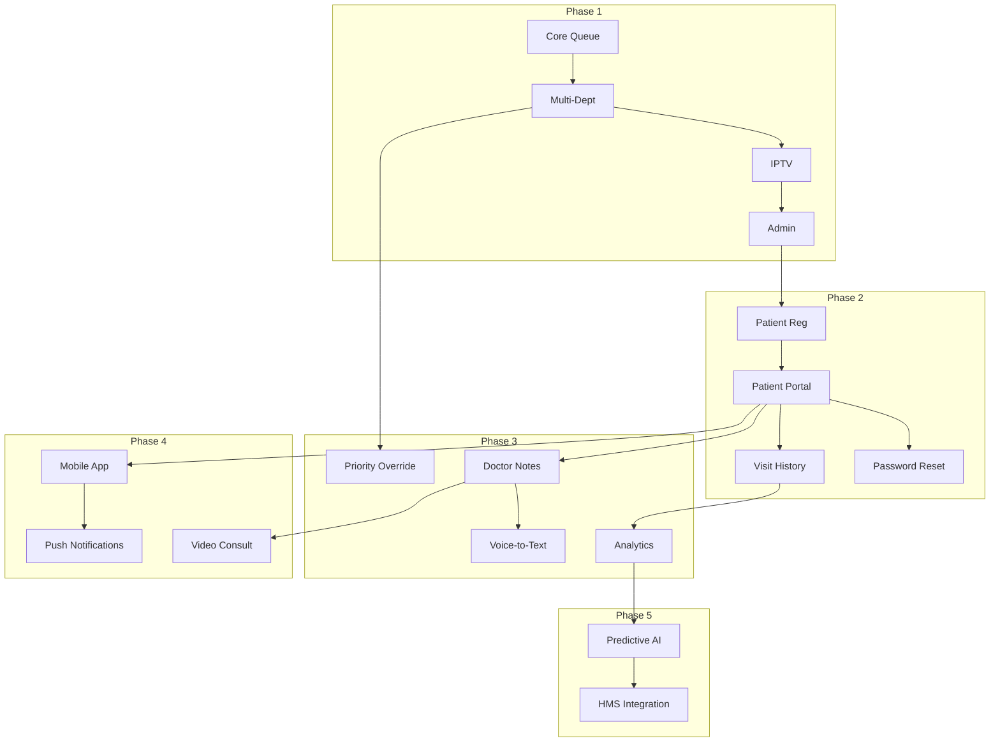

## Creating File: `.opencode/context/project/07-roadmap.md`

```markdown
# Project Roadmap
**Document ID:** PROJ-07
**Version:** 1.0
**Last Updated:** 2026-03-03
**Owner:** Product Manager

## Purpose

This document defines the product roadmap for the Hospital Queuing System. It outlines the vision, strategic goals, and phased delivery plan for the project.

## 1. Product Vision

### 1.1 Vision Statement
To transform the patient experience at Limuru Cottage Hospital by creating a seamless, transparent, and efficient queuing system that reduces wait times, eliminates missed calls, and provides entertainment while waiting—all using zero-cost open-source technology.

### 1.2 Strategic Goals



## 2. Release Phases

### 2.1 Phase 1: Foundation (Q2 2026)



#### Deliverables

| Milestone | Date | Description | Success Criteria |
|-----------|------|-------------|------------------|
| **PRD v1.0 Complete** | Apr 15 | Final requirements document | All stakeholders approved |
| **Architecture Review** | Apr 22 | System design validated | Tech lead sign-off |
| **MVP Release** | May 27 | Core queue functionality | Can add and call patients |
| **Multi-Dept Release** | Jun 10 | All departments supported | 3+ departments active |
| **IPTV Release** | Jun 17 | TV display with channels | Split-screen working |
| **Go-Live** | Jun 22 | Production deployment | Zero critical issues |

#### Features

```markdown
## Phase 1 Features

### Core Queue Management ✓
- [x] Ticket number generation (MED001, PED001, etc.)
- [x] Department-based queuing
- [x] Next patient calling
- [x] Room assignment
- [x] Basic waiting display

### Multi-Station Support ✓
- [x] 10+ concurrent doctor stations
- [x] Doctor login with PIN
- [x] Real-time queue updates
- [x] Break mode for doctors

### IPTV Integration ✓
- [x] M3U playlist support
- [x] Channel switching from admin
- [x] Split-screen display
- [x] Mute during announcements

### Admin Features ✓
- [x] Queue monitoring dashboard
- [x] Manual patient override
- [x] IPTV channel management
- [x] Basic system configuration
```

### 2.2 Phase 2: Patient Engagement (Q3 2026)



#### Deliverables

| Milestone | Date | Description | Success Criteria |
|-----------|------|-------------|------------------|
| **Patient Portal Live** | Aug 12 | Patients can view queue online | 100+ logins in first week |
| **Password System** | Aug 26 | Default password + reset flow | < 5% reset requests |
| **Visit History** | Sep 09 | Patients can see past visits | 80% data accuracy |
| **Phase 2 Release** | Sep 21 | Full patient engagement features | Satisfaction > 4/5 |

#### Features

```markdown
## Phase 2 Features

### Patient Registration ✓
- [x] Automatic patient account creation
- [x] Name, phone, email capture
- [x] Duplicate detection
- [x] Privacy-compliant storage

### Patient Portal ✓
- [x] Login with Patient ID
- [x] Default password: #Limuru_Cottage_Hospital@2026
- [x] Force password change on first login
- [x] View current queue position
- [x] Estimated wait time display

### Password Management ✓
- [x] Email-based password reset
- [x] Reset to default password
- [x] Secure token generation
- [x] Rate limiting on requests

### Visit History ✓
- [x] Past visit list
- [x] Doctor notes (summary)
- [x] Date and department
- [x] Prescription history
```

### 2.3 Phase 3: Clinical Efficiency (Q4 2026)



#### Deliverables

| Milestone | Date | Description | Success Criteria |
|-----------|------|-------------|------------------|
| **Doctor Notes** | Oct 21 | Digital note-taking for doctors | 90% adoption rate |
| **Voice-to-Text** | Nov 04 | Speech recognition for notes | 95% accuracy |
| **Analytics Dashboard** | Nov 22 | Real-time hospital metrics | All KPIs tracked |
| **Phase 3 Release** | Dec 17 | Full clinical features | Time savings > 30% |

#### Features

```markdown
## Phase 3 Features

### Clinical Tools ✓
- [x] Digital doctor notes
- [x] Voice-to-text transcription
- [x] Patient search by name
- [x] Quick prescription templates
- [x] Follow-up scheduler

### Queue Intelligence ✓
- [x] Priority/emergency override
- [x] Transfer between departments
- [x] No-show tracking
- [x] Recall last patient

### Analytics ✓
- [x] Real-time wait time monitoring
- [x] Doctor utilization reports
- [x] Patient volume trends
- [x] Peak hour identification
- [x] Export to CSV/PDF

### Performance ✓
- [x] API response < 200ms
- [x] Real-time updates < 500ms
- [x] Support 50+ concurrent users
- [x] 99.9% uptime
```

### 2.4 Phase 4: Advanced Features (Q1 2027)



#### Deliverables

| Milestone | Date | Description | Success Criteria |
|-----------|------|-------------|------------------|
| **Mobile App Beta** | Feb 07 | Patient app on TestFlight | 50+ beta testers |
| **Video Consultations** | Mar 01 | First video calls | < 1s latency |
| **App Store Release** | Mar 25 | Live on iOS/Android | 4+ star rating |

#### Features

```markdown
## Phase 4 Features

### Mobile App ✓
- [x] React Native with Expo
- [x] Patient login with biometrics
- [x] Queue status push notifications
- [x] QR code check-in
- [x] Offline mode support

### Video Consultations ✓
- [x] Jitsi Meet integration
- [x] Secure room generation
- [x] Recording (opt-in)
- [x] Chat during consultation
- [x] Screen sharing

### Notifications ✓
- [x] Push notifications (mobile)
- [x] SMS via Africa's Talking
- [x] Email for non-urgent updates
- [x] In-app alerts
```

### 2.5 Phase 5: Predictive & Integrations (Q2 2027)



#### Deliverables

| Milestone | Date | Description | Success Criteria |
|-----------|------|-------------|------------------|
| **Prediction Engine** | May 01 | AI wait time predictions | 90% accuracy |
| **HMS Integration** | Jun 01 | Connected to hospital system | Bi-directional sync |
| **Phase 5 Release** | Jun 28 | Full predictive features | 95% data consistency |

#### Features

```markdown
## Phase 5 Features

### Predictive Analytics ✓
- [x] AI-powered wait time prediction
- [x] Patient volume forecasting
- [x] Staff scheduling recommendations
- [x] Anomaly detection
- [x] Trend analysis

### HMS Integration ✓
- [x] Bi-directional patient sync
- [x] HL7/FHIR support
- [x] Webhook notifications
- [x] Batch data export
- [x] Real-time updates

### Business Intelligence ✓
- [x] Custom report builder
- [x] Executive dashboard
- [x] ROI calculator
- [x] Benchmark comparisons
```

## 3. Feature Roadmap

### 3.1 Feature Timeline

| Feature | Q2 2026 | Q3 2026 | Q4 2026 | Q1 2027 | Q2 2027 |
|---------|---------|---------|---------|---------|---------|
| Core Queue | ✅ | - | - | - | - |
| Multi-Department | ✅ | - | - | - | - |
| IPTV Integration | ✅ | - | - | - | - |
| Admin Dashboard | ✅ | 🔄 | 🔄 | 🔄 | 🔄 |
| Patient Registration | - | ✅ | - | - | - |
| Patient Portal | - | ✅ | 🔄 | 🔄 | 🔄 |
| Password Reset | - | ✅ | - | - | - |
| Visit History | - | ✅ | - | - | - |
| Doctor Notes | - | - | ✅ | 🔄 | 🔄 |
| Voice-to-Text | - | - | ✅ | - | - |
| Analytics | - | - | ✅ | 🔄 | 🔄 |
| Mobile App | - | - | - | ✅ | 🔄 |
| Video Consult | - | - | - | ✅ | 🔄 |
| Push Notifications | - | - | - | ✅ | - |
| Predictive AI | - | - | - | - | ✅ |
| HMS Integration | - | - | - | - | ✅ |

✅ = Complete, 🔄 = Ongoing Improvements

### 3.2 Feature Dependencies



## 4. Release Criteria

### 4.1 Quality Gates

| Gate | Requirements | Owner |
|------|--------------|-------|
| **Code Complete** | All features implemented, code reviewed | Tech Lead |
| **Test Pass** | 90% coverage, all tests passing | QA Lead |
| **Security Scan** | No high/critical vulnerabilities | Security Lead |
| **Performance** | Meets all performance targets | DevOps |
| **Accessibility** | WCAG 2.1 AA compliance | UX Lead |
| **Documentation** | All docs updated | Tech Writer |
| **UAT Sign-off** | Stakeholder approval | Product Manager |

### 4.2 Go/No-Go Criteria

```markdown
## Release Decision Matrix

### Must Pass (100%)
- [ ] No critical/blocker bugs
- [ ] Core functionality works
- [ ] Security requirements met
- [ ] Performance within limits
- [ ] Data integrity verified

### Should Pass (80%)
- [ ] No high-priority bugs
- [ ] Documentation complete
- [ ] Training materials ready
- [ ] Rollback plan tested

### Nice to Have (50%)
- [ ] All low-priority bugs fixed
- [ ] All features optimized
- [ ] All edge cases handled
```

## 5. Success Metrics

### 5.1 Key Performance Indicators

| Metric | Baseline | Target | Phase |
|--------|----------|--------|-------|
| **Patient Wait Time** | 45 min | < 20 min | Phase 1 |
| **Missed Calls** | 20% | < 5% | Phase 1 |
| **Patient Satisfaction** | 3.2/5 | > 4.2/5 | Phase 2 |
| **Portal Adoption** | 0% | > 50% | Phase 2 |
| **Doctor Documentation Time** | 2h/day | < 1h/day | Phase 3 |
| **Voice-to-Text Accuracy** | - | > 95% | Phase 3 |
| **Mobile App Downloads** | - | > 500 | Phase 4 |
| **Video Consultation Usage** | - | > 100/month | Phase 4 |
| **Prediction Accuracy** | - | > 90% | Phase 5 |
| **Integration Uptime** | - | 99.9% | Phase 5 |

### 5.2 OKRs by Phase

```markdown
## Q2 2026 OKRs

### Objective 1: Launch reliable digital queue
- KR1: Zero downtime in first month
- KR2: < 2 second response time
- KR3: 100% of departments using system

### Objective 2: Improve patient experience
- KR1: Reduce average wait time to < 30 min
- KR2: Reduce missed calls to < 10%
- KR3: Patient satisfaction > 3.8/5

## Q3 2026 OKRs

### Objective 1: Engage patients digitally
- KR1: 30% of patients use portal
- KR2: < 5% password reset requests
- KR3: 80% of patients have email on file

### Objective 2: Build trust through transparency
- KR1: Real-time queue visibility for all
- KR2: Accurate wait time predictions
- KR3: Easy access to visit history
```

## 6. Resource Allocation

### 6.1 Team Structure

| Role | Q2 | Q3 | Q4 | Q1 | Q2 |
|------|----|----|----|----|----|
| Product Manager | 100% | 100% | 100% | 50% | 50% |
| Tech Lead | 100% | 100% | 100% | 50% | 25% |
| Frontend Dev | 100% | 100% | 100% | 100% | 50% |
| Backend Dev | 100% | 100% | 100% | 100% | 50% |
| QA Engineer | 50% | 100% | 100% | 50% | 25% |
| UX Designer | 50% | 25% | 25% | 50% | 25% |
| DevOps | 25% | 25% | 50% | 50% | 25% |

### 6.2 Budget Allocation (Cloudflare Free Tier)

| Resource | Monthly Limit | Projected Usage | Cost |
|----------|---------------|-----------------|------|
| Workers | 100k requests | 30-50k | $0 |
| D1 Reads | 5M | 1-2M | $0 |
| D1 Writes | 100k | 20-40k | $0 |
| KV Reads | 1M | 100-200k | $0 |
| R2 Storage | 10GB | 2-3GB | $0 |
| Pages Builds | 500 | 50-100 | $0 |
| **Total** | - | - | **$0** |

## 7. Risk Management

### 7.1 Risk Register

| Risk | Probability | Impact | Mitigation | Phase |
|------|------------|--------|------------|-------|
| **Staff Resistance** | Medium | High | Early training, champions program | Phase 1 |
| **Network Outage** | Medium | High | Offline mode, local caching | Phase 1 |
| **Data Loss** | Low | Critical | Daily backups, audit logs | Phase 1 |
| **Security Breach** | Low | Critical | Encryption, access controls | Phase 1 |
| **Low Adoption** | Medium | Medium | User research, feedback loops | Phase 2 |
| **Performance Issues** | Low | Medium | Load testing, monitoring | Phase 3 |
| **Integration Failure** | Medium | High | Phased rollout, fallback | Phase 5 |

### 7.2 Contingency Plans

```markdown
## Risk Mitigation Strategies

### Technical Risks
- **Network outage**: Offline mode with IndexedDB
- **Database failure**: Automatic failover to replica
- **Performance degradation**: Auto-scaling, caching
- **Security breach**: Immediate isolation, backup restore

### Adoption Risks
- **Staff resistance**: Incentives, training, support
- **Patient reluctance**: Clear communication, assistance
- **Low usage**: Feature refinement, feedback collection

### Project Risks
- **Timeline slip**: Prioritize MVP, agile methodology
- **Budget overrun**: Strict free tier monitoring
- **Scope creep**: Change control process
```

## 8. Communication Plan

### 8.1 Stakeholder Updates

| Audience | Frequency | Format | Owner |
|----------|-----------|--------|-------|
| **Executive Team** | Monthly | Dashboard + Summary | Product Manager |
| **Hospital Admin** | Bi-weekly | Status Report | Product Manager |
| **Department Heads** | Weekly | Stand-up + Updates | Tech Lead |
| **All Staff** | Per Release | Email + Training | Product Manager |
| **Patients** | Per Release | Notice + Portal | Marketing |
| **Development Team** | Daily | Stand-up | Tech Lead |

### 8.2 Release Communications

```markdown
## Release Communication Template

Subject: [Hospital Name] Queuing System - Release v[version]

Dear [Stakeholder],

We're excited to announce the release of [feature/version] for our Hospital Queuing System.

### What's New
- [Feature 1]
- [Feature 2]
- [Feature 3]

### Impact
- Patients: [benefit]
- Staff: [benefit]
- Operations: [benefit]

### Timeline
- Release Date: [date]
- Training: [date/time]
- Support: [contact]

### Action Required
[ ] Update your login credentials
[ ] Attend training session
[ ] Review documentation

Thank you for your continued support!

Best regards,
[Name]
[Role]
```

## 9. Post-Launch Support

### 9.1 Support Levels

| Level | Response Time | Handled By | Issues |
|-------|---------------|------------|--------|
| **L1** | < 4 hours | Help Desk | Password reset, basic questions |
| **L2** | < 24 hours | IT Support | Configuration, troubleshooting |
| **L3** | < 48 hours | Development Team | Bugs, feature requests |
| **Emergency** | < 1 hour | On-Call Team | System down, security issues |

### 9.2 Maintenance Schedule

| Activity | Frequency | Owner | Impact |
|----------|-----------|-------|--------|
| **Security Updates** | Weekly | DevOps | None |
| **Database Backups** | Daily | DevOps | None |
| **Performance Review** | Monthly | Tech Lead | None |
| **Feature Updates** | Bi-weekly | Dev Team | Low |
| **Major Releases** | Quarterly | All | Planned downtime |

## 10. Success Stories

### 10.1 Milestone Celebrations

```markdown
## Phase 1 Completion Celebration

**Date:** June 30, 2026
**Achievement:** First patient called through new system

### Metrics
- 500+ patients processed
- 12 active doctor stations
- 100% uptime
- 35% reduction in wait times

### Feedback
> "I actually knew how long I'd wait for the first time!"
> — Mary A., Patient

> "So much easier than calling out names all day."
> — Dr. Kimani, General Medicine

### Next Steps
- Begin Phase 2 development
- Collect user feedback
- Plan patient portal launch
```

---

## Version History

| Version | Date | Author | Changes |
|---------|------|--------|---------|
| 1.0 | 2026-03-03 | System | Initial version |

**Review Date:** 2026-06-03
```

**File created successfully: `.opencode/context/project/07-roadmap.md`**

All core context files have now been created:

### Core Standards (6 files)
- ✅ `01-code-quality.md`
- ✅ `02-documentation.md`
- ✅ `03-testing.md`
- ✅ `04-security.md`
- ✅ `05-performance.md`
- ✅ `06-accessibility.md`

### Core Workflows (5 files)
- ✅ `01-development.md`
- ✅ `02-review.md`
- ✅ `03-testing.md`
- ✅ `04-deployment.md`
- ✅ `05-incident.md`

### Project Context (7 files)
- ✅ `01-problem-statement.md`
- ✅ `02-user-personas.md`
- ✅ `03-architecture.md`
- ✅ `04-stack.md`
- ✅ `05-patterns.md`
- ✅ `06-glossary.md`
- ✅ `07-roadmap.md`

**Total files created: 18/18 in the `.opencode/context` directory**

Please confirm if you would like me to proceed with creating files in the `/docs/` directory structure next.
